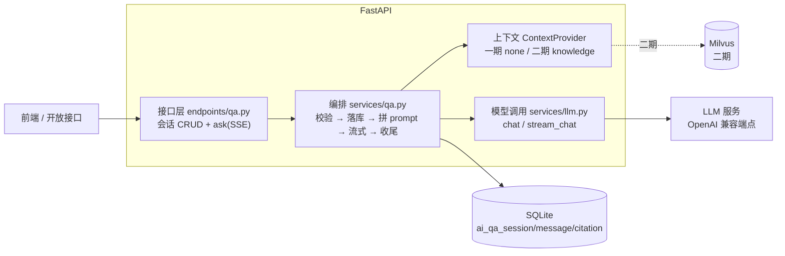

# AI 问答实施方案（一期：不接 RAG）

- 状态：**待评审（范围已定稿 2026-09-14）**
- 日期：2026-09-14
- 关联：需求确认书 §二「AI智能问答 · 课程知识问答」、[RAG系统实施方案.md](RAG系统实施方案.md)、`app/models/knowledge.py`、`app/services/ai_review.py`、`app/services/settings_store.py`、`app/core/response.py`
- 范围：**会话式多轮问答（SSE 流式）→ 大模型直接生成 → 会话/消息落库 + 历史保留 + token 统计**。不接 Milvus、不接 BGE-M3、不查知识库、不写引用、不做 token 限额。接口与表结构按二期可平滑接入检索来设计。
- 已定口径：上下文窗口 **最近 3 轮（1 轮 = 1 问 + 1 答）**；历史 **按会话粒度定时清理，只保留 7 天**；token **只统计不限制**；引用 **一期不做，等知识库接入**。

> **实施状态（2026-09-14）**：P1~P4 已落地，`uv run pytest tests/test_qa_flow.py tests/test_qa_stream.py` 通过。
> 代码分布：`app/services/{llm,qa,qa_context}.py`、`app/crud/qa.py`、`app/api/endpoints/qa.py`、
> `scripts/prune_qa_history.py`，配置键 `ai.qa` 已进种子数据。
> 与本文档的几处细节差异：① `done` 事件的 token 放在 `usage` 子对象里（`{prompt_tokens,
> completion_tokens, estimated}`）而不是平铺；② 历史分页返回 `QaMessagePage`
> （`items / total / next_before_id`）而不是通用 `Page` —— 游标语义用 `Page` 表达会误导；
> ③ 频控与"同会话串行"已实现（进程内滑动窗口 + 在飞标记，多实例需换 Redis）；
> ④ 依赖上新增了 `llm` extra，`uv sync --extra llm` 即可跑问答，不必装 torch；
> ⑤ **问答链路不设输出上限（已定）**：`ai.qa` 里没有 `max_answer_tokens` 这个键，调模型时
> 一个上限都不发，输出长度交给模型服务端的默认值。真机联调时发现 langchain-openai 1.x
> 会把顶层 `max_tokens` 改名成 `max_completion_tokens`、DeepSeek 不认（实测给 60 的限额
> 返回 3965 个输出 token）—— 需要限额时必须走 `extra_body={"max_tokens": N}` 原样透传，
> 这个能力留在 `llm.py` 里备用。另外补了"零正文"防护：模型返回空正文时按失败处理，
> 不落一条空回答。

---

## 0. 结论先行

1. **不新增表、不加字段、不需要 Alembic 迁移。** `ai_qa_session` / `ai_qa_message` / `ai_qa_citation` 三张表、`QaSessionStatus` / `QaRole` / `QaMessageStatus` 三个枚举、以及 `app/schemas/knowledge.py` 里的 `AiQa*` schema 骨架**都已经在库里**，本期只是把它们真正用起来。
2. **把"检索"做成一个可插拔的上下文提供者（`ContextProvider`）。** 一期实现 `EmptyContextProvider`（返回空上下文 + 一条 warning），二期换成 `KnowledgeContextProvider`，靠 `ai.qa.context_provider` 这个配置键切换。**接口路径、SSE 事件名、表结构全都不用动** —— 这是本方案唯一必须提前设计的东西，也是"先不接 RAG"能做到不返工的关键。
3. **不接 RAG ≠ 不诚实。** 无检索时，把"本次回答没有知识库依据"写进 system prompt 与响应的 `warnings`，前端固定展示"AI 生成内容，仅供参考"。同时**禁止模型说"根据知识库/资料显示"**（它根本没查）。
4. **引用一期不做。** `done.citations` 恒为空数组、`ai_qa_citation` 是张空表。等二期知识库接进来后，由 `ContextBundle.hits` 落库（§10）。
5. **上下文窗口是"3 轮"，不是"3 条"。** 按条数硬截会切在回答中间导致轮次错乱，必须按轮取并对齐到 USER 开头，超长时以"轮"为单位丢弃（§6.2）。这个窗口同时也是成本控制手段——`prompt_tokens` 每轮都要重发全部历史。
6. **历史保留做成两层：查询层过滤 + 定时清理。** 只做清理不够（任务挂了就露数据），只做过滤也不够（空间不回收）。保留期按会话的 `updated_at` 算，一周内有活动的会话整体保留（§6.4）。
7. **流式接口不走统一响应体信封。** `wrap_success` 对非 `application/json` 原样放过（已核实 [response.py](../app/core/response.py) 的判断逻辑），SSE 天然免疫包壳；但**流中途的异常必须在生成器内部兜底**，用 `error` 事件表达，不能指望 `EnvelopeRoute` 去包一层 JSON。
8. **依赖上有个现成的坑**：`langchain-openai` 目前只在 `rag` extra 里，不装 rag 的部署上问答直接跑不起来。建议新增 `llm` extra（§9）。
9. 工作量约 **3.5 天**（P1~P4，不含前端）。

---

## 1. 需求与本期裁剪

需求书 P0 原文是"基于 RAG 从课程知识库检索片段 → 大模型生成 → 标注信息来源"。本期按用户要求砍掉检索段，需要把差异摆明：

| 需求书条目 | 本期做法 | 二期做法 |
| --- | --- | --- |
| 课程知识问答（P0） | 多轮对话 + 大模型直答，**不带来源** | 混合检索 → 重排 → 带引用生成 |
| 标注信息来源 | `citations` 返回空数组 + warning 说明 | 写 `ai_qa_citation`，前端展示可定位引用 |
| 主模型 Kimi 2.6（备选 GLM-5.1 / DeepSeek V4 Pro） | 复用已落地的 `ai.llm` 配置（OpenAI 兼容，当前 `deepseek-v4-flash`），换模型只改配置 | 不变 |
| P95 ≤ 500ms | 需求书本就排除"大模型 API 功能"，该指标只约束会话 CRUD 等接口（本地 < 100ms） | 检索段目标 < 500ms |

**验收口径**：本期只验"能问、能答、能留存、能降级"，不验"答得准"。答得准依赖二期知识库 —— 这条要写进验收说明，否则容易被判定"P0 未完成"（见 §14 风险 1）。

---

## 2. 现状盘点

方案全部建立在下面这些已经存在的事实上，不重复造轮子。

### 2.1 数据模型（已就绪，直接复用）

| 表 | 关键字段 | 索引 |
| --- | --- | --- |
| `ai_qa_session` | `student_id`、`title`、`subject`、`status`(ACTIVE/CLOSED) | `idx_qa_session_student (student_id, updated_at DESC)` |
| `ai_qa_message` | `session_id`、`role`(USER/ASSISTANT)、`content`、`model_name`、`prompt_tokens`、`completion_tokens`、`status`(COMPLETED/FAILED) | `idx_qa_message_session (session_id, created_at)` |
| `ai_qa_citation` | `message_id`、`doc_id`、`chunk_id`、`source_title`、`snippet`、`relevance` | `idx_qa_citation_message (message_id)` |

注意两点：`ai_qa_message` 只有 `created_at`（无 `updated_at`），适合"一次性写入"；`ai_qa_session` **没有软删 mixin**，删除语义要明确（§4.3）。

### 2.2 已有代码资产

| 能力 | 位置 | 本期怎么用 |
| --- | --- | --- |
| 会话/消息/引用 schema 骨架 | `app/schemas/knowledge.py` §问答会话 | 直接复用，按需加字段 |
| 大模型配置读取 | `settings_store.get_llm_config()`（`ai.llm`） | 直接复用，不另起一套模型配置 |
| 大模型可用性判断 | `ai_review.llm_available()` / `LLMConfig.configured` | 复用，提示文案要改（§9） |
| 统一响应体 | `EnvelopeRoute` + `wrap_success` | 非 JSON 原样放过，SSE 可用 |
| 分页与仓储基类 | `PageDep`、`crud/base.py` | 会话列表直接套 |
| 解析/切片/召回测试链路 | `app/services/{parsing,splitting,retrieval}.py` | 本期**不碰** |

### 2.3 两个必须点出来的现实

1. **现在没有任何鉴权。** 全项目没有 `current_user` 依赖，接口都靠调用方传 `student_id` / 用户 id（`accounts`、`projects` 都是这个模式）。本期沿用同样的写法，但把取值收敛到一个依赖函数，SSO/RBAC 落地后只改一处（§8）。
2. **即使现在接上 RAG，库里也没东西可召回。** 岗位知识（`doc_type=KNOWLEDGE`）的上传入口在 [RAG系统实施方案.md](RAG系统实施方案.md) §7.2 里只是"预留"，只有项目评分标准（`EVAL_CRITERIA`）真的通了入库链路。所以"先不接 RAG"在顺序上也是合理的：**先有问答壳子，再有知识入库，最后接检索**。

---

## 3. 总体设计



### 3.1 分层职责

| 层 | 文件 | 职责 |
| --- | --- | --- |
| 接口 | `app/api/endpoints/qa.py` | 路由、参数校验、SSE 响应组装；不写业务分支 |
| 编排 | `app/services/qa.py` | 一次提问的完整时序：校验 → 落 USER 消息 → 取上下文 → 拼 prompt → 流式产出 → finally 落 ASSISTANT 消息 |
| 上下文 | `app/services/qa_context.py` | `ContextProvider` 协议 + `EmptyContextProvider`（一期）+ 注册表 |
| 模型 | `app/services/llm.py` | `llm_available()` / `complete()` / `stream_chat()`；被问答与评审共用 |
| 仓储 | `app/crud/qa.py` | 会话、消息、引用的查询与写入（含"删除会话级联"） |
| 配置 | `settings_store` 新增 `ai.qa` | 提示词、预算、限流、`context_provider` |

### 3.2 上下文提供者契约（本期最关键的设计）

```python
@dataclass(frozen=True)
class ContextHit:
    doc_id: int | None
    chunk_id: int | None
    source_title: str | None
    snippet: str
    relevance: float | None


@dataclass(frozen=True)
class ContextBundle:
    hits: list[ContextHit] = field(default_factory=list)
    text: str = ""  # 直接拼进 prompt 的 `<knowledge>` 槽位
    warnings: list[str] = field(default_factory=list)


class ContextProvider(Protocol):
    name: str

    async def provide(self, session, *, session_row, question, history) -> ContextBundle: ...
```

- 一期 `EmptyContextProvider`：`hits=[]`、`text=""`、`warnings=["当前未接入知识库检索，回答来自模型的通用知识"]`。
- 二期 `KnowledgeContextProvider`：调 `retrieval.recall(... doc_type=KNOWLEDGE ...)` + 阈值判定，**无命中就不硬答**（直接返回"未找到依据"）。
- 选择方式：`ai.qa.context_provider` 配置值 → 注册表 `{"none": EmptyContextProvider, "knowledge": ...}` 取实例，**不散落 if/else**。

### 3.3 Prompt 结构（槽位固定，二期只填空）

```
[system]   角色 + 回答规则 + 诚实性约束
[history]  历史 USER/ASSISTANT 交替（已裁剪）
<knowledge>…</knowledge>   ← 一期恒为空；二期填检索片段（带编号）
[user]     本轮问题
```

system prompt 要点：中文作答、面向工业视觉 / AI 实训场景、代码与公式用 fenced block；**不知道就说不知道**，不编造平台内部数据（项目名、成绩、教师点评一律以接口数据为准）；**不得出现"根据知识库/参考资料显示"这类措辞**（本期确实没查）。

---

## 4. 数据模型：不新增表

### 4.1 字段用法

| 表 | 一期写入规则 |
| --- | --- |
| `ai_qa_session` | 新建时 `status=ACTIVE`；`title` 留空则首次提问后自动取问题前 30 字；`subject` 仅存标记，一期不参与检索（二期用作可见 doc 范围） |
| `ai_qa_message` | 每条提问先写一行 `role=USER, status=COMPLETED`；回答在流结束后写一行 `role=ASSISTANT`，回填 `model_name` / `prompt_tokens` / `completion_tokens` |
| `ai_qa_citation` | **一期不写**，表保持空；二期由 `ContextBundle.hits` 落库 |

### 4.2 两个取舍（都要显式决策）

**失败原因存哪？** 现表没有 `error_msg` 字段。

- 方案 A（推荐）：把可读失败原因写进 `content`（如"回答失败：未配置大模型 api key"）并置 `status=FAILED`。失败是稀疏事件，`content` 足够表达，前端也只需渲染一处。
- 方案 B：新增 `ai_qa_message.error_msg varchar(500)`。语义更干净，但要一次 Alembic 迁移 + 字段清单/一致性脚本同步，收益有限。

**要不要落 `raw_json` / 耗时 / request_id？** 一期不落，只进应用日志（`ai_review.raw_json` 那种做法是为评审结果可追溯服务的，问答场景高频且价值低）。真需要再加列，成本不高。

### 4.3 删除语义

`ai_qa_session` 没有软删 mixin，所以"删除会话"= 物理删除，顺序与知识文档删除的既有哲学一致 —— **先删外面的再删里面的**：`ai_qa_citation` → `ai_qa_message` → `ai_qa_session`。保留期的定时清理（§6.4）用的是同一套删除顺序，只是条件从"指定会话"换成"`updated_at` 超期"。若要"回收站/恢复"，必须先加 `deleted_at` 列，属于另一个需求，本期不做（前端用 `status=CLOSED` 表达"结束会话"）。

---

## 5. 接口设计

统一挂 `/api/qa` 前缀，路由文件 `app/api/endpoints/qa.py`，`route_class=EnvelopeRoute`（与其它域一致），注册进 `app/api/router.py` 的 `API_ROUTERS`。

| 方法 | 路径 | 说明 | 响应 |
| --- | --- | --- | --- |
| POST | `/api/qa/sessions` | 新建会话（`title?`、`subject?`） | `AiQaSessionRead` |
| GET | `/api/qa/sessions` | 我的会话分页（`status` 过滤，**只返回 7 天内活动过的**，按 `updated_at DESC`） | `Page[AiQaSessionRead]` |
| GET | `/api/qa/sessions/{id}` | 会话详情：会话 + 最近 N 条消息（引用字段留空，二期再填） | `AiQaSessionDetail` |
| GET | `/api/qa/sessions/{id}/messages` | 历史消息分页（长会话用，`before_id` 游标懒加载更早的消息） | `Page[AiQaMessageRead]` |
| GET | `/api/qa/usage` | **token 统计**：当日 / 近 7 天的提问次数与 token 合计（§6.5） | `QaUsageOut` |
| PATCH | `/api/qa/sessions/{id}` | 改名 / 关闭 / 重开 | `AiQaSessionRead` |
| DELETE | `/api/qa/sessions/{id}` | 删除会话并级联清理消息与引用 | `MessageOut` |
| POST | `/api/qa/sessions/{id}/ask` | **提问**，默认 SSE 流式；`stream=false` 时返回普通 JSON | `text/event-stream` / `AskOut` |

### 5.1 提问入参（`AskIn`）

```json
{
  "student_id": 12,
  "question": "BGE-M3 的稀疏向量是怎么用的？",
  "stream": true
}
```

`student_id` 一期显式传（沿用现状），SSO 落地后由依赖注入覆盖，见 §8。

### 5.2 SSE 协议

请求是 POST，所以**前端不能用 `EventSource`**，要用 `fetch` + `ReadableStream` 手动解析（协议见下表，前端按 `event:` 与 `data:` 两行切）。

| event | data | 说明 |
| --- | --- | --- |
| `meta` | `{session_id, message_id, model, created_at}` | 首帧。前端立刻拿到落库的 USER 消息 id |
| `delta` | `{text}` | 增量文本。建议按"≥ 2 字符或 ≥ 50ms"合并再发，避免逐 token 刷屏 |
| `done` | `{message_id, usage: {prompt_tokens, completion_tokens}, citations: [], warnings: [...], elapsed_ms}` | 正常结束。`citations` 一期恒为空，二期才填 |
| `error` | `{code, msg}` | 任何失败（含超时、鉴权、模型报错）。已生成的部分内容仍会落库 |
| `ping` | `{}` | 15s 心跳，防反向代理掐连接 |

响应头固定：`Content-Type: text/event-stream`、`Cache-Control: no-cache`、`X-Accel-Buffering: no`（nginx 关缓冲，否则流会被攒成一坨）。

### 5.3 约定

- **`stream=false` 走同一编排函数**：内部把 `delta` 累积成完整回答后一次性返回 `AskOut`。目的是让集成测试与脚本化调用不必解析 SSE。
- `AskOut` = `{message: AiQaMessageRead, usage: {...}, citations: [], warnings: [...], elapsed_ms}`，与 `done` 事件字段保持同名同义。

---

## 6. 链路细节

### 6.1 一次提问的时序

1. **校验**：会话存在、属于该 `student_id`、`status=ACTIVE`；该会话没有"在飞"的提问（否则 422）。
2. **准入**：问题长度 ≤ `max_question_chars`；通过频控（§8）。本期**不做 token 额度拦截**，只在收尾时把用量记下来（§6.5）。
3. **落 USER 消息**：`status=COMPLETED`，同时把 `session.updated_at` 刷新（列表排序依赖它）。
4. **取上下文**：`ContextProvider.provide(...)` → 一期返回空 bundle + warning。
5. **拼 prompt**：system + 裁剪后的历史 + `<knowledge>` 槽位 + 本轮问题。
6. **流式调用**：逐块 yield `delta`；这一步要放在 `try` 里。
7. **收尾落库（`finally`）**：正常 → `status=COMPLETED` + 已生成全文 + tokens；异常/超时/客户端断开 → `status=FAILED` + 已生成的部分内容 + 可读原因。

**为什么 USER 先落库、ASSISTANT 只在最后落库**：断线时学生刷新页面仍能看到"我问过什么、答到了哪"；同时避免半截消息进入历史上下文被模型当成完整回答。

### 6.2 历史裁剪：最近 3 轮

**单位是"轮"，不是"条"。** 1 轮 = 1 问 + 1 答，窗口 = 最近 3 轮 = 6 条消息；当前这一问不计入窗口。

```python
async def recent_turns(self, session_id: int, rounds: int) -> list[AiQaMessage]:
    """取最近 N 轮完整对话：倒序取 2N 条，再翻回时间正序。"""
    stmt = (
        select(AiQaMessage)
        .where(
            AiQaMessage.session_id == session_id, AiQaMessage.status == QaMessageStatus.COMPLETED
        )  # 失败回答不进上下文
        .order_by(AiQaMessage.id.desc())
        .limit(rounds * 2)
    )
    rows = list((await self.session.exec(stmt)).all())
    rows.reverse()
    while rows and rows[0].role != QaRole.USER:  # 对齐到 USER 开头
        rows.pop(0)
    return rows
```

三条规则：

1. **只取 `status=COMPLETED`**：失败回答不进上下文，否则模型会把"未配置大模型 api key"当成对话内容。
2. **必须对齐到 USER 开头**：按条数硬截会切在回答中间，历史以 ASSISTANT 开头，模型会把上一轮回答当成用户说的话，轮次错乱；部分 OpenAI 兼容端点对 user/assistant 交替有硬要求，会直接报错。
3. **超过 `history_max_chars` 时以"轮"为最小单位丢弃**，不丢单条（丢单条会留下没有回答的孤儿提问）。system prompt 与本轮问题不占这个预算。

### 6.3 断线、取消与重试

- 客户端 abort → 生成器收到 `GeneratorExit` / `CancelledError` → 仍走 `finally` 落库已生成内容。
- **不自动重试**（避免重复扣费与重复消息）。前端"重新回答"= 以新的 USER 消息重发。
- 超时用 `ai.qa.timeout`（默认 60s），超时按 `error` 事件 + `FAILED` 落库。

### 6.4 历史保留与定时清理

**保留期按会话的活动时间算，不按单条消息算**：一周内有活动的会话整体保留；`updated_at` 超过 7 天没动过的会话，连同它的消息、引用一起删除。

两层落地，缺一不可：

- **查询层（硬保证）**：所有历史查询都带 `updated_at >= now() - 7d`。清理任务没跑或跑挂了，学生也看不到过期数据。
- **清理层（回收空间）**：`scripts/prune_qa_history.py` 物理删除，删除顺序仍是引用 → 消息 → 会话。

```sql
CREATE TEMP TABLE stale AS
  SELECT id FROM ai_qa_session WHERE updated_at < :cutoff;
DELETE FROM ai_qa_citation WHERE message_id IN (
  SELECT id FROM ai_qa_message WHERE session_id IN (SELECT id FROM stale));
DELETE FROM ai_qa_message WHERE session_id IN (SELECT id FROM stale);
DELETE FROM ai_qa_session WHERE id IN (SELECT id FROM stale);
```

**触发方式（已定）：宿主 cron / docker 定时任务调脚本**，与 `reindex_knowledge.py` 同一风格 —— 不占 API 进程、执行时间可控，也不给 `create_app()` 加 lifespan。建议每天凌晨跑一次：

```bash
uv run python scripts/prune_qa_history.py                  # 用 ai.qa.history_retention_days
uv run python scripts/prune_qa_history.py --days 7 --dry-run   # 先看会删哪些
```

两个提醒：删除是物理删除、不可恢复，若要留档就在清理前先导出到 MinIO（文件存储链路已在）；保留期**只在前端会话列表上标注"仅保留最近 7 天"**，不额外走教师方确认（已定）。

### 6.5 token 统计（只统计，不限制）

本期**不做**额度拦截、不做超限提示、不做预扣——只把用量记下来并能查出来，为后续限额和教师端看板留数据。

- **写入**：ASSISTANT 消息落库时回填 `prompt_tokens` / `completion_tokens`。`prompt_tokens` 天然包含 system + 历史 + 本轮问题，所以上下文收到 3 轮同时也把每轮成本压下来了。
- **兜底**：不是所有 OpenAI 兼容端点在流式响应里返回 usage（需要 `stream_options={"include_usage": true}`）。拿不到时用 `len(content) // 2` 粗估回填，**不要留空**，否则统计永远是 0。
- **查询**：两步走，避免在几十万行的消息表上退化成全表扫。

```python
# 1) 走 idx_qa_session_student 先拿该学生的会话 id（几十个）
session_ids = list(
    (await session.exec(select(AiQaSession.id).where(AiQaSession.student_id == student_id))).all()
)
# 2) 走 idx_qa_message_session 做范围汇总
stmt = select(
    func.coalesce(func.sum(AiQaMessage.prompt_tokens), 0)
    + func.coalesce(func.sum(AiQaMessage.completion_tokens), 0)
).where(
    AiQaMessage.session_id.in_(session_ids),
    AiQaMessage.role == QaRole.ASSISTANT,
    AiQaMessage.created_at >= since,
)
```

- **暴露**：`GET /api/qa/usage` 返回当日 / 近 7 天的提问次数与 token 合计；`done` 事件带本次的 `usage`。
- **将来加限额**：只在这条查询上加阈值判断即可，不用改表、不用改接口。

---

## 7. 配置项（`system_config`）

新增一个 `ai.qa` 配置键。`system_config` 是 KV 表，**加键不需要数据库迁移**，只需同步两处：`settings_store.DEFAULTS` 与 `app/db/seed.py`。

| 键 | 默认值 | 说明 |
| --- | --- | --- |
| `system_prompt` | 见 §3.3 | 一期含"无知识库依据"的诚实性约束 |
| `history_rounds` | 3 | **上下文窗口：最近 3 轮（1 轮 = 1 问 + 1 答）** |
| `history_max_chars` | 6000 | 历史字符双保险，超出时按"轮"丢弃 |
| `history_retention_days` | 7 | **历史保留天数**，按会话 `updated_at` 定时清理 |
| `max_question_chars` | 2000 | 单次提问长度上限，超出直接拒绝 |
| — | — | **不设输出上限**：调模型时不发 `max_tokens`，输出长度交给服务端默认值 |
| `temperature` | 0.3 | 问答比评审需要更发散一点 |
| `timeout` | 60 | 单次生成超时（秒） |
| `context_provider` | `none` | **`none` 一期 / `knowledge` 二期**，切换的唯一开关 |
| `context_top_n` | 6 | 二期检索片段数（一期不生效） |
| `score_threshold` | 0.3 | 二期命中阈值（一期不生效） |
| `rate_limit_per_minute` | 10 | 单学生每分钟提问数（需求书 §3.3 的频控要求，与 token 限额无关） |

**`daily_token_quota` 这类限额键本期不出现**——token 只统计不限制（§6.5），等要做限额时再加键加判断，届时不需要改表和接口。

模型、api key、base_url 全部复用 `ai.llm`，**不新建第二套模型配置**。`/api/system-configs` 现有读写接口可直接管理这个键，其中没有密钥字段，不需要掩码处理（掩码逻辑已在 `app/core/secrets.py` 覆盖有 key 的配置）。

---

## 8. 权限、限流与配额

| 主题 | 一期做法 | 说明 |
| --- | --- | --- |
| 身份 | `app/api/deps.py` 加 `current_student_id` 依赖，一期从 query/body 取值 | SSO 落地后只改这一个函数，所有问答接口自动切到 JWT |
| 归属 | 会话必须属于该学生，否则一律 404 | 不返回 403，避免泄露"这个会话存在" |
| 并发 | 同一会话同时只允许 1 个在飞提问 | 第二次返回 422，前端串行提问即可 |
| 频控 | 单学生每分钟提问数上限 | 一期用进程内滑动窗口；多实例/多 worker 需换 Redis（需求书本来就有 Redis） |
| token | **只统计、不限制** | 回填 `prompt_tokens` / `completion_tokens` 并提供 `GET /api/qa/usage`；不做拦截、不做预扣（§6.5） |
| 保留期 | 查询层过滤 7 天 + 按会话粒度定时清理 | 两层缺一不可（§6.4）；保留期是产品规则，界面要写明 |
| 审计 | **不进 `operation_log`** | 问答是学生高频操作，进审计表会淹没关键操作；只走应用日志（模型、tokens、耗时、失败原因） |

---

## 9. 依赖与部署影响

### 9.1 必须解决的依赖问题

`langchain-openai` 现在只声明在 `rag` extra（`torch` / `FlagEmbedding` / `pymilvus` 同组）。不装 rag 的部署上，AI 问答会直接抛"缺少大模型调用依赖"。

| 方案 | 做法 | 评价 |
| --- | --- | --- |
| **A（推荐）** | 新增 `llm = ["langchain-openai"]` extra；`rag` extra 里保留同一依赖（重复声明幂等，装 rag 自然带上） | 基础环境仍然轻量，问答与 RAG 的安装可分离 |
| B | 把 `langchain-openai` 提到基础依赖 | 最省事，但违背"基础环境不背模型依赖"的既定方针 |
| C | 问答链路直接用 `httpx` 打 OpenAI 兼容端点，自己解析 SSE | 省掉 langchain，但与 `ai_review` 分裂成两套调用方式，二期还是要统一，不推荐 |

选 A 后，`ai_review.LLM_EXTRA_HINT` 的文案要同步改成 `uv sync --extra llm`（或 `--extra rag`）。

### 9.2 共享 LLM 调用层

抽 `app/services/llm.py`：`llm_available()`、`complete()`、`stream_chat()`，由问答与评审共用，`ai_review.call_llm` 改为委托。

- 好处：一处统一超时/重试/usage 解析，二期接 RAG 的生成段不用再写第二遍；已验收的评审测试只需改 `monkeypatch` 目标（`tests/test_ai_review.py` 现在是替换 `ai_review.call_llm`）。
- 备选：`qa.py` 自带调用、完全不动 `ai_review`（少动已验证代码，代价是重复约 20 行且在二期要统一两次）。若倾向降风险，可在 P2 先用备选，P4 再合并。

### 9.3 部署注意事项

- SSE 是长连接，会占用 worker。需求书的 500 在线 / 100 并发下，建议问答路由独立 worker，或用 `--limit-concurrency` 给流式接口留出余量。
- 反向代理要关缓冲，后端已在响应头带 `X-Accel-Buffering: no`。
- 流式 usage 依赖 OpenAI 兼容端点的 `stream_options={"include_usage": true}`（langchain-openai 侧是 `stream_usage=True`）。**不是所有兼容端点都返回 usage**，所以 token 回填要允许为空（表字段本来就可空）。

---

## 10. 二期接 RAG 时只改这几处

| # | 改动 | 文件 | 动接口吗 |
| --- | --- | --- | --- |
| 1 | 实现 `KnowledgeContextProvider`（`retrieval.recall` + `doc_type=KNOWLEDGE` + 阈值 + 无命中不硬答）并注册 | `app/services/qa_context.py` | 不动 |
| 2 | 配置 `ai.qa.context_provider`: `none` → `knowledge` | `system_config` 一行数据 | 不动 |
| 3 | 把 `ContextBundle.hits` 落入 `ai_qa_citation` | `app/services/qa.py` + `crud/qa.py` | 不动 |
| 4 | 补岗位知识上传入口（`doc_type=KNOWLEDGE`）—— 现在只有评分标准入库，没有这条链路 | 见 RAG 方案 §7.2 的"预留"项 | 新增，不改 |
| 5 | 前端展示引用（`done.citations` 已在协议里预留） | 前端 | 不动 |

路径、事件名、表结构、配置键风格全部保持不变 —— 这就是 §0 第 2 条的意义。

---

## 11. 里程碑与工作量

| 阶段 | 内容 | 验收 | 预估 |
| --- | --- | --- | --- |
| **P1 会话管理** | `crud/qa.py` + schema 微调 + 会话 CRUD/删除级联 | 会话能建、列出、改名、关闭、删除干净 | 0.5 天 |
| **P2 问答主链路** | `qa.py` 编排 + prompt 组装 + **3 轮窗口** + 非流式生成 + 落库 + `ai.qa` 配置与种子 | 非流式提问能拿到回答且消息可回溯 | 1 天 |
| **P3 流式** | SSE 事件协议 + 断线/超时落库 + token 回填 | 事件顺序正确，断线后仍能看到已生成内容 | 1 天 |
| **P4 收口** | **保留期过滤 + 清理脚本** + **token 统计接口** + 频控 + `llm.py` 抽取 + 测试 + README/字段清单同步 | `pytest` 与 `ruff check` 全绿 | 1 天 |
| — | **合计** | | **3.5 天**（含 9.2 重构则 4 天） |

> token 限额、引用落库都不在这一期的工作量里 —— 前者是 §6.5 那条统计查询加一个阈值，后者是 §10 的五处改动。

---

## 12. 验收标准

```bash
# 建会话
curl -X POST http://127.0.0.1:8000/api/qa/sessions \
  -H 'Content-Type: application/json' -d '{"student_id":1,"subject":"工业视觉"}'

# 非流式提问（便于验收与脚本化）
curl -X POST http://127.0.0.1:8000/api/qa/sessions/1/ask \
  -H 'Content-Type: application/json' -d '{"student_id":1,"question":"什么是三端稳压管？","stream":false}'

# 流式提问（SSE）
curl -N -X POST http://127.0.0.1:8000/api/qa/sessions/1/ask \
  -H 'Content-Type: application/json' -d '{"student_id":1,"question":"BGE-M3 稀疏向量怎么用？","stream":true}'
```

- [ ] **未配 api key**：返回可读失败（"还没配置大模型 api key：请在系统配置 ai.llm 里填 api_key"），落一条 `status=FAILED` 的 ASSISTANT 消息，不产生空壳成功消息。
- [ ] **正常问答**：SSE 依次 `meta` → `delta`* → `done`；`done.warnings` 至少有一条"未接入知识库检索"，`done.citations` 为空数组，`done.usage` 带本次 token。
- [ ] **可回溯**：`GET /api/qa/sessions/{id}` 能看到 USER/ASSISTANT 两条消息及 `model_name` / tokens（usage 缺失时允许为 null）。
- [ ] **3 轮窗口**：同一会话连问 5 轮，第 5 轮请求里只带第 2~4 轮的 6 条消息，且首条是 USER。
- [ ] **7 天保留**：把某会话 `updated_at` 改到 8 天前 → 会话列表不返回它；跑 `prune_qa_history.py` 后该会话的消息与引用一并清空。
- [ ] **token 统计**：连续提问两轮后 `GET /api/qa/usage` 的合计 ≥ 两次回答回填的 tokens；模型未返回 usage 时也有估算值（不为 0）。
- [ ] **越权**：用别人的 `student_id` 访问该会话 → 404。
- [ ] **并发**：同一会话同时两次 `ask` → 第二次 422。
- [ ] **断线**：`curl` 中途 Ctrl-C 后，详情里仍能看到已生成的部分回答。
- [ ] 会话 CRUD 本地 P95 < 100ms；`uv run pytest`、`uv run ruff check .` 通过。
- [ ] 文档同步：README 的组件/接口说明、`docs/数据库表字段清单.md` §7.3~7.5 的用法，以及 `scripts/check_db.py` 输出无差异（表数仍为 39）。

---

## 13. 测试计划

新增 `tests/test_qa_flow.py`（接口与编排）与 `tests/test_qa_stream.py`（SSE）。大模型调用一律用假实现替换（做法与 `tests/test_ai_review.py` 一致：`monkeypatch` 掉调用函数，不消耗真实 token、离线可跑）。

| 类型 | 用例 |
| --- | --- |
| 纯函数 | 3 轮窗口（倒序取 2N 条、对齐 USER 开头、以 ASSISTANT 开头时被裁掉）；跳过 FAILED；超 `history_max_chars` 时整轮丢弃；prompt 拼装（`<knowledge>` 槽位存在且一期为空） |
| 接口 | 会话 CRUD 全流程；删除会话级联清干净消息与引用；越权 404；关闭会话后提问被拒；`GET /api/qa/usage` 汇总正确 |
| 保留 | 8 天前活动的会话不出现在列表；`prune_qa_history.py` 按会话粒度删干净（含引用），7 天内的会话不动；边界正好 7 天 |
| 编排 | 非流式提问正常落库；LLM 抛异常 → `error` 事件 + `FAILED` 落库 + 已生成内容保留；生成器 `aclose()`（模拟断线）仍落库 |
| 流式 | 事件序列 `meta` → `delta`* → `done` 且字段齐全；`delta` 合并阈值生效 |
| 降级 | 未配 key（`get_llm_config` 返回空 key）→ 可读提示；未装 langchain → `LLM_EXTRA_HINT`；端点不返回 usage → 字符估算回填 |
| 准入 | 超长问题被拒；超频被拒 |

---

## 14. 风险与待确认

1. **与需求书的差异需要提前对齐。** 需求书 P0 明确写 RAG，本期是裁剪版。建议在验收说明里写明"本期为无检索版本，来源标注留空并在界面提示"，并要求前端固定显示"AI 生成内容，仅供参考"。
2. **无检索兜底时的幻觉风险在教学中被放大。** 学生可能把模型通用知识当成课程结论。除界面提示外，建议保留"教师答疑"入口，且提示词禁止模型自称引用资料（§3.3）。
3. **7 天保留期是产品规则，需求书里没有。** 已定：只在前端会话列表标注"仅保留最近 7 天"，不做额外的教师方确认；清理是物理删除、不可恢复，若要留档就在清理前导出到 MinIO。
4. **token 统计口径是近似的。** 兼容端点不返回 usage 时只能用字符数估算，数字会有偏差。要财务级精确就必须换支持 `stream_options={"include_usage": true}` 的端点，本期接口和字段不用改。
5. **主模型尚未实测。** 当前 `ai.llm` 配的是 `deepseek-v4-flash`，需求书主选 Kimi 2.6、备选 GLM-5.1。换模型只改配置，但**流式与 usage 返回的支持度要实测**。
6. **进程内限流在多 worker / 多实例下会失效。** 取决于最终部署形态；若要多实例，需要引入 Redis 限流（需求书已有 Redis 组件）。
7. **是否注入"当前实训项目/关卡描述"（定点取数，不是检索）？** 例如把 `project_module` / `stage_template` 的描述与验收标准按主键精确拼进 system prompt，让问答能贴着当前关卡回答。本方案默认**不做**，一是避免与二期 RAG 的边界混淆，二是需求书没提。如果要做：`ask` 加 `project_id` 入参 + 精确查两张表拼 prompt，工作量 +0.5 天，且与二期检索不冲突（一个走主键、一个走向量）。
8. **前端要按 §5.2 对接**：POST + `fetch` 流，不能用 `EventSource`；需要处理 `error` 事件与中途取消，并在会话列表提示 7 天保留期。
