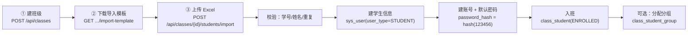

# P1 实施方案（待评审）：账户权限 / 教学组织 / 岗位技能 三域 CRUD

> 状态：**待评审，未开始编码**。评审通过后按第 6 节批次实施。
> 前置：P0 脚手架已交付（38 表模型、Schema、迁移、种子、健康检查、枚举字典接口）。

## 1. 目标与范围

### 1.1 本期要交付

1. `sys_user` 增加密码字段，默认密码 `123456`。
2. 三个域的 CRUD 接口：
   - **A 账户与权限**：用户、角色、权限点、用户-角色、角色-权限、系统配置
   - **B 教学组织**：班级、分组、在班学生、学生分组
   - **C 岗位与技能成长**：岗位、技能树、技能节点、节点依赖、岗位技能、成长规则、学生选岗、学生技能
3. 教师端建班导学链路：



4. 导入接口支持 **预览（dry-run）** 与 **正式导入** 两种模式，返回逐行结果。

### 1.2 本期不做（除非你另行确认）

- 登录 / JWT / 鉴权中间件（第 8 节问题 6）
- 实训项目域、闯关评审域、证书、知识库、通知
- 技能进度的**自动计算**（完成数 ÷ 关联项目总数）——依赖项目与提交数据，属 P2

## 2. 数据模型改动：给 `sys_user` 加密码

### 2.1 字段设计

| 项 | 方案 |
| --- | --- |
| 字段名 | `password_hash`（不建议叫 `password`，避免误存明文） |
| 类型 | `varchar(128)`，**可空**（空 = 从未设置密码，登录时拒绝） |
| 默认密码 | `123456`，哈希后写入；明文不落库 |
| 哈希算法 | `hashlib.pbkdf2_hmac('sha256', pwd, salt, 260_000)`，存 `pbkdf2_sha256$260000$<salt>$<hash>`；**不引入新依赖** |
| 默认值来源 | `settings.default_password = "123456"`（可被 `.env` 覆盖），不写死在业务代码里 |

为什么"可空"而不是 NOT NULL：SQLite 的 Alembic batch 模式改表要重建表再搬数据，非空列在没有库级默认值时无法迁移已有行。迁移里对存量行（admin）回填默认密码哈希，应用层创建用户时保证一定写入。

### 2.2 连带改动

| 文件 | 改动 |
| --- | --- |
| `app/models/account.py` | `SysUserBase` 之外的敏感字段：`password_hash` 只放在表模型 `SysUser` 上，**不进 `SysUserBase`**，避免出现在 Read/Create 公共 Schema 里 |
| `app/schemas/account.py` | `SysUserRead` 不含任何密码字段；新增 `PasswordResetIn`（新密码，可空=重置为默认） |
| `app/db/seed.py` | 管理员账号带默认密码哈希 |
| `alembic/versions/xxxx_add_user_password.py` | 新增列 + 回填存量行 |
| `docs/database_schema_draft.sql`、`docs/数据库表字段清单.md` | 同步补字段（**必须**，否则 `test_schema_parity` 会红） |
| `app/models/account.py` 的 `SysRole.password` | 建议删除（P0 里给 mock 登录预留的字段，现在密码归 `sys_user`，两处会打架） |

### 2.3 为什么要同步改文档

`tests/test_schema_parity.py` 会拿 ORM 去和 `docs/database_schema_draft.sql` 逐字段比对，字段名、可空性、索引、具名约束全都要对齐。只改模型不改 DDL 文档，测试直接失败。

## 3. 接口清单

统一约定（沿用 P0）：前缀 `/api`、驼峰转下划线、分页参数 `page`/`page_size`（默认 20，上限 200）、列表统一返回 `{items,total,page,page_size,pages}`、错误统一 `{code,message,detail}`、主数据表软删（`DELETE` = 打 `deleted_at`）。

### 3.1 A 账户与权限

| 方法 | 路径 | 说明 | 权限点 |
| --- | --- | --- | --- |
| GET | `/api/users` | 分页 + 筛选（`user_type`/`status`/`keyword`/`class_id`） | USER_MANAGE |
| POST | `/api/users` | 创建用户（自动写默认密码哈希） | USER_MANAGE |
| GET/PATCH/DELETE | `/api/users/{user_id}` | 详情 / 部分更新 / 软删 | USER_MANAGE |
| GET/POST/DELETE | `/api/users/{user_id}/roles` | 查角色 / 分配角色 / 解除 | ROLE_MANAGE |
| POST | `/api/users/{user_id}/password/reset` | 重置密码（默认或不填=123456） | USER_MANAGE |
| POST | `/api/users/password/reset-batch` | 按用户 ID 列表 / 按班级批量重置 | USER_MANAGE |
| GET/POST | `/api/roles` | 角色列表 / 新建 | ROLE_MANAGE |
| GET/PATCH/DELETE | `/api/roles/{role_id}` | 角色详情 / 更新 / 删除 | ROLE_MANAGE |
| GET/PUT | `/api/roles/{role_id}/permissions` | 查权限 / 覆盖式设置权限 | ROLE_MANAGE |
| GET/POST | `/api/permissions` | 权限点列表 / 新建 | ROLE_MANAGE |
| GET/PATCH/DELETE | `/api/permissions/{perm_id}` | 权限点详情 / 更新 / 删除 | ROLE_MANAGE |
| GET/POST | `/api/system-configs` | 配置列表 / 新建 | SYSTEM_CONFIG |
| GET/PATCH/DELETE | `/api/system-configs/{config_id}` | 配置详情 / 更新 / 删除 | SYSTEM_CONFIG |

### 3.2 B 教学组织

| 方法 | 路径 | 说明 | 权限点 |
| --- | --- | --- | --- |
| GET/POST | `/api/classes` | 班级分页（按负责教师/状态筛选）/ 新建班级 | CLASS_MANAGE |
| GET/PATCH/DELETE | `/api/classes/{class_id}` | 详情（含学生数、分组数）/ 更新 / 归档软删 | CLASS_MANAGE |
| GET/POST | `/api/classes/{class_id}/groups` | 分组列表 / 新建分组 | GROUP_MANAGE |
| PATCH/DELETE | `/api/groups/{group_id}` | 改分组名 / 删除分组 | GROUP_MANAGE |
| GET | `/api/classes/{class_id}/students` | 在班学生分页（含学生信息、分组） | CLASS_MANAGE |
| POST | `/api/classes/{class_id}/students` | 单个把学生加入班级（已有账号按学号复用） | CLASS_MANAGE |
| PATCH/DELETE | `/api/class-students/{id}` | 转班 / 离班（写 `left_at`，保留历史） | CLASS_MANAGE |
| PUT | `/api/class-students/{id}/group` | 分配 / 调整分组 | GROUP_MANAGE |
| POST | `/api/classes/{class_id}/students/import` | **Excel 导入**（`multipart/form-data`，含 `dry_run`） | CLASS_MANAGE |
| GET | `/api/classes/students/import-template` | 下载导入模板 xlsx | CLASS_MANAGE |
| GET/POST | `/api/groups/{group_id}/students` | 查看分组内学生 / 批量把学生加入分组 | GROUP_MANAGE |
| DELETE | `/api/groups/{group_id}/students/{class_student_id}` | 把学生移出分组 | GROUP_MANAGE |

### 3.3 C 岗位与技能成长

| 方法 | 路径 | 说明 | 权限点 |
| --- | --- | --- | --- |
| GET/POST | `/api/jobs` | 岗位分页（方向/等级/状态筛选）/ 新建 | JOB_MANAGE |
| GET/PATCH/DELETE | `/api/jobs/{job_id}` | 详情 / 更新 / 软删 | JOB_MANAGE |
| GET/PUT | `/api/jobs/{job_id}/skills` | 查岗位技能 / 覆盖式设置 | SKILL_MANAGE |
| POST/DELETE | `/api/jobs/{job_id}/skills/{skill_node_id}` | 单条增/删 | SKILL_MANAGE |
| GET/POST | `/api/skill-trees` | 技能树列表 / 新建 | SKILL_MANAGE |
| GET/PATCH/DELETE | `/api/skill-trees/{tree_id}` | 详情（含节点）/ 更新 / 软删 | SKILL_MANAGE |
| GET/POST | `/api/skill-trees/{tree_id}/nodes` | 节点列表 / 新建节点 | SKILL_MANAGE |
| GET/PATCH/DELETE | `/api/skill-nodes/{node_id}` | 节点详情 / 更新 / 软删 | SKILL_MANAGE |
| GET/PUT | `/api/skill-nodes/{node_id}/dependencies` | 查前置 / 覆盖式设置前置（DAG，自环直接拒） | SKILL_MANAGE |
| GET/POST | `/api/growth-rules` | 成长规则列表 / 新建 | GROWTH_RULE_MANAGE |
| GET/PATCH/DELETE | `/api/growth-rules/{rule_id}` | 详情 / 更新 / 删除 | GROWTH_RULE_MANAGE |
| GET/POST/DELETE | `/api/students/{student_id}/jobs` | 学生选岗 / 设主岗位（唯一主岗位）/ 取消 | JOB_MANAGE |
| GET | `/api/students/{student_id}/skills` | 学生技能进度（按技能树分组） | SKILL_MANAGE |
| PATCH | `/api/students/{student_id}/skills/{skill_id}` | 手工调整（`source=MANUAL`） | SKILL_MANAGE |
| GET | `/api/students/{student_id}/job-recommendations` | 岗位推荐（默认前三名，按技能匹配度倒序，技能点按体系分组） | 登录学生本人 |
| GET | `/api/students/{student_id}/skill-tree-progress` | 技能树总览（全部技能树与技能点 + 单树/整体进度与技能点统计） | 登录学生本人 |

两个推荐视图都是**只读派生**，口径与 `app/services/skill.py` 完全一致，不落库：

- **技能点进度**取 `student_skill.progress`（0~100，"完成项目数 ÷ 关联项目总数"×100，手工调整记 MANUAL）；
- **岗位匹配度** = 岗位关联技能点进度的**均值**；推荐排序：匹配度 → 已达 100% 的技能点数 → 岗位热度 → 岗位 ID；
  没关联技能点的岗位算不出匹配度，不参与推荐；岗位的关联项目 = `training_project.job_id` 指向该岗位且已发布（PUBLISHED）的项目；
- **技能树进度 / 整体进度** = 其下技能点进度的均值；`total_nodes` / `done_nodes` 是技能点总数与进度达 100% 的个数。

### 3.4 Excel 导入细则

- 模板列：`学号*`、`姓名*`、`专业`、`手机号`、`邮箱`（**不含分组序号**）
- 分组：教师流程为「建班 → 导名单 → 建分组 → 加学生」，导入阶段不分组；
  历史文件若带「分组序号」列仍兼容：分组已建就顺手分进去，没建则忽略并计入 `ignored_group_hints`
- 逐行校验：必填非空、学号在文件内不重复、`user_no` 不与其他用户冲突
- 冲突策略（评审确认）：**先整批校验，任何一处不通过就整批拒绝**并返回逐行原因，不做部分导入
- 事务策略：校验全部通过后才进入写入阶段，写入在同一个请求事务里完成
- 返回结构：

```json
{
  "dry_run": true,
  "class_id": 1,
  "total": 42,
  "created_users": 40,
  "reused_users": 2,
  "created_class_students": 40,
  "assigned_groups": 42
}
```

校验失败时返回 422，`detail` 里是逐行原因：

```json
{
  "code": "BUSINESS_RULE_VIOLATION",
  "message": "名单校验未通过，共 1 处问题，已全部撤回未导入",
  "detail": [{"row": 17, "user_no": "2026017", "reason": "学号 2026017 与第 5 行重复"}]
}
```

## 4. 分层落地（文件级）

延续 P0 的分层，每域四层同名，便于对照：

| 层 | 新增文件 | 说明 |
| --- | --- | --- |
| models | 改 `app/models/account.py` | 加 `password_hash` |
| schemas | 改 `app/schemas/account.py`、`organization.py`、`job_skill.py` | 补导入/重置密码/分配等入参出参 |
| crud | `app/crud/account.py`、`organization.py`、`job_skill.py` | 各域仓储，继承 `BaseRepository`，叠加带 join 的列表查询 |
| services | `app/services/password.py`、`student_import.py` | 密码哈希/校验/默认密码；Excel 解析 + 建号 + 入班编排（**新建 services 目录**，对应 P0 方案里预留的位置） |
| api | `app/api/endpoints/accounts.py`、`organization.py`、`job_skill.py` | 一个域一个文件，路由汇总在 `app/api/router.py` 注册三行 |
| deps | 改 `app/api/deps.py` | 可选：`require_perm("USER_MANAGE")` 依赖（见问题 6） |
| 迁移 | `alembic/versions/xxxx_add_user_password.py` | 加列 + 回填 |
| 测试 | `tests/test_crud_account.py`、`test_crud_organization.py`、`test_student_import.py`、`test_crud_job_skill.py` | 用内存 SQLite，导入用例用 openpyxl 现造 xlsx |

新依赖：`openpyxl`（读写 xlsx）、`python-multipart`（FastAPI 接文件上传），用 `uv add` 写入 `pyproject.toml`。

## 5. 交付批次与验证

| 批次 | 内容 | 验证方式 |
| --- | --- | --- |
| B0 | 密码字段 + 迁移 + DDL/字段清单文档同步 + 种子 | `pytest`、`alembic check`、`check_schema_parity`、`check_db` |
| B1 | 账户与权限 CRUD | 新增用例 + `ruff check` + curl 冒烟 |
| B2 | 教学组织 CRUD + Excel 导入 | 导入用例（正常/重复/缺列/坏文件）+ curl 上传真实 xlsx |
| B3 | 岗位与技能成长 CRUD | 依赖自环、主岗位唯一、岗位技能覆盖式更新用例 |
| B4 | 三域联调：建班 → 导学生 → 建账号 → 选岗 → 手工调技能 | 端到端脚本 + README 接口清单更新 |

每批结束跑 `uv run pytest` + `uv run ruff check .`，并给出"改了什么、怎么验证"的说明。

## 6. 影响面与风险

| 风险 | 说明 | 处理 |
| --- | --- | --- |
| 文档与模型不一致 | `test_schema_parity` 逐字段比对 DDL 文档 | B0 里同步改 `docs/database_schema_draft.sql` 与 `docs/数据库表字段清单.md` |
| 默认密码安全 | 全员 `123456` 且明文可推 | 只存哈希；建议增加"首次登录强制改密"标记（问题 5） |
| 既有数据迁移 | 存量 admin 无密码 | 迁移里回填默认密码哈希 |
| Excel 脏数据 | 学号重复、姓名缺失、分组不存在 | 两段式导入，先 `dry_run` 预览再落库 |
| 软删与唯一约束 | 学号唯一，软删后重建同号用户会冲突 | 学号冲突时给明确 409 文案，或提供"恢复已删用户"分支（问题 4） |
| 并发导入 | 同班级两人同时导入 | `class_student` 局部唯一索引（`status='ENROLLED'`）兜底，冲突转 409 |

## 7. 评审结论（已确认并落地）

| # | 决策点 | 结论 |
| --- | --- | --- |
| 1 | 密码字段与存储 | `password_hash` + PBKDF2-SHA256 哈希 |
| 2 | `sys_role.password` | 删除，密码统一归 `sys_user` |
| 3 | 新依赖 | 允许添加 `openpyxl`、`python-multipart` |
| 4 | 导入重复学号 | 先校验，有重复则整批拒绝并报错 |
| 5 | 默认密码 | 只做"新建时写入默认密码" |
| 6 | 鉴权 | 本期不做，纯 CRUD |
| 7 | 系统配置 CRUD | 一并交付 |
| 8 | 路由风格 | 一个域一个文件 + 资源嵌套路径 |

实施记录见 README 的「P1 交付范围」。
