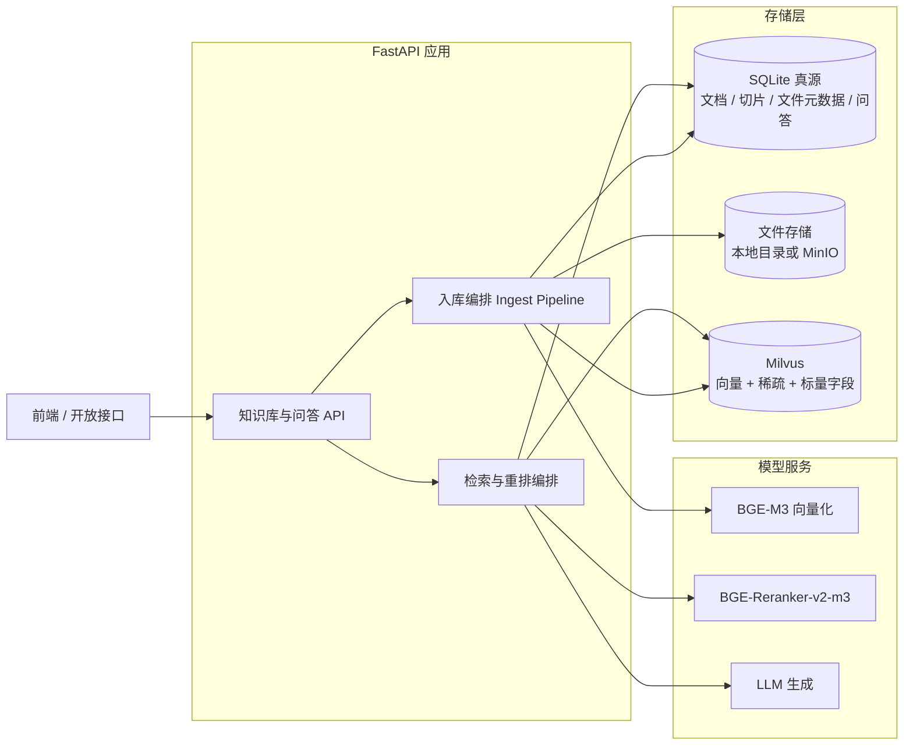

# RAG 知识库实施方案（BGE-M3 + BGE-Reranker-v2-m3 + Milvus + LangChain）

- 状态：**待评审**
- 日期：2026-09-11
- 关联：`docs/数据库表字段清单.md` §7 H 域、`app/models/knowledge.py`、`app/models/attempt.py`（`file_asset`）
- 结论：业务数据与文件元数据放 SQLite、向量放 Milvus 的分工**成立**，但必须补一条铁律——**SQLite 是唯一真源，Milvus 是可随时重建的派生索引**。

---

## 0. 结论先行（TL;DR）

1. **BGE-M3 的价值不只是 1024 维稠密向量**。它的 lexical weights（稀疏权重）可以直接塞进 Milvus 的 `SPARSE_FLOAT_VECTOR` 字段，与稠密向量做 hybrid search。中文技术文档里"专有名词、型号、编号、英文缩写"这类查询，稠密向量常漏，稀疏权重常中。建议一期就上 dense + sparse 双路，而不是先做 dense-only。
2. **8192 是模型上限，不是切片长度**。仍然要切片：建议 **700~1000 token/块、100~150 token 重叠、块首拼标题路径（breadcrumb）**。8192 留给表格、代码段、公式密集页这类"不能切"的场景。
3. **LangChain 只用在编排层**（Loader / Splitter / Prompt / LCEL / 流式 / Callback）。检索层用 **pymilvus 直连**，因为 hybrid search + RRFRanker + 标量过滤用原生 API 更可控；再用两个适配器（`BaseRetriever` / `BaseDocumentCompressor`）把原生检索接回 LangChain 即可。
4. **模型推理不要跑在 FastAPI 进程内**。一期先用独立进程加载权重（`pymilvus[model]` 或 FlagEmbedding），二期换 TEI / Xinference 暴露 HTTP 端点。理由：torch 会把 API 进程的内存和启动时间拖垮，且无法独立扩缩容。
5. **向量主键直接用 `knowledge_chunk.id`**（Int64），天然幂等，省掉一层映射表。

---

## 1. 范围

本方案覆盖三件事：

- 知识文档**入库链路**：解析 → 切片 → 向量化 → 写入 Milvus
- **检索问答链路**：混合检索 → 重排 → 生成 → 引用落库
- 支撑上述两条链路所需的**表结构微调、配置、脚本、里程碑与验收标准**

不覆盖：LLM 选型与提示词工程细节、前端交互、平台整体权限模型（仅说明检索侧如何配合过滤）。

---

## 2. 总体架构



主数据流：**文件 → 解析 → 切片 → SQLite 落 chunk（真源）→ 批量向量化 → Milvus upsert（派生）→ 检索时回 SQLite 校验与回填引用**。

---

## 3. 关键设计决策

### 3.1 存储分工：SQLite 真源 + Milvus 派生索引

| 数据 | 存放位置 | 理由 | 丢失后能否重建 |
| --- | --- | --- | --- |
| 文档元数据 `knowledge_doc` | SQLite | 事务、外键、与实训域 join | 不需要重建 |
| 切片正文 `knowledge_chunk.content` | SQLite | 同上，且是引用展示来源 | 不需要重建 |
| 会话 / 消息 / 引用 `ai_qa_*` | SQLite | 业务数据，量小 | 不需要重建 |
| 文件本体 | 本地目录（一期）/ MinIO（二期） | 大对象不进 DB | 需备份 |
| 稠密向量 / 稀疏权重 / 过滤字段副本 | Milvus | 检索性能 | **由 chunk 全量重建** |

配套三条规则：

1. **Milvus 允许删库重建**。提供 `scripts/reindex.py --all`，任何"疑似索引不一致"都用重建解决，**不做双向同步**、不做补偿事务。
2. **不做分布式事务**。先提交 SQLite，再写 Milvus；用 `chunk.index_status` 表达"待索引 / 已索引 / 失败"，失败可重试，`upsert` 保证幂等。
3. **检索时永远带状态过滤**（`status == "READY"`），避免索引滞后把已停用文档召回。

**SQLite 的适用边界**（什么时候该换 PostgreSQL）：单实例部署、写并发低，本平台完全符合。一旦要水平扩多个 API 实例、或写入 QPS 上百、或需要高可用，就应换 PG。因为代码走 SQLModel + Alembic，迁移成本主要在 SQLite 专有 PRAGMA 与部分索引，属可控范围。

### 3.2 稀疏检索：三条路线

这是本方案**最需要你拍板**的一个分叉。

| 路线 | 稀疏来源 | 检索质量 | 额外成本 | 建议 |
| --- | --- | --- | --- | --- |
| **A. BGE-M3 lexical weights** | 与稠密向量同一次前向输出 | 最好，中文术语/缩写友好 | 推理服务需支持 FlagEmbedding | **一期首选** |
| B. Milvus 内置 BM25 | Milvus 对正文字段自动计算 | 好，但依赖分词质量 | 无需额外服务，需在 Collection 定义 `Function` + `analyzer=chinese` | 备选 / 降级 |
| C. 仅稠密 + 重排 | 无 | 一般，精确关键词/编号类查询易漏 | 零 | 兜底 / 快速验证 |

实现上建议把稀疏来源做成配置开关（`SPARSE_MODE=m3|bm25|off`），Collection 里 `sparse` 字段两者复用同一字段名，便于后续切换对比。

### 3.3 8192 上下文怎么用

| 关注点 | 建议 |
| --- | --- |
| 常规正文 | 700~1000 token/块，重叠 100~150 token，硬上限 1500 |
| 表格 / 代码 / 公式密集页 | 允许单块 2000+ token 不切，靠重排器兜底 |
| 切分方式 | 结构优先（标题层级）→ 递归兜底，保留 heading_path / page_no |
| 块首 breadcrumb | 每块 embedding 前拼上标题路径（如 `第3章 模型训练 > 3.2 超参调优`），对中文技术文档召回提升明显 |
| 重排输入长度 | 支持 8k，但 cross-encoder 成本随长度上升，建议 pair 截断到 **1024**（长块 2048），不要吃满 |

注意：块太大 → 召回粒度粗、引用定位差、重排成本高；块太小 → 语义不完整、上下文割裂。上面的区间是起点，M5 阶段用金标集标定。

### 3.4 LangChain 用在哪、不用在哪

**用：**

- Loader 家族（PDF / docx / xlsx / markdown）+ 自定义 Loader，统一产出 `Document`，metadata 带 `doc_id / page_no / heading_path`
- `TextSplitter`（含结构感知切分的二次封装）
- `ChatPromptTemplate`、LCEL 组链、`astream` 做 SSE 流式
- `BaseRetriever`、`BaseDocumentCompressor` 适配器，包成 `ContextualCompressionRetriever`
- `langchain-openai` 对接 OpenAI 兼容端点的 LLM

**不用 / 慎用：**

- **不用 `langchain_milvus.Milvus` 做混合检索**。`MilvusCollectionHybridSearchRetriever` 在 community 包里、能力受限（自定义 filter、多路召回、RRF 参数不好控制）。直接用 pymilvus 写一个 60 行的检索函数，再包一层 `BaseRetriever`，可控性高得多。
- 不用 LangChain 的 `add_documents` 做入库主流程——它表达不了我们的状态机与幂等重试。
- 不用 LangChain 的 memory / 缓存持久化——会话我们已有 `ai_qa_message`。

### 3.5 Milvus 部署形态

| 形态 | 适用阶段 | 说明 |
| --- | --- | --- |
| Milvus Lite（pymilvus 内嵌，本地文件） | 本机开发 / 单测 | 免 Docker，但功能是子集，稀疏向量与别名支持需按锁定版本实测（见待确认项） |
| **Standalone（docker compose：etcd + minio + milvus）** | **一期联调 / 单机部署** | **推荐**，支持 hybrid search / BM25 函数 / partition key |
| Cluster（K8s + 消息队列） | 生产多副本 | 本平台规模（几十万~百万 chunk）用不上 |

Collection 命名：物理名 `knowledge_chunk_v1`，对外**别名** `knowledge_chunk`。换 embedding 模型或改切分策略时建 `_v2`，追平数据后原子切别名，实现不中断重建。

---

## 4. SQLite 表结构增量

现有 5 张表骨架够用，缺的是"索引状态"与"可重建性"的表达。以下为建议增量，命名沿用现有规范（`uk_ / idx_ / chk_`）。

### 4.1 `knowledge_doc` 增补

| 字段 | 类型 | 说明 |
| --- | --- | --- |
| content_sha256 | varchar(64) | 源文件/正文摘要，用于重复上传短路 |
| parse_error | text | 解析失败原因 |
| chunk_strategy | varchar(50) | 切分策略版本，如 `v1_structural_800` |
| embedding_model | varchar(100) | 如 `BAAI/bge-m3` |
| embedding_dim | int | 1024 |
| index_status | varchar(20) | `PENDING / INDEXING / INDEXED / PARTIAL / FAILED` |
| indexed_chunks | int | 已成功入 Milvus 的块数 |
| indexed_at | datetime | 索引完成时间 |
| index_error | text | 索引失败原因 |

> 关键点：把 `status`（业务可用性：PARSING/READY/FAILED/DISABLED）与 `index_status`（索引一致性）**拆成两个字段**。用一个字段表达两件事，后期必然打架——比如"文档可用但只索引了一半"就没法表达。

### 4.2 `knowledge_chunk` 增补

| 字段 | 类型 | 说明 |
| --- | --- | --- |
| token_count | int | 实际 token 数 |
| heading_path | varchar(512) | 块所属标题路径 |
| page_no | int | 来源页码 |
| embedding_model | varchar(100) | 允许按块记录版本，支持局部重建 |
| index_status | varchar(20) | `PENDING / INDEXED / FAILED / SKIPPED` |
| indexed_at | datetime | 入 Milvus 时间 |
| index_error | varchar(255) | 失败原因 |

新增索引：`idx_knowledge_chunk_doc_status (doc_id, index_status)`、`idx_knowledge_chunk_hash (content_hash)`。

### 4.3 关于 `vector_id`

字段清单里 `vector_id` 定义为"Milvus 主键（varchar(64)）"。建议**直接用 `knowledge_chunk.id`（Int64）做 Milvus 主键**，`vector_id` 保留但语义改为"索引指纹"，写 `knowledge_chunk_v1:123`（collection:pk），便于跨版本排查与回溯。

若你希望业务 ID 与向量主键解耦，也可保留 `f"{doc_id}-{chunk_index}"` 形式的字符串主键，但删除/更新的一致性逻辑要自己维护。一期建议前者。

### 4.4 建议新增一张表：`knowledge_ingest_job`

现有表没有地方表达"这个文档正在被解析/向量化到第几步、失败了几次"。这会让"上传接口秒回、后台慢慢索引、失败可重试"无法落地。

| 字段 | 类型 | 说明 |
| --- | --- | --- |
| id | int | PK |
| doc_id | int | FK → knowledge_doc.id |
| job_type | varchar(20) | `PARSE / EMBED / REINDEX / PURGE` |
| status | varchar(20) | `PENDING / RUNNING / SUCCEEDED / FAILED` |
| progress / total | int | 进度 |
| retry_count / max_retry | int | 重试控制 |
| error | text | 错误信息 |
| started_at / finished_at | datetime | 耗时统计 |
| created_at / updated_at | datetime | — |

索引：`idx_ingest_job_status (status, created_at)`、`idx_ingest_job_doc (doc_id)`。

### 4.5 `ai_qa_citation` 小改

已够用。建议补两个**调优期很值钱**的字段（可先建后不用）：

- `score_rerank numeric(6,4)`：重排分数
- `retrieval_debug`：`sa_type=JSON`，存 dense 分、sparse 分、RRF 分、召回排名

---

## 5. Milvus Collection 设计

### 5.1 字段

| 字段 | 类型 | 说明 |
| --- | --- | --- |
| pk | Int64 | = `knowledge_chunk.id`，主键 |
| doc_id | Int64 | 文档 ID，删除/过滤主力 |
| biz_type | VarChar(30) | 冗余自 doc，供权限过滤 |
| biz_id | Int64 | 同上 |
| chunk_index | Int32 | 切片序号 |
| status | VarChar(20) | `READY / DISABLED`，检索过滤用 |
| text | VarChar(65535) | 结果直出；走 BM25 路线时此字段同时作为 BM25 输入 |
| dense | FLOAT_VECTOR(1024) | BGE-M3 稠密向量（L2 归一化） |
| sparse | SPARSE_FLOAT_VECTOR | BGE-M3 lexical weights 或 Milvus BM25 |

### 5.2 索引

| 字段 | 索引类型 | 度量 | 参数 |
| --- | --- | --- | --- |
| dense | HNSW | COSINE | `M=16`、`efConstruction=200`，检索 `ef=64~128` |
| sparse | SPARSE_INVERTED_INDEX | IP | `drop_ratio_build=0.2` |

注意：BGE-M3 的稀疏权重非负，用 IP（内积）即可，不要用 COSINE。

### 5.3 混合检索调用形态

```python
from pymilvus import AnnSearchRequest, RRFRanker

FLT = f'doc_id in {doc_ids} and status == "READY"'  # 权限与状态在检索阶段过滤

req_dense = AnnSearchRequest(
    [q_dense], "dense",
    {"metric_type": "COSINE", "params": {"ef": 96}},
    limit=50, expr=FLT,
)
req_sparse = AnnSearchRequest(
    [q_sparse], "sparse",
    {"metric_type": "IP", "params": {"drop_ratio_search": 0.2}},
    limit=50, expr=FLT,
)

hits = client.hybrid_search(
    COLLECTION, [req_dense, req_sparse], RRFRanker(60),
    limit=40, output_fields=["doc_id", "chunk_index", "text", "status"],
)
```

### 5.4 其他约定

| 项 | 约定 |
| --- | --- |
| 一致性级别 | 写入后校验用 `Strong`；线上检索用 `Bounded`（默认）。"刚上传就能搜到"由入库完成回调保证，而非强一致 |
| 幂等写入 | `client.upsert()`，主键 = chunk_id，重跑不产生脏数据 |
| 删除 | `client.delete(expr=f"doc_id in [...]")`，放在 `PURGE` 任务里异步执行；SQLite 侧同步软删，检索兜底过滤 |
| 分区 | chunk 量级不到千万不用 partition key；真要分就按 `biz_type`，注意 Milvus Lite 未必支持 |
| 权限过滤 | 必须在检索 `expr` 里做，不能检索后再过滤——后者会直接掉召回 |
| 文本副本 | `text` 字段是 SQLite 的副本，只用于展示与 BM25；出现不一致以 SQLite 为准并触发重建 |

---

## 6. 链路细节

### 6.1 入库链路

1. 上传 → `file_asset` 落元数据 + 文件落盘（按 `sha256` 去重）
2. 建 `knowledge_doc(status=PARSING, index_status=PENDING)` + `ingest_job(PARSE)`
3. 解析：pypdf / python-docx / openpyxl / markdown → 纯文本 + 结构（标题层级、页码）
4. 切分：结构优先 + 递归兜底，产出 chunk 列表（带 `heading_path / page_no / token_count / content_hash`）
5. 落库：批量插入 `knowledge_chunk`；`content_hash` 与已有块比对，命中则跳过重算（增量更新关键）
6. 向量化：按 32~64 批量调 BGE-M3 → dense(1024, L2 归一化) + sparse(`dict[token_id → weight]`)
7. 写 Milvus：分批 `upsert`；成功后回填 `chunk.index_status=INDEXED`、`indexed_at`、`vector_id`
8. 收尾：`doc.index_status=INDEXED`、`status=READY`

**失败恢复**：任一步失败 → job 标 `FAILED` 并记 error；重试时只处理 `PENDING` 的 chunk，已 `INDEXED` 的不重算。

**SQLite 注意**：embedding 绝不能放在事务里跑。长事务会阻塞所有写入（SQLite 单写），正确做法是"短事务写 chunk → 出事务做推理 → 短事务回填状态"。

### 6.2 检索问答链路

1. 取用户问题（可选：LLM 改写/扩展；多 query 时各自检索再融合）
2. BGE-M3 `encode` → dense + sparse（**同一次前向**，不要分两次加载模型）
3. Milvus `hybrid_search` top 40~60，带权限与状态过滤
4. 去重、相邻块合并（可选）→ 裁剪到 `rerank_top_k = 30`
5. BGE-Reranker-v2-m3 打分（batch 16~32，`max_length=1024`），取 top 5~8
6. 阈值过滤：低于阈值（起点 0.3~0.35，需按数据标定）时回答"未找到依据"，不硬答
7. 组装 context：带编号 + 标题路径 + 出处，prompt 明确要求引用编号
8. LLM 流式生成 → 落 `ai_qa_message(ASSISTANT)` + 逐条落 `ai_qa_citation`

**延迟预算**（单卡 GPU 参考值）：

| 环节 | 目标 |
| --- | --- |
| 查询向量化（dense+sparse） | 20~50 ms |
| Milvus hybrid search | 10~30 ms |
| 重排 30 条 | 100~300 ms |
| 检索段合计（不含 LLM） | **< 500 ms** |

### 6.3 缓存策略

- 查询向量与重排结果：一期进程内 LRU，二期换 Redis
- 不缓存"问题 → 答案"：知识库会变，缓存答案会导致引用过期

---

## 7. 代码落点

```
app/
├─ core/
│  ├─ config.py          # 追加 Milvus / 模型 / 检索参数配置
│  └─ milvus.py          # MilvusClient 单例、健康检查
├─ services/
│  └─ rag/
│     ├─ loader.py       # 各格式文件 → Document（LangChain Loader 封装）
│     ├─ splitter.py     # 结构感知 + 递归切分 + breadcrumb 拼接
│     ├─ embedder.py     # BGE-M3 封装（dense + sparse，批量）
│     ├─ reranker.py     # BGE-Reranker-v2-m3 封装
│     ├─ indexer.py      # Milvus schema / upsert / delete / 全量重建
│     ├─ retriever.py    # 原生 hybrid 检索 + LangChain BaseRetriever 适配
│     ├─ pipeline.py     # 入库编排（状态机 + job 表 + 重试）
│     └─ qa_chain.py     # LCEL 链：检索 → 重排 → prompt → LLM → 引用
├─ api/endpoints/
│  ├─ knowledge.py       # 文档上传 / 列表 / 删除 / 重建
│  └─ qa.py              # 会话与提问（SSE 流式）
scripts/
├─ init_milvus.py        # 建 collection + index + alias（幂等）
├─ reindex.py            # 全量或按文档重建（--all / --doc-id）
├─ check_milvus.py       # 一致性体检：SQLite INDEXED 数 vs Milvus count
└─ eval_retrieval.py     # 离线评估 recall@k / MRR / nDCG
```

---

## 8. 接口设计（P1 之后）

| 方法 | 路径 | 说明 |
| --- | --- | --- |
| POST | `/api/knowledge/docs` | multipart 上传，秒回 `doc_id`，后台异步索引 |
| GET | `/api/knowledge/docs` | 分页列表（含索引状态） |
| DELETE | `/api/knowledge/docs/{id}` | 软删 + 异步清理向量 |
| POST | `/api/knowledge/docs/{id}/reindex` | 单文档重建 |
| GET | `/api/knowledge/jobs/{id}` | 索引进度轮询 |
| POST | `/api/qa/sessions` | 新建会话 |
| POST | `/api/qa/sessions/{id}/ask` | 提问，SSE 流式返回，含引用 |
| GET | `/api/qa/sessions/{id}/messages` | 历史消息 + 引用 |
| GET | `/api/health/milvus` | Milvus 连通性与集合统计 |

---

## 9. 依赖与配置

### 9.1 新增依赖

```
pymilvus>=2.5            # Milvus 客户端；pymilvus[model] 额外提供 BGEM3EmbeddingFunction / BGERerankFunction
langchain-core
langchain-text-splitters
langchain-community      # Loader 家族
langchain-openai         # LLM 走 OpenAI 兼容端点
FlagEmbedding>=1.3       # 直连 BGE-M3 / Reranker-v2-m3（会拉 torch + transformers）
pypdf python-docx openpyxl markdown beautifulsoup4
```

取舍：`FlagEmbedding` 更灵活、可控；`pymilvus[model]` 开箱即用（`BGEM3EmbeddingFunction` 直接返回 dense + sparse 字典，`BGERerankFunction` 直接可用），代价是抽象层稍厚。**一期建议 `pymilvus[model]` 快速跑通，二期按需下沉到 FlagEmbedding 自管**。

代价提醒：引入 torch 后镜像从 ~200MB 涨到 2GB+，CI 与本地安装时间都要重新评估。

### 9.2 配置项（`.env.example` 追加）

```
MILVUS_URI=http://127.0.0.1:19530     # 本地 Lite 用 ./data/milvus.db
MILVUS_COLLECTION_ALIAS=knowledge_chunk
MILVUS_COLLECTION_VERSION=v1
EMBEDDING_MODEL=BAAI/bge-m3
EMBEDDING_DEVICE=cuda                 # Apple Silicon 用 mps，无 GPU 用 cpu
EMBEDDING_BATCH_SIZE=32
SPARSE_MODE=m3                        # m3 | bm25 | off
RERANKER_MODEL=BAAI/bge-reranker-v2-m3
RERANKER_MAX_LENGTH=1024
RETRIEVE_TOP_K=50
RERANK_TOP_K=30
CONTEXT_TOP_N=6
RERANK_SCORE_THRESHOLD=0.3
CHUNK_SIZE_TOKENS=800
CHUNK_OVERLAP_TOKENS=120
MODEL_CACHE_DIR=./data/models
```

---

## 10. 里程碑与工作量

| 里程碑 | 内容 | 验收标准 | 预估 |
| --- | --- | --- | --- |
| M1 检索底座 | 起 Milvus 容器、`init_milvus` 建集合与索引、BGE-M3 封装、用 md/txt 跑通稠密检索 | 脚本能按 query 查回正确片段 | 1~2 天 |
| M2 混合检索 + 重排 | 接 sparse 路 + RRFRanker + BGE-Reranker-v2-m3；30 条问题的三方对比（dense / hybrid / hybrid+rerank） | hybrid+rerank 的 recall@5 显著优于 dense-only，对比表进 docs | 1~2 天 |
| M3 入库管线 | 解析器 + 切分 + chunk 落库 + 批量向量化 + Milvus upsert + 状态机与重试 + 一致性体检脚本 | 上传 10 份 PDF/docx 后 `doc.index_status=INDEXED`；`check_milvus` 数量一致；进程 kill 后重启能续跑 | 2~3 天 |
| M4 问答链路 | LCEL 链 + 流式输出 + 引用落库 + 会话接口 | 回答带可定位引用，`ai_qa_citation` 能反查到 chunk | 2 天 |
| M5 评估与调优 | 离线评估脚本 + 阈值与参数标定 + 性能压测 | 给出 recall@5 / nDCG@10 / p95 基线 | 1~2 天 |
| M6（可选）生产化 | 模型服务化（TEI / Xinference）、Milvus 持久化与备份、监控告警 | 压测通过、可平滑重建 | 2~3 天 |

合计约 **7~11 个工作日**（M1~M5，不含模型下载与 GPU 到位时间）。

---

## 11. 风险与待确认项

| # | 风险 / 待确认 | 应对 |
| --- | --- | --- |
| 1 | **Milvus Lite 是否支持稀疏向量与集合别名**，随版本变化 | 锁定版本实测；不支持则本地开发也用 docker compose standalone（8G 内存够） |
| 2 | 中文分词质量（仅走 BM25 路线时） | analyzer 用 `chinese`；这也是首选 BGE-M3 sparse 的原因 |
| 3 | 显存占用：BGE-M3 fp16 约 2.2GB + reranker 约 2.3GB | 同卡共存建议 ≥16GB；CPU / Apple Silicon 只作小批量验证 |
| 4 | 表格 / 公式 / 代码块是中文技术文档的主要召回杀手 | 单独抽成块类型，prompt 中标注类型 |
| 5 | SQLite 长事务阻塞写入 | 事务内只做 DB 操作，推理在事务外 |
| 6 | 换 embedding 模型后新旧向量不可混用 | Collection 版本号 + 别名原子切换，全量重建 |
| 7 | `flagembedding` / `transformers` 版本组合敏感 | 在 `pyproject.toml` 锁定版本，写进 `uv.lock` |
| 8 | 重排阈值 0.3 是经验起点 | M5 用金标集标定，不要直接上生产 |

---

## 12. 验收指标（建议基线）

| 维度 | 指标 | 目标 |
| --- | --- | --- |
| 检索 | recall@5（自建 50 题金标集） | ≥ 0.85 |
| 检索 | nDCG@10 | ≥ 0.75 |
| 回答 | 引用命中率（依据出现在 top-6 上下文中） | ≥ 0.9 |
| 回答 | 无依据时明确说"未找到" | 不允许编造 |
| 性能 | 检索段 p95（不含 LLM） | < 500 ms |
| 性能 | 100 页 PDF 入库（GPU） | < 3 分钟 |
| 一致性 | `check_milvus` 差异 | 0 |
| 可用性 | 任一时刻可从 SQLite 全量重建索引 | 通过 |

---

## 13. 需要你拍板的三个点

1. **稀疏检索走哪条路线**：A（BGE-M3 lexical，质量最好、需要 FlagEmbedding 服务）/ B（Milvus BM25，最省事）/ C（先只做稠密）。
2. **Milvus 本地开发形态**：Milvus Lite（免 Docker，功能子集）还是 docker compose standalone（功能完整）。
3. **推理服务形态**：一期进程内直载（简单、启动慢）还是直接上 HTTP 模型服务（重、但可独立扩缩容）。

这三点定了，M1 可以立刻开工。
