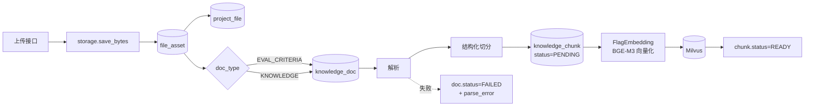

# RAG 系统实施方案（BGE-M3 + Milvus + LangChain + DeepSeek）

- 状态：**待评审**
- 日期：2026-09-14
- 本文替代：[RAG知识库实施方案-BGE-M3-Milvus.md](RAG知识库实施方案-BGE-M3-Milvus.md)、[知识入库与切片实施方案.md](知识入库与切片实施方案.md)
- 相对前两版的调整：模型配置统一收进 `system_config`；归属字段 `biz_type`/`biz_id` **删除**不用；`knowledge_doc` 只加一列 `doc_type`

---

## 0. 先看这条：API Key 的处理

**1. 请轮换一把新的 key。** 明文 key 一旦出现在聊天记录、工单、截图里，就应当视为已泄露——这不是流程洁癖，是成本最低的止损动作。

**2. 本方案不把 key 写进任何文件。** 不写进 `.env.example`、不写进文档、不写进代码、不提交 git。key 的唯一归属地是 `system_config` 表。

**3. 存进去之后必须挡住两个出口：**

| 出口 | 风险 | 处置 |
| --- | --- | --- |
| `GET /api/system-configs`、`GET /api/system-configs/{id}` | 现在会把 `config_value` 原样返回，key 直接裸奔 | 读取时对密钥字段**掩码**（返回 `sk-****27cf`），只有服务端内部取值时才拿明文 |
| SQLite 文件本身 | 谁能读到 `data/app.db` 谁就能拿到 key | 可选加密（见 2.4）。至少保证 `.env` 里的 `CONFIG_SECRET_KEY` 与 db 文件分开存放 |

掩码是**必做项**，加密是**可选项**——先说清楚：只要 API 接口不吐明文，内部部署下明文存库的风险是可接受的；真正的边界是"谁能登录管理端"和"谁能上服务器"。

---

## 1. 技术选型（定稿）

| 能力 | 选型 | 说明 |
| --- | --- | --- |
| 向量嵌入 | **FlagEmbedding + BAAI/bge-m3** | 多语言，1024 维稠密 + lexical weights 稀疏，单次最长 8192 token |
| 重排序 | **FlagEmbedding + BAAI/bge-reranker-v2-m3** | cross-encoder，主模型侧排序（二期启用） |
| 向量数据库 | **Milvus** | 稠密 + 稀疏混合检索，标量字段过滤 |
| RAG 框架 | **LangChain（Python）** | 只用在编排层：Loader / Splitter / Prompt / Chain / Callback |
| 主模型 | **deepseek-v4-flash**（OpenAI 兼容 API） | 经 `langchain-openai` 调用，base_url 指向服务地址 |
| 业务库 | **SQLite** | 业务数据、文件元数据、知识文档与切片正文 |
| 配置中心 | **`system_config` 表** | 模型 / key / Milvus / 检索参数全部走这里，支持热切换 |

**分工铁律**：SQLite 是唯一真源，Milvus 是可随时重建的派生索引。任何"只在 Milvus 里"的数据都必须能由 SQLite 重新生成。

**LangChain 的边界**：只用于编排。检索层用 pymilvus 直连——混合检索（dense + sparse + RRFRanker + 标量过滤）用原生 API 更可控，LangChain 的 `MilvusCollectionHybridSearchRetriever` 覆盖不到全部能力。用 `BaseRetriever` / `BaseDocumentCompressor` 两个适配器把原生检索接回 LangChain 即可。

---

## 2. 配置中心：`system_config`

### 2.1 为什么用表而不是 `.env`

`.env` 的问题是**改一次要重启服务**，而且导出配置要靠登录服务器。你的需求是"支持后续模型更换和 api key 切换"，这要求**运行时可改、改完即生效**，所以放表里是对的。

但要注意一个副作用：配置进了 DB，就不再受 git 保护和代码评审约束了，改错了没人知道。所以配套要有：改配置的人记录在 `updated_by`、变更留痕、以及一个"测试连接"接口。

### 2.2 配置键设计

沿用现有 `config_key` + `config_value`（JSON）结构，新增一组 `ai.*` / `rag.*`：

```
ai.embedding
{
  "provider": "flagembedding",
  "model": "BAAI/bge-m3",
  "model_path": "",                  // 留空按 model 下载；离线部署填本地绝对路径
  "device": "cuda",                  // cuda / mps / cpu
  "batch_size": 32,
  "max_length": 8192,
  "normalize": true,
  "dim": 1024,
  "version": "bge-m3-v1"             // 写进 collection 版本，换模型必须换版本
}

ai.reranker
{
  "provider": "flagembedding",
  "model": "BAAI/bge-reranker-v2-m3",
  "model_path": "",
  "device": "cuda",
  "batch_size": 16,
  "max_length": 1024
}

ai.llm
{
  "provider": "openai-compatible",
  "base_url": "https://<deepseek 服务地址>/v1",
  "model": "deepseek-v4-flash",
  "api_key": "",                     // 只在这里存；接口读取一律掩码
  "temperature": 0.2,
  "timeout": 60,
  "max_tokens": 4096
}

rag.vector_store
{
  "provider": "milvus",
  "uri": "http://127.0.0.1:19530",
  "collection_alias": "knowledge_chunk",
  "collection_version": "v1",
  "metric": "COSINE",
  "index": "HNSW",
  "consistency": "Bounded"
}

rag.retrieval
{
  "retrieve_top_k": 50,
  "rerank_top_k": 30,
  "context_top_n": 6,
  "score_threshold": 0.3,
  "rrf_k": 60
}
```

### 2.3 与现有配置项的关系

种子里已经有两组模型配置，不能放着不管，否则会出现"两处都写着模型名、不知道读哪个"：

| 现有配置 | 处置 |
| --- | --- |
| `review.ai` = `{model: IndustryGPT, fallback: DeepSeek V4 Pro, pass_score: 60}` | **拆分**：模型部分迁到 `ai.llm`；`pass_score` 迁到新的 `review.grading` |
| `qa.limits` = `{model: Kimi 2.6, context_rounds: 3, retention_days: 7}` | 模型部分迁到 `ai.llm`；`context_rounds` / `retention_days` **保留**（这是业务限制，不是模型配置） |
| 新增 | `review.grading` = `{pass_score: 60, auto_pass: true, criteria_doc_required: true}` |

迁移时把旧键删掉，避免有人改错地方。种子里放**不含密钥**的默认值，key 由管理员通过接口填。

### 2.4 读取、缓存与密钥

**读取路径**：新增 `app/services/settings_store.py`，对外只暴露 `get_ai_llm()` / `get_embedding_config()` / `get_milvus_config()` 这类**带类型的取值函数**，业务代码不直接碰 `config_value` 字典。这样键名改了只改一个地方。

**缓存**：配置读一次就缓存（进程内，TTL 60 秒），在 `/system-configs` 的更新/删除接口里显式 `invalidate()`。不缓存的话每个请求都要查一次库。

**掩码**：`SystemConfigRead` 输出前，对 `api_key` / `secret` / `token` 这类键名做递归替换，值替换成 `sk-****` + 后 4 位。**在 model 转 schema 这一层统一做**，不要指望每个接口自己记得。

**可选加密**：`ai.llm.api_key` 落库前用 `cryptography.Fernet` 加密，密钥来自环境变量 `CONFIG_SECRET_KEY`（放 `.env`，不进 git）。代价是多一个依赖和一处密钥管理；收益是 db 文件泄露时 key 不直接可用。建议二期做，一期先把掩码落地。

---

## 3. 数据模型

### 3.1 只动 2 张表

**`knowledge_doc`**

| 动作 | 字段 | 说明 |
| --- | --- | --- |
| **删** | `biz_type` | 一个字段扛"用途 + 归属"两个维度，评分标准一进来就错位 |
| **删** | `biz_id` | 同上 |
| **加** | `doc_type` varchar(20) NOT NULL | `KNOWLEDGE` AI 问答走这个 / `EVAL_CRITERIA` 评分走这个 |
| **加** | `parse_error` text 可空 | 解析或切片失败的原因 |
| 加 | `chunk_strategy` varchar(50) 可空 | 切分策略版本，换策略时识别旧数据 |
| 加 | `idx_knowledge_doc_file_asset (file_asset_id)` | 支撑"项目 → 附件 → 文件 → 知识文档"这条链 |

**`knowledge_chunk`**

| 动作 | 字段 | 说明 |
| --- | --- | --- |
| **加** | `heading_path` varchar(512) 可空 | 结构化切分产物，引用展示要用 |
| **加** | `page_no` int 可空 | PDF 来源定位 |
| 加 | `token_count` int 可空 | 一期留空，接入模型后用真实 tokenizer 回填 |

### 3.2 归属通过附件表表达，不在 `knowledge_doc` 上重复

评分标准上传后本来就挂在项目上（`project_file.project_id`），归属信息已经有了。再在 `knowledge_doc` 上存一份 `owner_type`/`owner_id` 就是同一件事写两遍，还会不一致。

批改取某个项目的评分标准：

```
project_id → project_file(file_kind=SCORING_CRITERIA) → file_asset_id → knowledge_doc(doc_type=EVAL_CRITERIA)
```

岗位知识一期不做归属（需求里岗位管理页还没有资料区）；将来要按岗位组织或隔离时，加一张 `job_file`（与 `project_file` 同构），**纯增量，不动现有字段**，而且天然支持一份资料挂多个岗位。

### 3.3 枚举改动（不动表结构）

| 枚举 | 改动 |
| --- | --- |
| `ProjectFileKind` | 加 `SCORING_CRITERIA` 评分标准 |
| `FileBizType` | 与 `ProjectFileKind` 对齐（补 `REPORT_TEMPLATE` / `DATASET` / `GUIDE`） |
| `KnowledgeChunkStatus` | 加 `PENDING` 已切片待入库；`READY` 含义明确为"已写入 Milvus" |
| `KnowledgeDocStatus` | 不改 |
| `KnowledgeBizType` | **整个删除** |
| 新增 `KnowledgeDocType` | `KNOWLEDGE` / `EVAL_CRITERIA` |

这些只是代码与 `/api/enums` 输出的变化，落库仍是 `varchar`。

---

## 4. 入库与切片

### 4.1 流程



入库失败不影响上传成功——文件照常落存储、附件照常挂项目，只是 `knowledge_doc.status=FAILED` 并记原因。

### 4.2 解析

| 格式 | 库 | 依赖状态 |
| --- | --- | --- |
| `.md` / `.txt` / `.csv` | 内置 | 已有 |
| `.docx` | `python-docx` | 新增 |
| `.pdf` | `pypdf` | 新增 |
| `.xlsx` | `openpyxl` | 已有 |

统一产出 `ParsedDocument(blocks=[ParsedBlock(heading_path, page_no, text)])`。不支持的扩展名**明确失败并给出原因**，不静默跳过。

### 4.3 切片

纯 Python 实现，结构优先：

1. 按 `heading_path` 分组形成语义段
2. 段内按空行/句末聚合到目标长度
3. 超长单段按句切分，仍超长则按硬上限强制切
4. 相邻块保留重叠
5. 每块 `content` 前置 `heading_path`，正文保留
6. `content_hash = sha256(归一化正文)`

| 配置项 | 默认 | 说明 |
| --- | --- | --- |
| `knowledge_chunk_size_chars` | 800 | 目标块长（字符） |
| `knowledge_chunk_overlap_chars` | 120 | 相邻块重叠 |
| `knowledge_max_chunk_chars` | 20000 | 硬上限 |

**硬上限为什么是 20000**：Milvus 的 `VarChar` 上限是 65535 **字节**，中文 UTF-8 一字 3 字节，约 2.1 万汉字。在切片阶段卡住，比写向量库时才失败好。

**为什么一期按字符不按 token**：算准 token 要加载 XLM-R 词表（就是 torch 那套）。一期不接模型就没必要引入。`token_count` 字段先建好留空，接入 BGE-M3 时用真实 tokenizer 回填。

### 4.4 事务

解析与向量化都是 CPU/GPU 工作，**绝不能放在数据库事务里**——SQLite 单写，长事务会阻塞所有写入。顺序：

1. 短事务：建 `knowledge_doc(PARSING)`
2. 事务外：读文件 → 解析 → 切片
3. 事务外：批量向量化
4. 短事务：批量插 chunk、写 Milvus 回填、更新 doc 状态

---

## 5. 向量化与 Milvus

### 5.1 BGE-M3 封装

```python
from FlagEmbedding import BGEM3FlagModel

model = BGEM3FlagModel(model_path or model_name, use_fp16=True)
out = model.encode(
    texts,
    batch_size=cfg["batch_size"],
    max_length=cfg["max_length"],
    return_dense=True,
    return_sparse=True,
    return_colbert_vecs=False,     # colbert 多向量先不开，存储开销大
)
# out["dense_vecs"]        -> (n, 1024) 已归一化
# out["lexical_weights"]   -> list[dict[token_id, weight]]
```

要点：

- **dense 与 sparse 一次前向同时拿到**，不要分两次调用
- 稀疏权重是 `{token_id: weight}`，写 Milvus 前转成 `{index: value}` 形式
- 模型实例**进程内单例**，用 `lru_cache` 或模块级变量持有；每次请求重新加载模型会慢到不可用
- `device` 从 `ai.embedding.device` 读；macOS 用 `mps`，无 GPU 用 `cpu`（仅小批量验证）

### 5.2 Milvus Collection

| 字段 | 类型 | 说明 |
| --- | --- | --- |
| `pk` | Int64 | = `knowledge_chunk.id`，天然幂等 |
| `doc_id` | Int64 | 文档 ID |
| `doc_type` | VarChar(20) | 冗余，检索阶段过滤 |
| `chunk_index` | Int32 | 切片序号 |
| `status` | VarChar(20) | 冗余，检索过滤 |
| `text` | VarChar(65535) | 结果直出 |
| `dense` | FLOAT_VECTOR(1024) | BGE-M3 稠密向量 |
| `sparse` | SPARSE_FLOAT_VECTOR | BGE-M3 lexical weights |

| 索引 | 类型 | 度量 | 参数 |
| --- | --- | --- | --- |
| `dense` | HNSW | COSINE | `M=16`、`efConstruction=200`，检索 `ef=96` |
| `sparse` | SPARSE_INVERTED_INDEX | IP | `drop_ratio_build=0.2` |

Collection 物理名 `knowledge_chunk_v1`，对外**别名** `knowledge_chunk`。换 embedding 模型时建 `_v2`，追平后原子切别名，不中断服务。

### 5.3 混合检索

```python
from pymilvus import AnnSearchRequest, RRFRanker

FLT = f'doc_id in {doc_ids} and status == "READY"'
req_dense = AnnSearchRequest([q_dense], "dense",
    {"metric_type": "COSINE", "params": {"ef": 96}}, limit=50, expr=FLT)
req_sparse = AnnSearchRequest([q_sparse], "sparse",
    {"metric_type": "IP", "params": {"drop_ratio_search": 0.2}}, limit=50, expr=FLT)
hits = client.hybrid_search(COLL, [req_dense, req_sparse], RRFRanker(60),
    limit=40, output_fields=["doc_id", "chunk_index", "text", "doc_type"])
```

**权限过滤必须在检索阶段完成**，不能检索后再筛——后者会掉召回。

### 5.4 LangChain 接在哪

| 层 | 用什么 |
| --- | --- |
| 文档加载 | LangChain Loader 家族 + 自定义 Loader（或直接用 4.2 的解析器，产出 `Document`） |
| 切分 | 自己的 `splitter.py`（LangChain 的 splitter 满足不了结构感知 + breadcrumb） |
| 检索 | **pymilvus 原生**，包一层 `BaseRetriever` |
| 重排 | **FlagEmbedding 原生**，包一层 `BaseDocumentCompressor`，串进 `ContextualCompressionRetriever` |
| 生成 | `langchain-openai` 的 `ChatOpenAI`，`base_url` 指向 deepseek 服务 |
| 流式 | LCEL `astream` → SSE |

一句话：**LangChain 负责串起来，检索和重排保持原生**。

---

## 6. 检索链路

### 6.1 学生问答（`doc_type=KNOWLEDGE`）

1. 取问题（可选 LLM 改写）
2. BGE-M3 编码 → dense + sparse
3. Milvus hybrid search top 50，过滤 `doc_type=KNOWLEDGE` + 可见 `doc_id` 白名单 + `status=READY`
4. 去重 → 裁剪到 30
5. BGE-Reranker-v2-m3 打分 → 取 top 6
6. 低于阈值（默认 0.3）回答"未找到依据"，不硬答
7. 组装 context（带编号 + 标题路径）→ deepseek-v4-flash 流式生成
8. 引用落 `ai_qa_citation`

**可见范围怎么算**：先在 SQLite 查出该学生可见的 `doc_id` 列表，再传给 Milvus 做 `doc_id in [...]` 过滤。把权限逻辑写在 Milvus 表达式里又长又难维护。

### 6.2 评分（`doc_type=EVAL_CRITERIA`）

1. 由 `project_id` 找到评分标准文档（3.2 那条链），范围通常就 1~2 份
2. 用学生作答内容作为 query 检索标准片段——**检索在这里的作用不是"从海量文档里找"，而是"在长标准文件里精确定位与当前作答维度相关的片段"**
3. 拼 prompt：评分维度 + 命中标准 + 学生作答 → deepseek-v4-flash 打分
4. 结果写 `review_record`，`criteria_doc_id` 记录用了哪一版标准

**隔离**：评分入口是后端内部函数，学生端没有任何路径能调到 `doc_type=EVAL_CRITERIA`。这是第二道防线；真正的边界在 API 层。

### 6.3 延迟预算（单卡 GPU 参考）

| 环节 | 目标 |
| --- | --- |
| 查询编码（dense+sparse） | 20~50 ms |
| Milvus hybrid search | 10~30 ms |
| 重排 30 条 | 100~300 ms |
| 检索段合计（不含 LLM） | < 500 ms |

需求书里的 P95 ≤ 500ms 只约束"非大模型 API 功能的接口"，检索段按上表控制即可。

---

## 7. 接口

### 7.1 配置（改造现有）

| 方法 | 路径 | 改动 |
| --- | --- | --- |
| GET | `/api/system-configs` | **密钥掩码**（必做） |
| GET | `/api/system-configs/{id}` | 同上 |
| PATCH | `/api/system-configs/{id}` | 更新后清配置缓存 |
| POST | `/api/system-configs/{id}/test` | **新增**：测试连通性（调一次 LLM / 连一次 Milvus），避免改完配置不知道对不对 |

### 7.2 入库（一期）

| 方法 | 路径 | 说明 |
| --- | --- | --- |
| POST | `/api/projects/{id}/files/upload` | **改造**：`file_kind=SCORING_CRITERIA` 时同时建 `knowledge_doc(doc_type=EVAL_CRITERIA)` 并切片；返回体带 `knowledge_doc_id` |
| GET | `/api/knowledge/docs` | 文档分页列表，按 `doc_type` / `status` 过滤 |
| GET | `/api/knowledge/docs/{id}` | 详情（状态、块数、解析错误） |
| GET | `/api/knowledge/docs/{id}/chunks` | 切片列表，验收切分质量用 |
| POST | `/api/knowledge/docs/{id}/reparse` | 重新切片（幂等重建） |
| DELETE | `/api/knowledge/docs/{id}` | 停用 |
| POST | `/api/jobs/{job_id}/knowledge/docs/upload` | **预留**：岗位知识入库，`doc_type=KNOWLEDGE` |
| GET | `/api/jobs/{job_id}/knowledge/docs` | 该岗位的知识文档列表 |

### 7.3 向量与问答（二期）

| 方法 | 路径 | 说明 |
| --- | --- | --- |
| POST | `/api/knowledge/docs/{id}/embed` | 单文档向量化并写入 Milvus |
| GET | `/api/health/milvus` | Milvus 连通性与集合统计 |
| POST | `/api/qa/sessions` | 新建会话 |
| POST | `/api/qa/sessions/{id}/ask` | 提问，SSE 流式，带引用 |
| GET | `/api/qa/sessions/{id}/messages` | 历史消息与引用 |

---

## 8. 依赖

### 8.1 Python 包

```
# 一期（入库与切片）
python-docx>=1.1.2
pypdf>=5.1

# 二期（向量化与检索）
FlagEmbedding>=1.3          # 会连带安装 torch + transformers，镜像体积会显著上涨
pymilvus>=2.5
langchain-core
langchain-community
langchain-openai
```

**一期刻意不装二期那组**。`FlagEmbedding` 会拉 torch，镜像从 ~200MB 涨到 2GB+，CI 与本地安装时间都要重新评估。一期先不引入，等 GPU 环境就位再装。

### 8.2 需要新增的配置项（`.env` / `system_config`）

`.env` 只放**引导性**配置（连不上库时也要能启动）：

```
# 配置解密密钥（若启用加密），不进 git
CONFIG_SECRET_KEY=

# 上传与存储（已有）
STORAGE_BACKEND=local
UPLOAD_DIR=
MAX_UPLOAD_MB=50

# 知识切片（单位：字符）
KNOWLEDGE_CHUNK_SIZE_CHARS=800
KNOWLEDGE_CHUNK_OVERLAP_CHARS=120
KNOWLEDGE_MAX_CHUNK_CHARS=20000
```

模型、api key、Milvus、检索参数**全部走 `system_config`**，不写 `.env`。

---

## 9. 分期与里程碑

| 阶段 | 内容 | 验收 | 预估 |
| --- | --- | --- | --- |
| **P0 模型与迁移** | 枚举增删改、`knowledge_doc` / `knowledge_chunk` 字段与索引、Alembic 迁移、字段清单同步 | `alembic check` 无差异、`check_schema_parity` 通过、表数仍为 39 | 0.5 天 |
| **P1 配置中心** | `ai.*` / `rag.*` 配置键、`settings_store.py`、种子数据迁移（拆 `review.ai`）、**密钥掩码**、连通性测试接口 | `/api/system-configs` 不返回明文 key；改配置后无需重启即生效 | 1 天 |
| **P2 解析与切分** | `parser.py` / `splitter.py` + 纯函数单测 | 六种格式可解析；超长 / 空文件 / 不支持格式均返回明确结果 | 1 天 |
| **P3 项目评分标准入库** | 上传接口加 `SCORING_CRITERIA` + 入库编排 + 知识文档四个接口 | 上传评分标准后 `knowledge_doc` / `knowledge_chunk` 数据正确，失败可重试 | 1 天 |
| **P4 岗位知识入库（预留）** | 岗位维度 scope + 三个接口 | 与项目侧行为一致，`doc_type=KNOWLEDGE` | 0.5 天 |
| **P5 测试与文档** | 集成测试、README、一致性脚本 | 全量测试与 lint 通过 | 0.5 天 |
| — | **一期合计** | | **4.5 天** |
| **P6 向量化与 Milvus** | FlagEmbedding 封装、Collection 初始化、批量写入、`reindex.py`、`check_milvus.py` | 切片状态从 `PENDING` 推进到 `READY`；可从 SQLite 全量重建 | 2~3 天 |
| **P7 检索与问答** | 混合检索 + 重排 + LCEL 链 + SSE + 引用落库 | 回答带可定位引用 | 2~3 天 |
| **P8 评分链路** | 评价知识库检索 + 打分 prompt + `review_record` 落库 | AI 评审结果可追溯到具体标准片段 | 2 天 |
| **P9 评估调优** | 金标集、recall@5 / nDCG@10、阈值标定 | 给出检索与性能基线 | 1~2 天 |

---

## 10. 风险与待确认

| # | 事项 | 处置 / 建议 |
| --- | --- | --- |
| 1 | **API key 已明文外露** | **先轮换**，再写入 `system_config`；读取接口一律掩码 |
| 2 | `deepseek-v4-flash` 的实际 base_url 与模型名 | 待你提供；配置项已按 OpenAI 兼容格式预留，改配置即可 |
| 3 | 显存：BGE-M3 fp16 约 2.2GB + Reranker 约 2.3GB | 同卡共存建议 ≥16GB；CPU / Apple Silicon 只作小批量验证 |
| 4 | `FlagEmbedding` / `transformers` 版本组合敏感 | 在 `pyproject.toml` 锁版本并写进 `uv.lock` |
| 5 | Milvus Lite 是否支持稀疏向量与集合别名 | 按锁定版本实测；不支持则本地开发也用 docker compose standalone |
| 6 | 换 embedding 模型后新旧向量不可混用 | Collection 版本号 + 别名原子切换，全量重建 |
| 7 | 评分标准改版后历史分数无法解释 | 二期给 `review_record` 加 `criteria_doc_id`，钉住批改时用的版本 |
| 8 | 配置进 DB 后脱离 git 评审 | `updated_by` 留痕 + 变更日志 + 连通性测试接口 |
| 9 | 切片阈值 0.3、块长 800 都是经验起点 | P9 用金标集标定，不要直接上生产 |

---

## 11. 马上可以开工的部分

P0~P5（一期，4.5 天）**不依赖 GPU、不依赖 Milvus、不依赖 deepseek 服务**，只依赖已经就绪的 SQLite 与本地文件存储。也就是说：

- 评分标准上传、岗位知识入库、解析、切片、状态流转——现在就能做完并测试
- 模型配置中心（含掩码）也能同步做完，等 key 轮换后填入即可
- 二期的 P6 只是在 `ingest.py` 末尾追加一步，**表结构不用再改**

这正是把 `doc_type`、`PENDING` 状态、配置中心一次性做对的价值。
