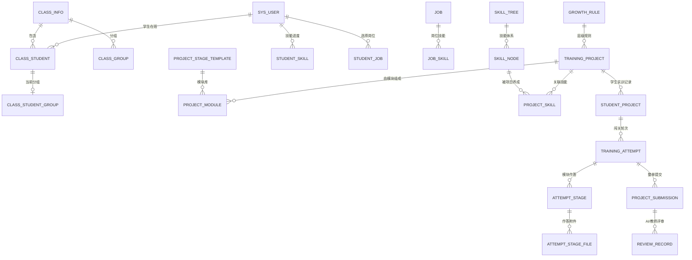

# 岗位闯关式实训平台 · 数据库表架构设计（v0.3-P0 单学院）

- 依据文档：`docs/岗位闯关式实训平台-需求确认书0706.docx`（V1.0，REQ-2026-001）
- 范围：服务对象为单个学院；只保留 P0 所需表
- 版本：v0.3（按新一轮评审意见重构）
- 日期：2026-09-10
- 目标库：PostgreSQL 15+（配套 Redis / MinIO / Milvus / RabbitMQ）
- 配套文件：
  - `docs/database_schema_draft.sql`：PostgreSQL DDL（38 张表）
  - `docs/数据库表字段清单.md`：逐字段数据字典（由 DDL 自动生成）

---

## 1. 本版改动（相对 v0.2）

| 类别 | 改动 |
| --- | --- |
| 账户权限 | `sys_role` 去掉 `data_scope`、`remark`，新增 `password`（mock 预留）；`sys_permission` 去掉树形结构（`parent_id`）与 `sort_no`；`sys_user_role` 去掉 `source` |
| 简化字段 | `class_group` 去掉 `capacity`、`sort_no`；`job`、`skill_tree`、`skill_node`、`skill_node_dependency`、`project_skill` 去掉 `sort_no` |
| 岗位技能 | `job_skill` 去掉 `required_level`、`weight`、`sort_no`（岗位推荐改为按学生技能进度计算） |
| 实训项目 | `difficulty` 改为数字 1~5；去掉 `cover_url`、`last_publisher_id`；`pass_score` 不再放项目上，统一由 `growth_rule` 按层级设置 |
| 项目组成 | 原 `project_stage` 重构为 `project_module`：项目 = 从模块库中挑选模块组装，一条记录代表项目中的一个模块 |
| 闯关方式 | 取消“单关提交/单关评审”，改为**全部模块填写完成后整单提交**；提交后可撤回再改 |
| 项目可见性 | 教师发布的实训项目**所有学生可见**；学生点击“开始闯关”时才生成 `student_project`（不再由教师导入名单生成） |
| 模块组成 | 模块可少于 7 个，也可自定义新模块，数量不限 |
| 删除表 | 任务下发 `publish_task / publish_task_target / publish_task_project`、评审维度 `review_dimension`、积分称号 `point_rule / point_log / title_def / student_title`、单关提交 `stage_submission / stage_submission_file`、`review_dimension_score`、`project_completion_rule` |
| 新增表 | `project_module`（项目模块组成）、`attempt_stage_file`（模块作答附件）、`project_submission`（整单提交） |

表数量：47 → **38 张**。

---

## 2. 存储边界

| 组件 | 承担职责 | 与表的关系 |
| --- | --- | --- |
| PostgreSQL（主库） | P0 全部业务事务数据 | 唯一业务数据源 |
| Redis 7 | SSO 临时 Key、会话、缓存 | 不落业务数据 |
| MinIO（S3） | 作答附件、头像、证书 PDF、导入名单 | `file_asset` 存元数据，`attempt_stage_file` 关联作答 |
| Milvus | RAG 向量检索 | `knowledge_chunk.vector_id` 关联向量主键 |
| RabbitMQ | AI 评审等异步任务 | 任务状态落 `review_ai_job` |

---

## 3. 领域划分（38 张表）

| 域 | 主题 | 表数 | 表清单 |
| --- | --- | --- | --- |
| A 账户与权限 | 用户、角色、权限、配置 | 6 | sys_user、sys_role、sys_permission、sys_user_role、sys_role_permission、system_config |
| B 教学组织 | 班级、分组、在班学生 | 4 | class_info、class_group、class_student、class_student_group |
| C 岗位与技能成长 | 岗位、技能树、成长规则、学生技能/岗位 | 9 | job、student_job、skill_tree、skill_node、skill_node_dependency、student_skill、job_skill、project_skill、growth_rule |
| D 实训项目 | 项目、模块库、项目模块组成 | 3 | training_project、project_stage_template、project_module |
| E 闯关过程与评审 | 实训记录、轮次、模块作答、整单提交、评审、文件 | 8 | file_asset、student_project、training_attempt、attempt_stage、attempt_stage_file、project_submission、review_record、review_ai_job |
| F 证书台账 | 已发放电子证书 | 1 | student_certificate |
| H AI 问答知识库 | 知识文档、切片、问答会话/消息/引用 | 5 | knowledge_doc、knowledge_chunk、ai_qa_session、ai_qa_message、ai_qa_citation |
| I 通知与审计 | 站内通知、操作审计 | 2 | notification、operation_log |

### 3.1 核心实体关系（简化）



---

## 4. 通用约定

- 表名、字段名 `snake_case`；主键统一 `id`（`bigint` 自增）；外键 `xxx_id`。
- 时间：`created_at` / `updated_at`（`timestamptz`，默认 `now()`）；主数据表带 `deleted_at` 软删除。
- 枚举：`varchar` 存 code（集合见附录 A），不建数据库 CHECK，由后端常量管理。
- `jsonb` 只用于规则、快照、AI 原始返回这类低查询率内容。
- 版本：`attempt_no`（轮次）、`submit_no`（整单提交次数）、`version_no`（评审版本）。

---

## 5. 关键设计

### 5.1 模块库 → 项目模块组成

- `project_stage_template` 是**模块库**：系统预置七大模块（需求分析、方案设计、数据处理、模型训练、模型优化、模型测试、实训报告上传），含默认的必填、分值占比、作答要求、验收标准，供挑选。
- `project_module` 是**项目组成表**：教师建项目时从模块库挑选模块，也可以**自创新模块**，一条记录代表“某个项目中的一个模块”：
  - `module_name` 是模块名称（来自模板或自定义）；从模块库挑选时 `template_id`、`stage_key` 有值，自定义模块两者为空；
  - `stage_no` 决定项目内的填写顺序；
  - `required` 决定是否必填（必填模块全部填写完成才允许提交）；
  - `weight` 是分值占比（启用模块合计 100），供 AI 评审计分参考；
  - `requirement` / `accept_standard` 可覆盖模板默认值。
- **模块数量不限制**：可以少于 7 个、等于 7 个，也可以远多于 7 个；数据库层只约束 `UNIQUE(project_id, stage_no)`（顺序唯一），不限制行数。

### 5.2 闯关：全部填写完成 → 整单提交

- 实训项目**对所有学生可见**：教师把项目状态置为 `PUBLISHED` 后，学生端项目列表即可看到（可按层级、岗位筛选）。
- 学生点击“开始闯关”时才生成 `student_project`（`UNIQUE(student_id, project_id)`，一个学生一个项目一条记录），同时创建 `training_attempt`（`attempt_no` 从 1 递增）。
- 系统按 `project_module` 为该轮次初始化 `attempt_stage` 若干行：学生逐个模块填写文本（`answer_text`）与附件（`attempt_stage_file`），填写完成置 `is_filled = true`。
- **不允许单关提交**：只有当所有 `required = true` 的模块都 `is_filled = true` 时，才允许整单提交，生成一条 `project_submission`（`submit_no` 递增）。
- 提交后 `student_project.status = SUBMITTED`，AI 异步评审；**学生可以主动撤回**：撤回后该条提交置 `WITHDRAWN`，实训记录与轮次回到填写中，修改后可重新提交（`submit_no + 1`）；评审不通过时同样回到填写中。历史提交全部保留。

### 5.3 评审流程

| 状态 | 说明 |
| --- | --- |
| PENDING_AI | 已提交，等待 AI 评审（`review_ai_job` 记录异步任务） |
| AI_PASSED | AI 判定通过（默认通过），可触发完成判定 |
| AI_FAILED | AI 判定不通过，学生修改后重新提交 |
| PENDING_REVIEW | 学生对 AI 结果有异议，进入教师审核列表 |
| REVIEWING | 教师保存复审草稿 |
| REVIEWED | 教师完成复审（结论 PASS / FAIL） |
| WITHDRAWN | 学生主动撤回本次提交，回到填写中；该条记录仅留痕 |

- AI 与教师的评分记录都写入 `review_record`：
  - `review_kind = AI / TEACHER`，`version_no` 递增，`status = DRAFT / FINAL`；
  - `total_score` 为整单总分（0~100）；
  - `dimension_json` 存各维度得分与理由（不单独建维度字典表）；
  - `raw_json` 存 AI 原始返回，便于追溯。
- 教师复审可修改总分、填写批注；结果通过 `notification` 推送学生。

### 5.4 成绩与及格线

```text
总评得分 = 最新有效评审（教师 FINAL 优先，否则 AI）的 review_record.total_score
及格线   = growth_rule.pass_score（按项目层级 project_level 取：BASIC / ADVANCED / EXPANDED）
完成判定 = 评审结论 PASS 且 总评得分 ≥ 及格线
```

- 及格线**只在 `growth_rule` 配置一次**：基础、进阶、拓展各一条，所有同层级项目共用；教师调整层级及格线即对全部项目生效。
- 完成时写入 `student_project.status = COMPLETED`、`completed_at`、`completed_score`（分数快照）。
- 重新挑战：新 `attempt_no`，`student_project.total_score` 更新为最新成绩，`best_score` 保留历史最高。
- 模块分值占比 `project_module.weight` 供 AI 按模块权重评分；未填写模块按 0 分计入，避免分数虚高。

### 5.5 技能进度与点亮

- `project_skill` 声明“哪些项目负责养成哪个技能”（多对多）。
- 学生完成项目（`student_project.status = COMPLETED`）后：

```text
总数   = 该技能关联的项目数（project_skill）
完成数 = 该学生已完成的关联项目数（按项目去重）
progress = 完成数 ÷ 总数 × 100

完成数 ≥ 1    → student_skill.state = ACTIVATED（已激活）
完成数 = 总数 → student_skill.state = MASTERED（已精通）
无关联项目    → 不展示进度
```

- 状态只升不降；同一项目重挑战只计一次；技能前置 `skill_node_dependency` 决定“未解锁”提示。
- 技能树“前往实训”按钮：反查 `project_skill` 找到能养成该技能的项目，跳到闯关页。

### 5.6 岗位推荐

- `job_skill` 只记录“岗位需要哪些技能”，不再记录要求程度与权重。
- 岗位匹配度由学生技能进度直接计算，例如：

```text
匹配度 = 该岗位关联技能中，学生进度 > 0 的技能数 ÷ 岗位关联技能总数
```

后续如需更精细口径（按进度百分比加权），只需调整计算逻辑，不需要改表。

### 5.7 关于 `sys_role.password`

- 仅用于后续 mock / 联调阶段的角色模拟登录，正式环境仍走学校统一认证 SSO；
- 建议只在开发环境写入，生产环境留空，并在应用层禁止读取该字段参与鉴权。

### 5.8 为什么作答按模块分行存（`attempt_stage` 的作用）

四张表分工不同，不要混：

| 表 | 层级 | 存什么 | 举例 |
| --- | --- | --- | --- |
| `project_module` | 项目配置（教师） | 这个项目由哪些模块组成 | 项目 X 有 4 个模块：需求分析、数据处理、自定义“数据标注”、报告上传 |
| `attempt_stage` | 学生运行数据 | 某个学生某一轮里，**某个模块**的作答与填写状态 | 小王的第 1 轮：数据处理模块的作答内容 + `is_filled=true` |
| `attempt_stage_file` | 学生运行数据 | 某个模块作答的附件 | 数据处理模块上传的 2 个 CSV |
| `project_submission` | 学生运行数据 | 一次**整单提交**（提交动作与评审对象） | 小王第 1 轮第 1 次提交，状态 PENDING_AI |

数据形态示例（一个项目 4 个模块 → 4 行 `attempt_stage`）：

| attempt_id | project_module_id | module_name | is_filled | answer_text |
| --- | --- | --- | --- | --- |
| 1001 | 21 | 需求分析 | true | “本项目目标是…” |
| 1001 | 22 | 数据处理 | true | “清洗规则如下…” |
| 1001 | 23 | 数据标注（自定义）| true | “标注规范…” |
| 1001 | 24 | 实训报告上传 | false | 空 |

**为什么分行存，而不是一张表一行 / 一列一个模块：**

1. **模块数量不固定**：项目可以只有 3 个模块，也可以有 20 个自定义模块。列的数量必须固定，行的数量可以随模块变化；用“列”存模块就得随模块增减改表结构。
2. **每个模块有独立状态**：`is_filled`、`filled_at`、作答内容、附件都要按模块单独更新。分行存可以让“填完一个模块”只更新一行，天然支持断点续填与并发保存；挤在一行里每次保存都要整行覆盖，容易互相覆盖。
3. **附件需要挂到模块上**：文本/图片/PDF 是“按模块提交”的，`attempt_stage_file` 必须有一个明确的归属行，否则无法说明附件属于哪个模块。
4. **查询与统计更简单**：统计“各模块填写率”“某个模块的平均分”“该学生还有哪几个模块没填”都是一条 `GROUP BY` / `COUNT` 就能算出来的，用 JSON 就要在应用层展开。
5. **约束能落到数据库层**：`UNIQUE(attempt_id, project_module_id)` 保证一个模块在一个轮次里只有一条作答；`attempt_stage.project_module_id` 外键还能防止“作答指向一个不存在的模块”。
6. **评审可以按模块取数**：AI/教师评审时按模块组装作答明细，`review_record.dimension_json` 里也能按模块记录得分。

对比“把全部模块塞成一行”的几种做法：

| 方案 | 问题 |
| --- | --- |
| 固定 7 列（module1…module7） | 模块数量被写死，自定义模块、少于/多于 7 个都做不了 |
| 一行 + `answers jsonb` | 能跑通，但无法按模块做唯一约束、附件关联、状态与时间统计；并发保存容易整行覆盖；查询要应用层解析 |
| 每模块一列且动态加列 | 每次改项目结构都要 DDL，生产环境不可接受 |

> 配套建议：项目一旦有学生开始闯关，建议锁定模块结构（不允许删除或改 `stage_key`）；确需调整时用“新增模块 + 停用旧模块”，避免历史 `attempt_stage` 指向被改动的模块配置。

### 5.9 三个“序号”的区别（attempt_no / submit_no / version_no）

这三者层级不同，各自回答一个不同的问题：

| 字段 | 所在表 | 层级 | 回答的问题 | 什么时候 +1 |
| --- | --- | --- | --- | --- |
| `attempt_no` | training_attempt | 闯关轮次 | 学生第几次挑战这个项目 | 学生点“重新挑战”，新开一轮 |
| `submit_no` | project_submission | 轮次内提交 | 这一轮里第几次整单提交 | 撤回后重提、AI 不通过后重提 |
| `version_no` | review_record | 提交内评审 | 同一份提交的第几版评审记录 | 教师保存草稿 / 复核，多版本留档 |

一条时间线示例（学生小王挑战项目 X）：

```text
attempt_no = 1（第 1 轮）
  ├─ submit_no = 1  第 1 次提交 → AI 未通过
  ├─ submit_no = 2  修改后第 2 次提交 → 学生觉得 AI 判错，申请复审
  │     └─ review_record: AI v1（AI 评分）、TEACHER v1（草稿）、TEACHER v2（最终）
  └─ submit_no = 3  复审不通过 → 修改后第 3 次提交 → 通过且达到及格线 → 项目 COMPLETED

student_project.total_score = 第 3 次提交（最新有效提交）的得分
```

**为什么不直接用 `id` 或 `created_at` 代替：**

1. **语义与展示**：UI 和台账要显示“第 2 次提交”；教师申诉处理、学生查看历史时也要能明确指代“某一次提交”。`id` 是数据库全局编号，表达不出“这是本轮的第二次”。
2. **唯一约束与幂等**：`UNIQUE(attempt_id, submit_no)` 能从数据库层防止同一轮重复提交；前端重试、消息重放时也不会生成两条“第 2 次提交”。
3. **历史追溯**：撤回与不通过都不删除记录，多次提交并存，靠 `submit_no` 稳定排序就能还原完整轨迹（第 1 次撤回、第 2 次未通过、第 3 次通过）。
4. **评审归属清晰**：`review_record` 挂在某一条 `project_submission` 上，`submit_no` 让“这次评分是针对第几次提交的”一目了然；否则只能靠 `created_at` 猜测。
5. **统计指标**：一次通过率、平均提交次数、重提率等指标都要按 `submit_no` 计算；用时间戳排序在并发场景下可能相同，不可靠。

写入规则建议：

- 新建提交时 `submit_no = 该 attempt 内 MAX(submit_no) + 1`（用唯一键兜底并发重复）；
- 撤回只更新状态：`status = WITHDRAWN`、写入 `withdrawn_at`，不删除记录；
- 只有该轮次最新一次提交允许撤回或继续修改；`student_project.total_score` / `best_score` 取最新有效提交的评审结果。

---

## 6. 状态机

### 6.1 学生实训与轮次

```text
student_project: NOT_STARTED → IN_PROGRESS → SUBMITTED → COMPLETED
                                          ↘（AI 不通过 / 教师判不通过）→ IN_PROGRESS（重新填写）
training_attempt: IN_PROGRESS → SUBMITTED → COMPLETED / ABANDONED
attempt_stage.is_filled: false → true（逐模块填写）
```

### 6.2 整单提交与评审

```text
提交（全部必填模块已填写）→ project_submission(PENDING_AI)
  ├─ 学生撤回 → WITHDRAWN → 回到 IN_PROGRESS（可修改后重新提交，submit_no + 1）
  ├─ AI PASS → AI_PASSED → 触发完成判定（结论 PASS 且总分 ≥ growth_rule.pass_score）
  ├─ AI FAIL → AI_FAILED → 学生修改后重新提交（submit_no + 1）
  └─ 学生异议 → PENDING_REVIEW → 教师复审
                                ├─ 保存草稿 → REVIEWING
                                └─ 保存复审 → REVIEWED（PASS / FAIL）
```

> 撤回约束（建议）：只允许撤回自己最新一次、且项目尚未 `COMPLETED` 的提交；已完成的实训不可撤回，只能重新挑战（新 `attempt_no`）。

### 6.3 证书（P0 手动发放）

```text
教师生成电子证书 → VALID（唯一编号 + 有效期）
VALID → EXPIRED（到期） / REVOKED（作废）
EXPIRED 补发 → 新证 VALID，旧证标记 RESSUED 并指向新证
```

---

## 7. 表结构明细

> 逐字段说明（类型、可空、默认值、键约束、字段含义）见 `docs/数据库表字段清单.md`，此处只列用途与关键字段。

### 7.1 A 账户与权限

| 表 | 用途 | 关键字段 |
| --- | --- | --- |
| sys_user | 学生/教师/管理员账号，身份来自 SSO | user_no、user_type、ext_uid、major_name、status |
| sys_role | 角色定义；password 供 mock 预留 | role_code、role_name、password |
| sys_permission | 扁平权限点（无父子层级、无排序） | perm_code、perm_name |
| sys_user_role | 用户-角色多对多 | user_id、role_id、assigned_by |
| sys_role_permission | 角色-权限多对多 | role_id、permission_id |
| system_config | 平台级键值配置 | config_key、config_value(jsonb) |

### 7.2 B 教学组织

| 表 | 用途 | 关键字段 |
| --- | --- | --- |
| class_info | 班级主数据 | class_name、grade_year、head_teacher_id、group_count、status |
| class_group | 班级分组 | class_id、group_no、group_name |
| class_student | 在班学生（含转出历史） | class_id、student_id、status、enrolled_at |
| class_student_group | 学生当前分组 | class_student_id、group_id、assigned_by |

### 7.3 C 岗位与技能成长

| 表 | 用途 | 关键字段 |
| --- | --- | --- |
| job | 岗位主数据 | job_name、direction_tag、recommended_level、scene、heat、status |
| student_job | 学生选择/切换岗位 | student_id、job_id、is_primary |
| skill_tree | 技能树四大体系 | tree_code、tree_name、status |
| skill_node | 技能点 | tree_id、node_code、node_name、unlock_note |
| skill_node_dependency | 技能前置依赖（DAG） | node_id、prerequisite_node_id |
| student_skill | 学生技能进度与状态 | state、level、progress、activated_at、mastered_at |
| job_skill | 岗位需要的技能（无权重） | job_id、skill_node_id |
| project_skill | 项目与技能多对多（进度来源） | project_id、skill_node_id |
| growth_rule | 层级规则：解锁条件、技能书最大等级、及格线、等级说明 | level_type、unlock_condition_json、skill_max_level、pass_score |

### 7.4 D 实训项目

| 表 | 用途 | 关键字段 |
| --- | --- | --- |
| training_project | 项目主数据 | project_name、project_level、difficulty(1~5)、job_id、status |
| project_stage_template | 标准化模块库（七大模块默认配置） | stage_key、stage_name、default_required、default_weight、default_requirement |
| project_module | 项目模块组成（一条 = 项目中的一个模块，可自定义、数量不限） | project_id、template_id（可空）、stage_key（可空）、module_name、stage_no、required、weight、requirement、accept_standard |

### 7.5 E 闯关过程与评审

| 表 | 用途 | 关键字段 |
| --- | --- | --- |
| file_asset | 文件元数据（MinIO） | bucket、object_key、original_name、biz_type |
| student_project | 学生实训记录 | student_id、project_id、status、progress、total_score、best_score、completed_score |
| training_attempt | 闯关轮次 | student_project_id、attempt_no、status、filled_stage_count、submitted_at、total_score |
| attempt_stage | 模块作答与填写状态 | attempt_id、project_module_id、is_filled、answer_text、filled_at |
| attempt_stage_file | 模块作答附件 | attempt_stage_id、file_asset_id |
| project_submission | 整单提交记录（可撤回、可多次重提） | attempt_id、submit_no、status、final_conclusion、total_score、objection_reason、is_starred、withdrawn_at |
| review_record | AI/教师评审记录 | submission_id、review_kind、version_no、status、total_score、conclusion、comment、dimension_json |
| review_ai_job | AI 评审异步任务 | submission_id、job_status、model_name、request_id、attempt_count |

### 7.6 F 证书台账

| 表 | 用途 | 关键字段 |
| --- | --- | --- |
| student_certificate | 电子证书与台账 | student_id、job_id、certificate_no、cert_name、issue_date、expire_date、status、file_asset_id、replaced_by_id |

### 7.7 H AI 问答知识库

| 表 | 用途 | 关键字段 |
| --- | --- | --- |
| knowledge_doc | 知识文档 | title、biz_type、biz_id、file_asset_id、status、total_chunks |
| knowledge_chunk | 知识切片（Milvus 向量对应） | doc_id、chunk_index、content、vector_id、status |
| ai_qa_session | 问答会话 | student_id、title、subject、status |
| ai_qa_message | 问答消息 | session_id、role、content、model_name、prompt_tokens、completion_tokens |
| ai_qa_citation | 回答引用来源 | message_id、doc_id、chunk_id、source_title、snippet、relevance |

### 7.8 I 通知与审计

| 表 | 用途 | 关键字段 |
| --- | --- | --- |
| notification | 站内通知（评审结果、证书等） | recipient_user_id、title、content、biz_type、biz_id、read_at |
| operation_log | 关键操作审计 | operator_id、module、action、target_type、target_id、detail_json |

---

## 8. P0 功能 → 数据落点

| P0 功能 | 落点表 |
| --- | --- |
| SSO 登录 / 角色路由 / RBAC | sys_user、sys_role、sys_permission、sys_user_role、sys_role_permission |
| 班级管理（分组、名单） | class_info、class_group、class_student、class_student_group |
| 实训项目 CRUD / 模块组装 | training_project、project_stage_template、project_module |
| 岗位列表管理 | job、job_skill |
| 成长规则配置（含及格线） | growth_rule |
| 我的岗位 / 岗位切换 | student_job、job |
| 技能树 | skill_tree、skill_node、skill_node_dependency、student_skill、project_skill |
| 开始闯关（生成实训记录与轮次） | student_project、training_attempt |
| 关卡地图 / 填写 / 整单提交 | training_attempt、attempt_stage、attempt_stage_file、project_submission、file_asset |
| AI 评审 / 教师复审 | review_ai_job、review_record |
| 证书管理 / 台账 | student_certificate、file_asset |
| AI 智能问答（RAG） | knowledge_doc、knowledge_chunk、ai_qa_session、ai_qa_message、ai_qa_citation |
| 复审结果推送 | notification |
| 关键操作留痕 | operation_log |

---

## 9. 延后 / 删除的能力（本期不建表）

| 能力 | 原表 | 说明 |
| --- | --- | --- |
| 任务下发 / 发布管控 | publish_task、publish_task_target、publish_task_project | 本期不做；学生实训记录由教师导入名单直接生成 |
| 评审维度字典 | review_dimension、review_dimension_score | 维度明细改存 `review_record.dimension_json` |
| 积分与称号 | point_rule、point_log、title_def、student_title | 本期不做 |
| 单关提交/单关评审 | stage_submission、stage_submission_file | 改为整单提交（`project_submission`） |
| 项目完成规则表 | project_completion_rule | 完成口径固定为“评审通过 且 总分 ≥ growth_rule.pass_score” |
| 证书规则 / 申请审核 | certificate_rule、certificate_application | P2；P0 由教师手动发证 |
| 技能鉴定书 | skill_assessment | P1 |
| 在线时长统计 | user_session | P1；日均在线时长等统计后置 |

---

## 10. 下一步

1. 模块库预置七大模块的默认必填与分值占比（待确认具体数值）。
2. 撤回规则细化：是否允许 AI 评审中撤回、是否限制撤回次数（当前设计：项目完成前、仅最新一次提交可撤回）。
3. 确认及格线口径：`growth_rule.pass_score` 按层级统一设置，是否需要按项目单独覆盖（当前不支持）。
4. 确认岗位匹配度算法（当前：关联技能中进度 > 0 的占比）。
5. 确认学生实训记录的唯一性：`UNIQUE(student_id, project_id)` 表示同一学生同一项目只累计一条记录，重新挑战用 `attempt_no` 区分。
6. 确认无误后，将 DDL 落地为 SQLAlchemy 模型并编写 Alembic 迁移。
