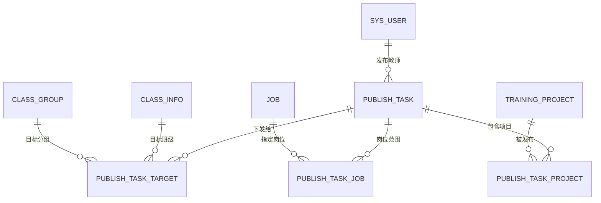

# 岗位闯关式实训平台 · 方案设计

## 2026-09-19 「我的实训」清单：学生自己挑的项目

- 背景：学生端能看到全部已发布项目（见下一节），项目一多就显得繁杂，需要一份"我关心的"清单。
- 结论：**新增一张关系表** `student_project_pick(student_id, project_id, sort_no, created_at, updated_at)`，
  唯一约束 `(student_id, project_id)`，索引 `(project_id)`；关系表不做软删，移除即删行。
- 关键取舍：**表里只存"学生主动挑的"**，老师发任务点名（必修）**不写表**，读的时候实时并集。
  这样任务撤回 / 转班 / 删班都不需要同步清单（否则发任务要给每个学生写行、撤回还得回滚）。
- 展示口径：一条项目只出现一次，用 `picked`（自己加的）+ `is_required`（老师点名）两个独立标记
  描述"为什么在这里"，另有派生字段 `sources`（`SELF` / `TEACHER`，可同时存在）。
  必修项目移出后仍在列表里（任务实时算的），自己挑过的项目在任务撤回后仍留着。
- 排序：必修置顶 → 学生自定义 `sort_no` → 加入时间新的在前；`PATCH .../my-projects/order` 写 1..N。
- 边界：项目下架 / 删除后不在列表里出现（记录保留，重新上架自动回来）；
  **加入清单不影响技能进度**（分母仍是"该技能点关联的全部已发布项目"）。
- 接口：`GET/POST /api/students/{id}/my-projects`、`PATCH .../my-projects/order`、
  `DELETE .../my-projects/{project_id}`；项目库接口 `GET .../training-projects` 同时返回 `picked` / `sources`。
- 落点：`app/models/attempt.py`、`app/crud/attempt.py::StudentProjectPickRepository`、
  `app/services/student_overview.py::my_projects`、`app/api/endpoints/attempts.py`、
  迁移 `5e7d2c41b8a6`；表数 43 → 44。

---

## 2026-09-19 口径调整：项目发布即全员可见，任务改为"必修"

> 本节**取代**下面 §0 / §4.2 里"学生可见 = 被发布任务覆盖"的结论，其余章节保留作决策沿革。

需求变更：**教师发布项目后，学生端就能看到全部已发布项目**，不必等任务下发；任务的含义收敛为
**"老师点名要求这批学生完成这个项目"**（必修）。学生平时也能自主做同一个项目，必修与自主练习
共用同一份闯关记录（完成状态 / 最高分 / 提交历史都按「学生 × 项目」记），两者不冲突。

落地口径：

1. **可见 / 可闯关** = `training_project.status = 'PUBLISHED'`；草稿（`DRAFT`）、已下架
   （`OFF_SHELF`）既不开放闯关，也不能发布任务；
2. **任务 = 必修**：目标班级 / 分组命中的学生，其项目列表里这些项目 `is_required = true`，
   并带 `required_task_ids` / `required_task_titles` / `required_deadline_at`；撤回任务只是取消
   必修标记，项目照旧能看能做。教师看板仍按任务统计覆盖人数与完成率；
3. **技能进度分母** = 该技能点关联的**全部已发布项目**（与任务、班级、分组无关），分子 = 学生
   已完成项目数；项目上架 / 下架 / 改关联技能时重算已有记录的学生
   （`sync_skills_after_projects_changed`）；
4. **代码落点**：`app/services/publish.py::ensure_project_published`、
   `app/services/student_overview.py::_published_project_ids` / `_required_projects`、
   `app/services/skill.py::_related_project_ids` / `sync_skills_after_projects_changed`、
   `app/crud/publish.py::required_projects_of_student`；
5. **受影响接口**：`GET /api/students/{id}/training-projects` 与
   `GET /api/students/{id}/projects/{project_id}`（新增必修字段）、
   `POST /api/students/{id}/projects/{project_id}/start`（改为只校验项目已发布）。

---

## 2026-09-15 21:53 发布任务（任务下发）功能 · 数据表与落地方案

- 状态：**已实现**（2026-09-15；表结构、接口、可见性改造、定时调度与测试都已落地，见 §11）
- 关联：需求确认书 §2.2「任务下发 / 撤回，发布方式即时或定时」；`docs/通知与审计实施方案.md` §10 风险 1；`app/models/project.py`、`app/models/organization.py`、`app/services/student_overview.py`、`app/api/endpoints/attempts.py`
- 范围：新增 **J 域（任务下发）4 张表** + 发布 / 撤回 / 定时发布流程 + 学生端可见性口径改造。**不含**前端页面、不含通知接口本身（依赖 `docs/通知与审计实施方案.md` 的 `services/notify.py`）。

---

## 0. 结论先行

1. **现在的口径是"一个字段管两件事"**：`training_project.status = 'PUBLISHED'` 同时表示"项目编辑完成"和"学生可见"。学生端 4 处查询直接按这个字段放行（`app/services/student_overview.py:74 / 90 / 372 / 493`），`start_student_project` 甚至不校验可见性。
2. **本方案要拆开这两件事**：`training_project.status = 'PUBLISHED'` 只表示"项目已编辑好、存放在平台上、可被任务引用"；**学生可见 = 该项目被一条已生效的发布任务覆盖到该学生**（班级 / 分组命中）。两条线各管一段：**发哪些项目**由「岗位 + 项目层级」筛出来，**发给谁**由班级 / 分组决定（岗位不筛学生，§1.1）。
3. **新增 4 张表**（J 域）：`publish_task`（任务主表）、`publish_task_target`（目标班级 / 分组）、`publish_task_job`（岗位范围，只用于筛项目，无记录 = 全部岗位）、`publish_task_project`（任务包含的项目快照）。表总数 **39 → 43**。
4. 这三张 `publish_*` 表在 v0.2 设计里有过、v0.3 被删掉（`docs/数据库表架构设计-雏形.md` §1「删除表」、§9），本方案把它**加回来并按新需求扩展**（岗位范围、定时发布、截止时间、撤回）。
5. **定时发布没有现成调度器**（`docs/通知与审计实施方案.md` §2 现状：连通知模块都还没实现），沿用本仓 `scripts/*.py + 宿主 cron` 的既有约定，新增 `scripts/dispatch_publish_tasks.py`，每分钟扫一次到点的任务。
6. **必须同步改的地方**（漏一个测试就红）：`app/services/student_overview.py` 的 4 处口径、`app/api/endpoints/attempts.py` 的开始闯关校验、`tests/test_metadata.py` 的表数 / 索引数 / 外键数 / 软删表断言、`docs/database_schema_draft.sql`（`tests/test_schema_parity.py` 逐表逐字段比对 ORM 与 DDL）、`tools/gen_schema_doc.py` + `docs/数据库表字段清单.md`。

---

## 1. 需求拆解

原文：**「可以下发目标班级、目标分组（默认全班）、指定岗位（默认全部岗位）、项目层级（基础实训、进阶实训、拓展实训）和发布方式（即时或定时，定时发布需要指定发布时间）」**

拆成三块：

| 要素 | 落在哪 | 默认值 / 约束 |
| --- | --- | --- |
| 目标（发给谁） | `publish_task_target`：`class_id` + `target_type(CLASS/GROUP)` + `group_id` | 班级必选（可多选）；分组不选 = 全班 |
| 内容（发什么） | `publish_task_job`（岗位范围，无记录 = 全部岗位）+ `publish_task.project_level`（层级）+ `publish_task_project`（项目快照） | 岗位默认全部；层级必选；项目按「岗位 × 层级」自动生成，允许人工增减 |
| 时机（什么时候发） | `publish_task.publish_mode(IMMEDIATE/SCHEDULED)` + `scheduled_at` | 即时 = 创建即生效；定时必须给发布时间 |

用户另外明确的两条业务约束（进校验，不只进文档）：

1. **实训项目管理里的"发布"只代表项目编辑完成**、存在平台里，学生看不到 —— 对应 `training_project.status = 'PUBLISHED'`，含义收窄为"可被任务引用"。
2. **草稿中的实训项目不能发布任务** —— 任务里的每个项目都必须是 `PUBLISHED`；`DRAFT` / `OFF_SHELF` 一律拒绝。
3. 需求书 §2.2 还写了"**任务下发 / 撤回**"，所以要有取消动作，且撤回后学生端立刻不可见（已经开始闯关的记录不删）。

### 1.1 已确认：「指定岗位」筛的是项目（2026-09-15）

**「指定岗位」= 这条任务里的项目属于该岗位**，即 `training_project.job_id ∈ 任务岗位范围`。它和"项目层级"一起决定这条任务发哪些项目；**不参与判断学生能不能看** —— 学生只要落在目标班级 / 分组里，就能看到老师发给他的任务（哪怕他自己选的岗位是别的）。

| 要点 | 结论 |
| --- | --- |
| 岗位范围的作用 | 生成任务项目集合的筛选条件（`publish_task_project`，§3.5） |
| 是否过滤学生 | 否。可见性只看班级 / 分组（§4.2） |
| 默认全部岗位 | `publish_task_job` 无记录 = 不限岗位，任何岗位的项目都能选 |
| 手工勾选项目时 | 项目的 `job_id` 必须落在任务岗位范围内，否则拒绝（§4.4） |
| 项目后来换了岗位 | 不影响已发任务：任务里存的是**项目快照**，以发布时为准 |

---

## 2. 现状盘点（改动依据，全部有出处）

| 位置 | 现状 | 与新功能的关系 |
| --- | --- | --- |
| `app/models/project.py: TrainingProject.status` | `DRAFT / PUBLISHED / OFF_SHELF` | 语义收窄为"项目可被任务引用" |
| `app/api/endpoints/projects.py:377` `update_project` | 改成 `PUBLISHED` 时走 `ensure_publishable`（关卡非空 + 权重合计 100） | 保持不变，这是"项目编辑完成"的校验 |
| `app/services/student_overview.py:74 / 90 / 372 / 493` | 4 处 `TrainingProject.status == "PUBLISHED"` 当作"学生可见" | **改成"被任务覆盖"**（§4.2），否则任务功能形同虚设 |
| `app/services/student_overview.py:624` `student_project_detail` | 只判断项目存在，不看状态 | 要补可见性校验，否则能看 / 做没发给自己的项目 |
| `app/api/endpoints/attempts.py:215` `start_student_project` → `services/attempt.start_attempt` | 不校验项目是否可见 | 补校验："这个项目没有发布任务给你" |
| `app/models/organization.py` | `class_student`（`ENROLLED` 取人）、`class_student_group`（学生当前分组） | 取任务目标学生的唯一依据 |
| `app/models/notification.py` | `notification.biz_type` 已有 `TASK_PUBLISH`、`operation_log.module/action` 已有 `PUBLISH` 位 | 发布 / 撤回埋点直接复用，不用改这两张表 |
| `app/services/notify.py` | **不存在**（`docs/通知与审计实施方案.md` §3.1 已设计好签名） | 定时 / 即时发布要给学生发通知，依赖这个薄封装（可先只写 `operation_log` 留痕） |
| `tests/test_metadata.py` | 硬断言：表数 39、索引 35、外键 60、软删表 8 张 | 新增 4 表后同步为：表数 43、索引 41、外键 68、软删表 +`publish_task` |
| `tests/test_schema_parity.py` + `scripts/check_schema_parity.py` | ORM 与 `docs/database_schema_draft.sql` 逐表 / 逐字段 / 索引名 / 具名约束比对 | DDL 必须同步加这 4 张表，否则测试红 |
| `alembic/versions/` | 当前 head = `996df7ebcc4a` | 新迁移的 `down_revision` 指向它 |

---

## 3. 表设计（J 域 · 任务下发，4 张）

### 3.1 关系图



### 3.2 publish_task —— 发布任务主表（软删）

> 教师发布任务 = 一条 `publish_task` + N 条目标 + N 条岗位范围 + N 条项目快照。任务进入 `PUBLISHED` 后目标与项目锁定不可改（要改就撤回重建），保证"已发任务"的确定性。

| 字段 | 类型 | 可空 | 默认 | 说明 |
| --- | --- | --- | --- | --- |
| id | bigint | 否 | 自增 | 主键 |
| title | varchar(150) | 否 | — | 任务名称，如「第 3 周 · 基础实训」 |
| description | text | 是 | — | 任务说明，学生端展示 |
| project_level | varchar(20) | 是 | — | 项目层级（BASIC / ADVANCED / EXPANDED），与 `training_project.project_level` 同域；为空 = 不限层级 |
| publish_mode | varchar(20) | 否 | 'IMMEDIATE' | IMMEDIATE 即时 / SCHEDULED 定时 |
| scheduled_at | timestamptz | 是 | — | 定时发布时间（`SCHEDULED` 必填，见 CHECK） |
| deadline_at | timestamptz | 是 | — | 截止时间；为空不限（学生端倒计时 / 逾期标记用） |
| status | varchar(20) | 否 | 'PENDING' | PENDING 待发布（含已排期）/ PUBLISHED 已发布 / CANCELLED 已撤回 |
| creator_id | bigint | 是 | — | 发布教师（`sys_user.id`） |
| published_at | timestamptz | 是 | — | 实际生效时间（即时 = 创建时间；定时 = 到点时间） |
| cancelled_at | timestamptz | 是 | — | 撤回时间 |
| remark | varchar(255) | 是 | — | 备注，仅教师可见 |
| created_at / updated_at / deleted_at | timestamptz | — | now() / now() / — | 通用约定 |

约束与索引：

- `chk_publish_task_schedule`：`(publish_mode = 'SCHEDULED' AND scheduled_at IS NOT NULL) OR publish_mode <> 'SCHEDULED'`
- `idx_publish_task_status (status, scheduled_at)`：调度脚本每分钟扫 `status='PENDING' AND scheduled_at <= now()` 用
- `idx_publish_task_creator (creator_id, created_at)`：教师端"我发布的任务"

> 为什么不用 `EXPIRED` 状态：过期是 `deadline_at < now()` 的派生结果，写回状态需要额外的定时任务，且没有业务动作挂在上面。列表接口直接算 `expired` 布尔值即可。

### 3.3 publish_task_target —— 目标班级 / 分组（流水表，无软删）

> 一条记录 = 一个目标："全班"或"某个分组"。**不选分组就是全班**，用 `target_type` 把这件事写死，避免"`group_id` 为 NULL 到底是全班还是没填"的歧义。

| 字段 | 类型 | 可空 | 说明 |
| --- | --- | --- | --- |
| id | bigint | 否 | 主键 |
| task_id | bigint | 否 | 任务 ID（`publish_task.id`） |
| target_type | varchar(20) | 否 | CLASS 全班 / GROUP 指定分组 |
| class_id | bigint | 否 | 目标班级（`class_info.id`）；指定分组时也冗余保存，便于按班级聚合与校验 |
| group_id | bigint | 是 | 目标分组（`class_group.id`）；`target_type = 'CLASS'` 时为空 |
| created_at | timestamptz | — | 创建时间 |

约束与索引：

- `chk_publish_task_target_group`：`(target_type = 'CLASS' AND group_id IS NULL) OR (target_type = 'GROUP' AND group_id IS NOT NULL)`
- `CREATE UNIQUE INDEX uk_publish_task_target_class ON publish_task_target (task_id, class_id) WHERE group_id IS NULL` —— 一个任务对一个班最多一条"全班"目标
- `CREATE UNIQUE INDEX uk_publish_task_target_group ON publish_task_target (task_id, group_id) WHERE group_id IS NOT NULL` —— 一个任务对一个分组最多一条
- `idx_publish_task_target_class (class_id, target_type)` —— 可见性查询按学生的班级 / 分组反查用

> 注意：这两条唯一性**不能**写成普通 `UNIQUE(task_id, class_id, group_id)`。SQLite 与 PostgreSQL 都把 NULL 视作彼此不相等，`(1, 5, NULL)` 可以插任意多条，约束等于没有。本仓已有同类写法（`class_student.uk_class_student_active`）。

### 3.4 publish_task_job —— 岗位范围（流水表）

> 表内**没有记录 = 全部岗位**（这就是"默认全部岗位"），有记录 = 任务里的项目只从这些岗位里挑。不建 `all_jobs` 布尔位，少一个可能自相矛盾的字段。**岗位只用于筛项目、不筛学生**（§1.1）——所以这张表不加 `student_job` 的任何关联。

| 字段 | 类型 | 可空 | 说明 |
| --- | --- | --- | --- |
| id | bigint | 否 | 主键 |
| task_id | bigint | 否 | 任务 ID |
| job_id | bigint | 否 | 岗位 ID（`job.id`） |
| created_at | timestamptz | — | 创建时间 |

约束：`uk_publish_task_job UNIQUE (task_id, job_id)`

### 3.5 publish_task_project —— 任务包含的项目快照（流水表）

> 为什么不"用到时按条件现算"：项目集合**必须快照**。否则任务发布之后新加一个同层级、同岗位的项目，它会**自动出现在已经发出去的任务里**；教师想"只发其中 3 个"也做不到。快照在创建任务时按「岗位范围 × 层级」生成，允许人工增减，发布后锁定。

| 字段 | 类型 | 可空 | 说明 |
| --- | --- | --- | --- |
| id | bigint | 否 | 主键 |
| task_id | bigint | 否 | 任务 ID |
| project_id | bigint | 否 | 项目 ID（`training_project.id`），**必须是 `PUBLISHED`** |
| sort_no | integer | 否 | 学生端展示顺序，默认 0 |
| created_at | timestamptz | — | 创建时间 |

约束与索引：

- `uk_publish_task_project UNIQUE (task_id, project_id)`
- `idx_publish_task_project_project (project_id)` —— "这个项目被哪些任务发布过"（教师端排查 / 撤回影响面）

### 3.6 落地 DDL（追加到 `docs/database_schema_draft.sql`，J 域）

> 约束必须写成**单行**：`scripts/check_schema_parity.py` 按行解析，多行 CHECK 的续行会被误当成字段名（报"多余字段"）。

```sql
-- =====================================================================
-- J 域：任务下发（4 张）
-- =====================================================================

CREATE TABLE publish_task (
    id            bigint GENERATED BY DEFAULT AS IDENTITY PRIMARY KEY,
    title         varchar(150) NOT NULL,
    description   text,
    project_level varchar(20),
    publish_mode  varchar(20) NOT NULL DEFAULT 'IMMEDIATE',
    scheduled_at  timestamptz,
    deadline_at   timestamptz,
    status        varchar(20) NOT NULL DEFAULT 'PENDING',
    creator_id    bigint REFERENCES sys_user (id),
    published_at  timestamptz,
    cancelled_at  timestamptz,
    remark        varchar(255),
    created_at    timestamptz NOT NULL DEFAULT now(),
    updated_at    timestamptz NOT NULL DEFAULT now(),
    deleted_at    timestamptz,
    CONSTRAINT chk_publish_task_schedule CHECK ((publish_mode = 'SCHEDULED' AND scheduled_at IS NOT NULL) OR publish_mode <> 'SCHEDULED')
);
CREATE INDEX idx_publish_task_status ON publish_task (status, scheduled_at);
CREATE INDEX idx_publish_task_creator ON publish_task (creator_id, created_at);

CREATE TABLE publish_task_target (
    id          bigint GENERATED BY DEFAULT AS IDENTITY PRIMARY KEY,
    task_id     bigint NOT NULL REFERENCES publish_task (id),
    target_type varchar(20) NOT NULL,
    class_id    bigint NOT NULL REFERENCES class_info (id),
    group_id    bigint REFERENCES class_group (id),
    created_at  timestamptz NOT NULL DEFAULT now(),
    CONSTRAINT chk_publish_task_target_group CHECK ((target_type = 'CLASS' AND group_id IS NULL) OR (target_type = 'GROUP' AND group_id IS NOT NULL))
);
CREATE UNIQUE INDEX uk_publish_task_target_class ON publish_task_target (task_id, class_id) WHERE group_id IS NULL;
CREATE UNIQUE INDEX uk_publish_task_target_group ON publish_task_target (task_id, group_id) WHERE group_id IS NOT NULL;
CREATE INDEX idx_publish_task_target_class ON publish_task_target (class_id, target_type);

CREATE TABLE publish_task_job (
    id         bigint GENERATED BY DEFAULT AS IDENTITY PRIMARY KEY,
    task_id    bigint NOT NULL REFERENCES publish_task (id),
    job_id     bigint NOT NULL REFERENCES job (id),
    created_at timestamptz NOT NULL DEFAULT now(),
    CONSTRAINT uk_publish_task_job UNIQUE (task_id, job_id)
);

CREATE TABLE publish_task_project (
    id         bigint GENERATED BY DEFAULT AS IDENTITY PRIMARY KEY,
    task_id    bigint NOT NULL REFERENCES publish_task (id),
    project_id bigint NOT NULL REFERENCES training_project (id),
    sort_no    integer NOT NULL DEFAULT 0,
    created_at timestamptz NOT NULL DEFAULT now(),
    CONSTRAINT uk_publish_task_project UNIQUE (task_id, project_id)
);
CREATE INDEX idx_publish_task_project_project ON publish_task_project (project_id);
```

### 3.7 落地 ORM（新增 `app/models/publish.py`）

```python
"""任务下发：发布任务主表、目标班级/分组、岗位范围、包含的项目。"""

from datetime import datetime

from sqlmodel import CheckConstraint, Field, Index, SQLModel, UniqueConstraint, text

from app.models.base import Base, CreatedAtMixin, SoftDeleteMixin, TimestampMixin


class PublishTaskBase(SQLModel):
    title: str = Field(max_length=150, description="任务名称")
    description: str | None = Field(default=None, description="任务说明（学生端展示）")
    project_level: str | None = Field(
        default=None, max_length=20, description="项目层级 BASIC / ADVANCED / EXPANDED；为空表示不限"
    )
    publish_mode: str = Field(
        default="IMMEDIATE", max_length=20, description="IMMEDIATE 即时 / SCHEDULED 定时"
    )
    scheduled_at: datetime | None = Field(default=None, description="定时发布时间；SCHEDULED 必填")
    deadline_at: datetime | None = Field(default=None, description="截止时间；为空不限")
    status: str = Field(
        default="PENDING", max_length=20, description="PENDING 待发布 / PUBLISHED 已发布 / CANCELLED 已撤回"
    )
    creator_id: int | None = Field(default=None, foreign_key="sys_user.id", description="发布教师")
    published_at: datetime | None = Field(default=None, description="实际生效时间")
    cancelled_at: datetime | None = Field(default=None, description="撤回时间")
    remark: str | None = Field(default=None, max_length=255, description="备注（仅教师可见）")


class PublishTask(Base, TimestampMixin, SoftDeleteMixin, PublishTaskBase, table=True):
    """发布任务：教师把"已编辑完成的项目"下发给目标班级/分组，学生才看得到。"""

    __tablename__ = "publish_task"
    __table_args__ = (
        CheckConstraint(
            "(publish_mode = 'SCHEDULED' AND scheduled_at IS NOT NULL) OR publish_mode <> 'SCHEDULED'",
            name="chk_publish_task_schedule",
        ),
        Index("idx_publish_task_status", "status", "scheduled_at"),
        Index("idx_publish_task_creator", "creator_id", "created_at"),
    )

    id: int | None = Field(default=None, primary_key=True)


class PublishTaskTargetBase(SQLModel):
    task_id: int = Field(foreign_key="publish_task.id", description="任务 ID")
    target_type: str = Field(max_length=20, description="CLASS 全班 / GROUP 指定分组")
    class_id: int = Field(foreign_key="class_info.id", description="目标班级")
    group_id: int | None = Field(
        default=None, foreign_key="class_group.id", description="目标分组；全班时为空"
    )


class PublishTaskTarget(Base, CreatedAtMixin, PublishTaskTargetBase, table=True):
    """任务目标：一条 = 一个全班目标或一个分组目标。"""

    __tablename__ = "publish_task_target"
    __table_args__ = (
        CheckConstraint(
            "(target_type = 'CLASS' AND group_id IS NULL) OR (target_type = 'GROUP' AND group_id IS NOT NULL)",
            name="chk_publish_task_target_group",
        ),
        Index(
            "uk_publish_task_target_class",
            "task_id",
            "class_id",
            unique=True,
            sqlite_where=text("group_id IS NULL"),
        ),
        Index(
            "uk_publish_task_target_group",
            "task_id",
            "group_id",
            unique=True,
            sqlite_where=text("group_id IS NOT NULL"),
        ),
        Index("idx_publish_task_target_class", "class_id", "target_type"),
    )

    id: int | None = Field(default=None, primary_key=True)


class PublishTaskJobBase(SQLModel):
    task_id: int = Field(foreign_key="publish_task.id", description="任务 ID")
    job_id: int = Field(foreign_key="job.id", description="岗位 ID")


class PublishTaskJob(Base, CreatedAtMixin, PublishTaskJobBase, table=True):
    """岗位范围：没有记录 = 全部岗位。"""

    __tablename__ = "publish_task_job"
    __table_args__ = (UniqueConstraint("task_id", "job_id", name="uk_publish_task_job"),)

    id: int | None = Field(default=None, primary_key=True)


class PublishTaskProjectBase(SQLModel):
    task_id: int = Field(foreign_key="publish_task.id", description="任务 ID")
    project_id: int = Field(foreign_key="training_project.id", description="项目 ID，必须已 PUBLISHED")
    sort_no: int = Field(default=0, description="学生端展示顺序")


class PublishTaskProject(Base, CreatedAtMixin, PublishTaskProjectBase, table=True):
    """任务包含的项目快照：发布时定稿，之后新增的同层级项目不会自动混进来。"""

    __tablename__ = "publish_task_project"
    __table_args__ = (
        UniqueConstraint("task_id", "project_id", name="uk_publish_task_project"),
        Index("idx_publish_task_project_project", "project_id"),
    )

    id: int | None = Field(default=None, primary_key=True)


__all__ = [
    "PublishTask",
    "PublishTaskBase",
    "PublishTaskJob",
    "PublishTaskJobBase",
    "PublishTaskProject",
    "PublishTaskProjectBase",
    "PublishTaskTarget",
    "PublishTaskTargetBase",
]
```

### 3.8 枚举（`app/models/enums.py` + `ENUM_DICTS`）

```python
class PublishMode(StrEnum):
    """发布方式。"""

    IMMEDIATE = "IMMEDIATE"  # 即时发布，创建即生效
    SCHEDULED = "SCHEDULED"  # 定时发布，到点生效


class PublishTaskStatus(StrEnum):
    """发布任务状态。"""

    PENDING = "PENDING"  # 待发布（含已排期的定时任务）
    PUBLISHED = "PUBLISHED"  # 已发布，学生可见
    CANCELLED = "CANCELLED"  # 已撤回，学生不可见


class PublishTargetType(StrEnum):
    """任务目标类型。"""

    CLASS = "CLASS"  # 全班
    GROUP = "GROUP"  # 指定分组
```

三个都要加进 `ENUM_DICTS`（`/api/enums` 字典接口遍历它生成，不加等于前端拿不到下拉选项）。

---

## 4. 关键设计

### 4.1 状态机

```text
创建 ──publish_mode=IMMEDIATE──▶ PUBLISHED ──撤回──▶ CANCELLED（终态）
  └──publish_mode=SCHEDULED──▶ PENDING ──到点（dispatch 脚本）──▶ PUBLISHED ──撤回──▶ CANCELLED
```

| 状态 | 学生可见（2026-09-19 起只影响"必修"） | 怎么到 | 说明 |
| --- | --- | --- | --- |
| PENDING | 任务清单里看不到，项目也还没被点名 | 定时任务创建后 | 到点由 `scripts/dispatch_publish_tasks.py` 翻成 PUBLISHED |
| PUBLISHED | 任务清单里能看到，项目对该批学生标为**必修** | 即发 / 定时到点 | 目标与项目锁定，只允许改 `deadline_at` / `description` / `remark` |
| CANCELLED | 必修标记消失（项目照旧开放） | 教师撤回 | 不删数据；已生成的 `student_project` 保留，学生端不再出现在"我的任务" |

> 撤回为什么不直接删：通知、审计、学生已产生的闯关记录都要能追溯到"这条任务是发过的"。

### 4.2 学生可见性判定（本方案的核心改动）—— 已被 2026-09-19 口径取代

> ⚠️ 本节结论已作废：现在 **项目 `PUBLISHED` 即对全体学生开放**，任务只标"必修"。
> 保留以下内容作为当时的设计记录，现行口径见文首「2026-09-19 口径调整」。

**口径**：学生 S 能看到项目 P ⟺ 存在任务 T 满足

```text
T.status = 'PUBLISHED'                        -- 已生效（定时任务到点后才是 PUBLISHED）
AND P ∈ T 的项目快照（publish_task_project）   -- 任务确实包含这个项目
AND P.status = 'PUBLISHED' AND P.deleted_at IS NULL
AND T.deleted_at IS NULL
AND ∃ 目标记录命中 S：
      目标.target_type = 'CLASS' AND 目标.class_id = S 的在班班级
   OR 目标.target_type = 'GROUP' AND 目标.group_id = S 当前分组
-- 岗位范围不参与可见性判定：它只决定任务包含哪些项目（§1.1）
```

其中"S 的在班班级 / 当前分组"取 `class_student.status = 'ENROLLED'` + `class_student_group`（同一个人在多个班时按并集）。

> 边界：**班级被删除（软删）后，发给这个班的任务不再覆盖它的学生**（可见性查询会 join
> `class_info` 过滤掉已软删的班级）。学生账号与在班记录不删，只是不再由这个班的任务驱动；
> 归档（`status = 'ARCHIVED'`）不等于删除，任务照旧覆盖。

> 换老师 / 转班：**进度不会丢**。完成状态（`student_project.completed_at`）、最高分、提交与评审
> 历史、技能进度都挂在"学生账号 × 实训项目"上，与班级 / 任务 / 老师无关。所以甲老师离职、乙老师
> 接手同一岗位的学生时，只要**学号复用同一个账号**（Excel 导入带 `reuse_existing=true`）+
> **任务复用同一个已发布项目**，学生的进度原样保留，新任务一发布就显示为已完成。
> 反向的两个坑：复制成新项目（新的 `project_id`）、或给学生新建账号（换了学号），进度都不跟过来。

新增 `app/services/publish.py`：

```python
async def visible_project_ids(session: AsyncSession, student_id: int) -> set[int]:
    """学生可见的项目 ID 集合：被已生效的发布任务覆盖到的项目。"""


async def visible_tasks_of_student(session: AsyncSession, student_id: int) -> list[dict]:
    """学生端"我的任务"列表（任务 + 项目 + 截止时间 + 完成进度）。"""


async def ensure_project_visible(session: AsyncSession, student_id: int, project_id: int) -> None:
    """开始闯关 / 项目详情前的可见性校验，不通过抛 BusinessRuleError。"""


async def target_student_ids(session: AsyncSession, task_id: int) -> list[int]:
    """任务目标展开成学生 ID（通知、覆盖人数统计用）。"""
```

改造点（4 + 2 处）：

| 文件 | 函数 | 改法 |
| --- | --- | --- |
| `app/services/student_overview.py:71` | `_published_project_job_ids` | 项目集合改为取 `visible_project_ids`（签名要加 `student_id` 参数，两个调用点都在学生维度，传得进去） |
| `app/services/student_overview.py:84` | `_published_node_project_ids` | 同上 |
| `app/services/student_overview.py:360` | `student_projects` | `TrainingProject.id.in_(visible_ids)` 取代 `status == "PUBLISHED"` |
| `app/services/student_overview.py:476` | `project_progress`（原 `job_project_progress`） | 同上（口径变成"已发布给你的项目"） |
| `app/services/student_overview.py:624` | `student_project_detail` | 加 `ensure_project_visible`，不可见返回 404（不泄露存在性） |
| `app/api/endpoints/attempts.py:215` | `start_student_project` | 加 `ensure_project_visible`，不可见报"这个项目没有发布任务给你，请联系老师" |

> 兼容性：`visible_project_ids` 只多一层 EXISTS 过滤，返回结构不变（前端不用改），但**语义变了**：以前发过的项目对所有学生可见，现在必须发任务 —— 演示数据（`app/db/seed_demo.py`）要补一条"全班发布任务"，否则学生端会变空。

### 4.3 定时发布怎么跑

本仓没有调度器，`scripts/prune_qa_history.py` 已经确立了"脚本 + 宿主 cron"的约定，照抄：

```bash
# scripts/dispatch_publish_tasks.py
uv run python scripts/dispatch_publish_tasks.py             # 把到点的 PENDING 翻成 PUBLISHED
uv run python scripts/dispatch_publish_tasks.py --dry-run    # 只看会翻哪些
uv run python scripts/dispatch_publish_tasks.py --task-id 12

# crontab —— 每分钟扫一次（定时发布的最小粒度就是分钟）
* * * * * cd /path/to/training_platform && .venv/bin/python scripts/dispatch_publish_tasks.py >> data/run/publish.log 2>&1
```

脚本做三件事（一个事务里）：

1. 查 `status='PENDING' AND scheduled_at <= now() AND deleted_at IS NULL`；
2. 逐个校验项目仍然 `PUBLISHED`（发布后可能被下架 → 剔除该条并记 `operation_log` 告警，项目全被剔空则整体留在 PENDING）；
3. 置 `status='PUBLISHED'`、`published_at=now()`，给目标学生写 `notification`（`biz_type=TASK_PUBLISH`、`biz_id=task_id`）+ `operation_log`（`module='PUBLISH'`、`action='PUBLISH'`）。

两个口径写进文档，别靠记忆：**① 接口层同时提供"立即发布"**（`POST /api/publish-tasks/{id}/publish`），定时任务没到点教师想提前发也能发；**② 脚本没跑 = 任务不生效**（定时发布只有这一条生效路径，不搞"读的时候顺便判定"的双口径，否则通知与可见性会不一致）。

### 4.4 校验规则（写进 service，接口只管传参）

| 规则 | 报错文案方向 |
| --- | --- |
| 项目必须是 `PUBLISHED`（草稿 / 已下架都不行） | "《XX》还在草稿中，不能发布任务；请先在实训项目管理里发布该项目" |
| 至少 1 个项目、至少 1 个目标班级 | "请至少选择一个项目和目标班级" |
| `SCHEDULED` 必须给 `scheduled_at` 且晚于当前时间 | "定时发布必须指定一个将来的发布时间" |
| 目标分组必须属于目标班级 | "分组 X 不属于班级 Y" |
| 岗位 / 层级筛选至少要能命中 1 个项目（除非教师手工指定了项目） | "该岗位 + 该层级下没有已发布的项目" |
| 手工勾选的项目必须属于本任务的岗位范围（`project.job_id ∈ job_ids`；不限岗位时免校验） | "《XX》属于「YY」岗位，不在本任务的岗位范围内" |
| 已 `PUBLISHED` 的任务不能改目标 / 项目 / 岗位 | "任务已发布，改目标请先撤回" |

---

## 5. 接口设计（教师端 / 学生端）

| 方法 | 路径 | 说明 |
| --- | --- | --- |
| GET | `/api/publish-tasks` | 任务列表（`status` / `project_level` / `creator_id` / 关键词过滤 + 分页） |
| POST | `/api/publish-tasks` | 创建并发布；body 带 `publish_mode` + `scheduled_at` |
| GET | `/api/publish-tasks/{id}` | 详情：目标班级 / 分组、岗位、项目、覆盖学生数、状态 |
| PATCH | `/api/publish-tasks/{id}` | 未发布可全量改；已发布只允许改 `deadline_at` / `description` / `remark` |
| POST | `/api/publish-tasks/{id}/publish` | 立即发布（定时任务提前发） |
| POST | `/api/publish-tasks/{id}/cancel` | 撤回 |
| DELETE | `/api/publish-tasks/{id}` | 软删（仅限未发布过的任务） |
| GET | `/api/publish-tasks/preview-students` | 选完班级 / 分组后预览覆盖人数（不建任务） |
| GET | `/api/publish-tasks/publishable-projects` | 按「岗位 + 层级」筛出可发布项目（前端勾选用），只返回 `PUBLISHED` |
| GET | `/api/students/{student_id}/tasks` | 学生端"我的任务"（任务维度；项目维度仍走现有 `training-projects`） |

创建请求体示例：

```json
{
  "title": "第 3 周 · 基础实训",
  "description": "完成工业视觉检测基础实训，7 天内提交",
  "project_level": "BASIC",
  "job_ids": [],
  "targets": [
    {"class_id": 1, "target_type": "CLASS"},
    {"class_id": 1, "target_type": "GROUP", "group_id": 3}
  ],
  "project_ids": [],
  "publish_mode": "SCHEDULED",
  "scheduled_at": "2026-09-20T08:00:00",
  "deadline_at": "2026-09-27T23:59:59"
}
```

`job_ids` / `project_ids` 留空 = 全部岗位 / 按「岗位 × 层级」自动生成项目集合。`job_ids` 是**项目筛选条件**（§1.1），不参与决定发给谁。

---

## 6. 改动清单（按依赖顺序，一步都不能漏）

| # | 文件 | 动作 |
| --- | --- | --- |
| 1 | `app/models/publish.py` | **新增** §3.7 的 4 个模型 |
| 2 | `app/models/__init__.py` | 导入 4 个模型 + 补 `__all__`（漏了 Alembic 就不认识表） |
| 3 | `app/models/enums.py` | 加 3 个枚举 + 3 条 `ENUM_DICTS` |
| 4 | `docs/database_schema_draft.sql` | 追加 §3.6 的 J 域 DDL（`test_schema_parity` 强校验） |
| 5 | `alembic/versions/xxxx_publish_task.py` | `alembic revision -m "publish task tables"` 生成后手改：`down_revision='996df7ebcc4a'`，两条部分唯一索引用 `batch_alter_table` 建 |
| 6 | `alembic/env.py` | 若 `alembic check` 报部分索引假差异，把 `uk_publish_task_target_class` / `uk_publish_task_target_group` 加进 `EXPRESSION_INDEXES` |
| 7 | `app/schemas/publish.py` | `PublishTaskCreate/Update/Read/Detail`、`PublishTargetIn` |
| 8 | `app/crud/publish.py` | `PublishTaskRepository`（含 `list_page` / `due_tasks`）、`PublishTaskTargetRepository`、`PublishTaskJobRepository`、`PublishTaskProjectRepository` |
| 9 | `app/services/publish.py` | §4.2 的可见性函数 + §4.4 的校验 + `create_task` / `publish_task_now` / `cancel_task` |
| 10 | `app/api/endpoints/publish.py` + `app/api/router.py` | 新增路由并注册进 `API_ROUTERS` |
| 11 | `app/services/student_overview.py` | 4 处口径改造 + `student_project_detail` 可见性校验 |
| 12 | `app/api/endpoints/attempts.py` | `start_student_project` 加可见性校验 |
| 13 | `app/services/notify.py` | 按 `docs/通知与审计实施方案.md` §3.1 实现 `notify` / `notify_many`（发布事件先行） |
| 14 | `scripts/dispatch_publish_tasks.py` | §4.3 的调度脚本 + `--dry-run` |
| 15 | `app/db/seed_demo.py` | 补一条演示发布任务，否则学生端列表为空 |
| 16 | `tools/gen_schema_doc.py` | `DOMAINS` 加 `("J 任务下发", [...])`、`TABLE_CN` / `TABLE_PURPOSE` 补 4 条，重跑生成 `docs/数据库表字段清单.md` |
| 17 | `tests/test_metadata.py` | 表数 39→43、索引 35→41、外键 60→68、软删表 +`publish_task`、表名集合 +4 |
| 18 | `tests/` | 新增：草稿项目不可发布；定时到点才可见；分组目标只覆盖该组；撤回后不可见；不可见访问 404 |
| 19 | `README.md` / `docs/数据库表架构设计-雏形.md` | 补 J 域与接口说明；把 §9「任务下发本期不做」改成已实现，避免文档自相矛盾 |

---

## 7. 分期与验收

| 阶段 | 内容 | 验收 |
| --- | --- | --- |
| P1 表与迁移 | 步骤 1~6 | `pytest tests/test_metadata.py tests/test_schema_parity.py` 全绿；`alembic upgrade head` 后 `scripts/check_db.py` 通过 |
| P2 发布服务与接口 | 步骤 7~10、13 | 即时发布 / 定时排期 / 撤回三条链路能跑；草稿项目被拒 |
| P3 可见性改造 | 步骤 11~12 | 学生只看到发给自己的项目；未被发布的学生访问项目详情 → 404 |
| P4 调度与演示数据 | 步骤 14~15 | `--dry-run` 正确；到点任务自动生效并产生通知与审计 |
| P5 文档与测试 | 步骤 16~19 | `uv run pytest`、`uv run ruff check .` 全绿；字段清单与 DDL 一致 |

核心验收场景（建议直接写成 `tests/test_publish_flow.py`）：

```text
1. 项目 A（PUBLISHED）+ 项目 B（DRAFT）→ 发布任务时选 A+B → 报错：B 还在草稿中
2. 任务 T1：全班（1 班）+ BASIC + 全部岗位 + 即时 → 1 班学生能看到 A，2 班学生看不到
3. 任务 T2：1 班第 2 组 + 即时 → 第 2 组学生能看到，第 1 组学生看不到
4. 任务 T3：定时（1 分钟后）→ 创建后学生看不到；跑 dispatch → 学生看到 + 收到通知
5. 撤回 T1 → 1 班学生看不到 A；已有的 student_project 记录仍在
6. 学生对未发布给自己的项目调 /start → 报"没有发布任务给你"
```

---

## 8. 工作量估算

| 阶段 | 预估 |
| --- | --- |
| P1 表与迁移（含 DDL / 断言同步） | 0.5 天 |
| P2 服务与接口 | 1.5 天 |
| P3 可见性改造 | 0.5 天 |
| P4 调度脚本 + 演示数据 | 0.5 天 |
| P5 文档与测试 | 0.5 天 |
| **合计** | **3.5 天**（通知模块若尚未落地，再加 0.5 天） |

---

## 9. 风险与待确认

1. ~~「指定岗位」是筛项目还是筛学生~~ —— **已确认：筛项目**（§1.1，2026-09-15）。岗位范围只决定任务包含哪些项目；可见性只看目标班级 / 分组。表结构据此定稿，不再受影响面。
2. **一个任务能否跨多个层级 / 多个岗位**。本方案：岗位多选（`publish_task_job` 多行），层级单选（`publish_task.project_level` 一个值）。要"一次发基础 + 进阶"得建两条任务；若必须一条，把层级也改成关系表（多一张 `publish_task_level`，表数 44）。注意岗位与层级是"与"关系（岗位 A 的进阶项目），不是"或"。
3. **可见性口径变更的兼容性**。以前"发过的项目全员可见"，改后必须发任务才可见 —— 演示数据、联调环境、前端空态都要一起改，否则会被当成 bug 报回来。
4. **定时发布依赖宿主 cron**。脚本没挂 = 任务不发；建议教师端列表把 `PENDING` 且已过 `scheduled_at` 的任务标成"待处理"，让异常可见。
5. **撤回后学生已产生的记录**怎么处置（保留 / 冻结 / 隐藏）：本方案选"保留记录、从待做列表移除"，需要教学侧确认。
6. **本方案未做按学生个人发布**（`publish_task_target` 到班级 / 分组为止）。若将来要"补发给某个缺考学生"，加 `target_type='STUDENT'` + `student_id` 可空列即可，不用新建表。
7. **通知与审计模块尚未落地**（`services/notify.py` 不存在）。发布事件可以在 P2 先只写 `operation_log` 留痕，通知等通知模块一起上。

---

## 10. 表结构已验证（本方案不是纸上设计）

§3.6 的 DDL 与 §3.7 的 ORM 已经用仓库自带的比对脚本跑过一遍，**结论是全绿**：

```text
$ .venv/bin/python <比对脚本>       # compare(Base.metadata, parse_ddl(原 DDL + J 域 DDL))
表数=43 索引=41 外键=68
ORM 与 DDL 一致（表 / 字段 / 可空性 / 索引 / 具名约束）
```

建表语句本身也验证过（SQLite `create_all` + 试插数据）：

| 验证项 | 结果 |
| --- | --- |
| 2 条"全班"目标 + 1 条分组目标共存 | 通过 |
| 同一任务重复插"全班"目标 | 被 `uk_publish_task_target_class` 拦下 |
| 同一任务重复插同一分组目标 | 被 `uk_publish_task_target_group` 拦下 |
| `publish_mode='SCHEDULED'` 但不给 `scheduled_at` | 被 `chk_publish_task_schedule` 拦下 |
| `target_type='GROUP'` 但 `group_id` 为空 | 被 `chk_publish_task_target_group` 拦下 |

所以 §2 里"表数 43 / 索引 41 / 外键 68"是实测值，直接照着改 `tests/test_metadata.py` 的断言即可；唯一还要在迁移生成后确认的是 `alembic check` 会不会对两条部分唯一索引报假差异（见 §6 步骤 6）。

---

## 11. 实施记录（2026-09-15）

按 §6 的改动清单逐条落地，实际改动如下：

| 层 | 文件 | 说明 |
| --- | --- | --- |
| 模型 | `app/models/publish.py` | 4 张表；`app/models/__init__.py` 注册（表数 43） |
| 枚举 | `app/models/enums.py` | `publish_mode` / `publish_task_status` / `publish_target_type`，`/api/enums` 从 27 条变 30 条 |
| DDL | `docs/database_schema_draft.sql` | 追加 J 域；`scripts/check_schema_parity.py` 全绿 |
| 迁移 | `alembic/versions/8b2df4d8233d_publish_task_tables.py` | `down_revision=996df7ebcc4a`；两条部分唯一索引用 `sqlite_where` 手写；upgrade / downgrade 都跑过 |
| Schema | `app/schemas/publish.py` | `PublishTaskCreate/Update/Read/Detail`、`PublishTargetIn/Read`、`PublishableProjectRead`、`StudentTaskRead` |
| 仓储 | `app/crud/publish.py` | 任务 / 目标 / 岗位范围 / 项目快照四个仓储 + 学生可见性查询（`visible_project_ids_of_student`、`visible_tasks_of_student`） |
| 服务 | `app/services/publish.py` | 创建 / 发布 / 撤回 / 调度 + 目标校验 + 项目筛选 + 可见性；`app/services/notify.py`、`app/services/audit.py` 这两个薄封装一并落地（通知按 `(接收人, biz_type, biz_id)` 幂等） |
| 接口 | `app/api/endpoints/publish.py`、`app/api/router.py` | 10 个接口（教师 9 + 学生 1） |
| 可见性 | `app/services/student_overview.py`、`app/api/endpoints/attempts.py` | 4 处学生视图改成"任务覆盖"口径，项目详情与开始闯关补可见性校验 |
| 调度 | `scripts/dispatch_publish_tasks.py` | 支持 `--dry-run` / `--task-id` / `--at`；发布前复核项目状态，被下架的项目剔除、剔空则留在 PENDING 并写 SKIP 审计 |
| 演示数据 | `app/db/seed_demo.py` | `TASKS` 三条：基础实训（全班全岗位，即时）、进阶实训（限岗位 + 定向班级，即时）、定时发布演示（PENDING） |
| 文档 | `README.md`、`tools/gen_schema_doc.py` | README 新增「任务下发」章节；字段清单重新生成（43 张表，顺带补上此前漏掉的 `project_file`） |
| 测试 | `tests/test_publish_flow.py`（新增 9 条）、`tests/helpers.py`（公共造数）、`tests/test_metadata.py`、`tests/test_api_health.py`、`tests/test_attempt_flow.py`、`tests/test_ai_review.py`、`tests/test_repeat_attempt_skills.py`、`tests/test_student_overview.py`、`tests/test_student_project_detail.py`、`tests/test_seed_demo.py` | 覆盖草稿拦截 / 全班 / 分组 / 定时到点 / 撤回 / 岗位范围 / 覆盖人数预览 / 锁定与删除 |

验证结果：

```text
uv run ruff check .                                     # 全绿
uv run pytest tests/test_publish_flow.py                # 9 passed
uv run python scripts/check_schema_parity.py            # ORM 与 DDL 完全一致（43 表 / 41 索引 / 68 外键）
alembic upgrade head / downgrade -1 / upgrade head      # 迁移可逆
```

遗留：需要 MinIO 的用例（上传类、`test_seed_demo`）在没起 MinIO 的环境里会失败，这是本次改动之前就
存在的环境问题；演示数据的发布任务与可见性已用打桩对象存储的方式单独验证通过（2401 班看到 1 个
项目、2404 班看到 2 个、PENDING 的定时任务不生效、重复执行不新增数据）。

---

## 12. 追加口径：技能进度的分母也算"发了任务的项目"（2026-09-15）—— 已于 2026-09-19 调整

> ⚠️ 本节口径已调整：现在**分母 = 该技能点关联的全部已发布项目**（与任务无关），因为学生端
> 能看到全部已发布项目、随时可以自主闯关。任务只标"必修"。现行口径见文首「2026-09-19 口径调整」；
> 本节保留作为决策沿革。

### 问题

技能点进度的公式是 `完成项目数 ÷ 关联项目总数`，而"关联项目"原来是**全体已发布项目**——
项目在项目管理里一发布就进分母。但学生能不能看到项目是由发布任务决定的（§4.2），于是会出现
这样一条别扭的数据：老师编辑好 5 个项目、只把其中 1 个发给学生，学生做完那 1 个，进度显示 20%。

### 新口径

```text
关联项目（分母的基数）
  = project_skill 关联到该技能节点
    ∩ 已经发布任务给该学生（publish_task 生效 + 班级/分组命中）
    ∩ training_project.status = 'PUBLISHED' 且未软删

progress = 该学生在这个集合里已完成（student_project.completed_at 有值）的项目数
           ÷ 这个集合的项目数 × 100
```

由此派生三条行为：

1. **发布任务 → 分母变大**：学生"已完成 / 发给我的"比例可能下降，`mastered_at` 会按新进度清掉；
2. **撤回任务 → 分母变小**：比例可能回升甚至到 100%（"发给我的都做完了"）；
3. **没记录的学生不铺数据**：重算只覆盖该学生**已经有 `student_skill` 记录**的技能点，
   发任务不会给全班凭空插一批 0 进度的空行（记录仍由"项目完成"时创建）。

### 落点

| 位置 | 改动 |
| --- | --- |
| `app/services/skill.py` | 新增 `_related_project_ids`（先取学生可见项目，再卡项目状态）；`_node_project_counts` / `_completed_counts` 都限定在这个集合里；新增 `sync_skills_after_task_changed` |
| `app/services/publish.py` | `_publish` 与 `cancel_task` 里调用 `sync_skills_after_task_changed`（发布 / 撤回各一次） |
| `app/services/skill.py` | 新增 `refresh_student_skills`：**入班 / 转班 / 换组 / 离班**都会改变"发给我了哪些项目"（分组目标的任务尤其明显），所以这几个动作之后也要重算该学生的进度；默认只重算他已经有记录的技能点 |
| `app/api/endpoints/organization.py`、`app/services/student_import.py` | 加人入班（单个 / Excel 导入）、调整分组（单个 / 批量）、移出分组、在班状态变更、离班、**删除班级** —— 这些入口各接一次 `refresh_student_skills` |
| `app/services/student_import.py`、`app/api/endpoints/organization.py` | 导入接口新增 `reuse_existing`（默认 false）：换老师 / 转班时用 `reuse_existing=true` 复用已有账号只补在班记录，账号与学习记录（进度、成绩、提交历史）原样保留 |
| `app/services/student_overview.py` | 视图口径同步（分母与 `student_skill.progress` 一致） |
| 文档 | `docs/database_schema_draft.sql`（表注释与说明）、`docs/数据库表架构设计-雏形.md` §5.5、README、字段清单 |
| 测试 | `tests/test_publish_flow.py::test_skill_progress_only_counts_task_published_projects`：只发甲→完成→100%；再发乙→自动掉到 50%；撤回甲→0%；`tests/test_multi_class_student.py`：跨班 / 跨老师 / 入班换组离班 / **甲老师离职乙老师接班**（含"项目复制成新 id 会丢进度"的反例）；`tests/test_crud_organization.py::test_import_reuse_existing_users_into_new_class` |

### 注意

- 分子永远 ≤ 分母（同一集合里取数），不会出现"进度超过 100%"；
- 重新挑战期间进度不会掉：分子仍看 `student_project.completed_at`（首次通过时写入、改判不通过
  才清空），与改动前一致；
- 教师手工调整（`source = MANUAL`）在下次重算该技能点时会被覆盖，这是改动前就有的行为。
- **学生换班 / 换组不用等下一次动作**：入班、转班、换组、离班都会当场重算（只对已经有进度记录的
  技能点），否则进度会停在上一个班的旧值上。

---

## 2026-09-17 08:39 上传文档里的图片信息不丢失（评分标准 + 知识库 · OCR / 图片理解方案）

关联：`app/services/parsing.py`、`app/services/splitting.py`、`app/services/knowledge_ingest.py`、
`app/services/ai_review.py`、`app/api/endpoints/knowledge.py`、`app/models/knowledge.py`、
`app/services/settings_store.py`、`pyproject.toml`

范围：**教师上传的评分标准（`EVAL_CRITERIA`）与知识库文档（`KNOWLEDGE`）里的图片**。
学生作答附件走的是同一个 `parsing.parse`，会顺带受益，但不在本期验收范围。

---

### 0. 结论先行

1. **主干用本地 OCR，不先上大模型。** 引擎选 **RapidOCR（PP-OCR 系列模型的 ONNX Runtime 版）**：
   `pip` 装完就能用、CPU 能跑、中英混排准、macOS arm64 与 Windows 双平台都有 wheel。
   本项目开发机是 arm64 Mac（无 CUDA），另一台部署机是 RTX 4060 Windows，**只有 ONNX 这一条路两边都不折腾**。
2. **图形类图片单独给一条语义通道。** 流程图、示意图、设备照片、检测结果图里"没有字但有信息"，
   OCR 天然无能为力。二期用**多模态大模型（VLM）**生成 markdown 结构 + 一句话语义描述，
   复用现有 OpenAI 兼容通道（`app/services/llm.py` 那套），**默认关闭**，打开才把图片送出去。
3. **图片文字不是"另存一份"，而是按锚点并回正文。** 识别结果作为普通的 `ParsedBlock` 插回文档顺序里，
   带 `【图片#3 · 第2页】` 标记：这样评分标准的 **整份一块**策略、知识库的**结构化细切**、
   AI 评审的 `criteria_max_chars` 预算、Milvus 向量化 —— 现有链路一行都不用改。
4. **图片本体存 MinIO，识别结果落一张新表。** 复用 `file_asset`（新增 `biz_type=KNOWLEDGE_IMAGE`），
   新表 `knowledge_doc_image` 存"第几张 / 第几页 / 挂在哪个标题下 / 识别文本 / 置信度 / 状态"。
   **教师的人工修订是这份图片文字的真源**，重新解析不会覆盖（除非显式 `force_ocr=true`）。
5. **全链路降级不阻断。** OCR 依赖没装、单图超时、模型报错，都只让这张图进 `SKIPPED` 并回一条
   warning，文档照常 `READY` —— 与现有 `embedding.rag_available()` 的纪律一致：
   不能因为一个可选能力把老师的上传堵死。
6. **同步执行 + 预算上限，异步任务表推迟。** 一期在请求内跑 OCR（图片数 ≤ 30、总耗时 ≤ 60s、
   单图 ≤ 15s），超预算的图直接跳过并提示；只有真出现"几十张大图"的文档时，才动
   `knowledge_ingest_job` 异步任务表这个已知缺口。

---

### 1. 现状盘点（改动依据，全部有出处）

| 现状 | 出处 | 后果 |
| --- | --- | --- |
| 解析器只抽文本：docx 走 `docx.paragraphs` + `docx.tables`，PDF 走 `page.extract_text()` | `app/services/parsing.py` 的 `_parse_docx` / `_parse_pdf` | docx 里的内嵌图（`word/media/*`）**根本没进 `ParsedDocument`**，PDF 里图片上的文字也不在文本层 |
| 扫描件 PDF 抽不出文本 → `parsed.is_empty` | `app/services/knowledge_ingest.py:86` | 抛 `文件里没有可解析的文本（扫描件需要先做 OCR）`，文档 `FAILED` |
| 图片文件被显式挡掉 | `app/services/parsing.py` 的 `_BINARY_MAGICS` + `looks_binary` + `tests/test_knowledge_parsing.py::test_binary_attachment_is_rejected_not_decoded_as_text` | 老师直接传 `png/jpg` 截图 → `暂不支持解析 .png 文件` |
| 学生附件里的图片同样读不到 | `app/services/ai_review.py:331` | 附件留一条 `没有可提取的文本（扫描件/图片需要先做 OCR）`，模型按"缺项"扣分（这是代码注释里明写的误判风险） |
| 环境里没有任何 OCR 能力 | `.venv` 无 `paddleocr/rapidocr/pytesseract/opencv`；`models/` 只有 `bge-m3` 与 `bge-reranker-v2-m3`；`pyproject.toml` 的 extra 只有 `llm` / `rag` | 从零开始，但可以按同样的 extra 纪律增量装 |
| 切分按 `(heading_path, page_no)` 分组，图片文字只要挂对锚点就能自动并进同一段 | `app/services/splitting.py` 的 `_group_blocks` | **锚点设计是本次方案的核心**，做对了后面全部白嫖 |
| 入库是同步的，且"CPU/GPU 重活不进写事务"是既定纪律 | `app/services/knowledge_ingest.py` 模块头注释 + README「现状与已知缺口」 | OCR 必须放在 `build_plan` 里（写事务之外），不能塞进 `persist_plan` |
| 平台已有 OpenAI 兼容的模型通道与配置桶机制 | `app/services/llm.py`、`app/services/settings_store.py` 的 `LLM_KEY = "ai.llm"` | VLM 语义层可以零新增依赖接进来，只加一个 `ai.vision` 配置桶 |

---

### 2. 需求拆解：到底哪些图片会丢、分别要什么能力

| 类型 | 典型出现场景 | 需要的能力 | 优先级 |
| --- | --- | --- | --- |
| **表格 / 细则截图** | 评分标准把评分细则表做成图片贴进 Word | 逐行 OCR，行序不能乱（分数必须对得上条款） | **P0** |
| **文档内嵌文字截图** | 界面截图、报错截图、范例代码截图 | 通用 OCR | **P0** |
| **独立的图片文件** | 老师直接把 `png/jpg` 截图当知识文档上传 | 不再被 `looks_binary` 挡掉 + OCR | **P0** |
| **扫描件 PDF** | 纸质标准扫描成 PDF | 整页渲染 + OCR，页码要留住 | **P0** |
| **流程图 / 架构图 / 示意图** | 项目交付流程、系统架构 | 图里字少，OCR 只能捞到零散词；需要**语义描述** | P1 |
| **设备照片 / 检测结果图** | 工业视觉案例里的引脚图像、缺陷图 | 需要**多模态理解**（描述图里是什么、缺陷在哪） | P1（也顺带是学生附件的刚需） |
| **装饰图 / 图标 / 校徽** | 页眉页脚、编号小图标 | 不是能力，是**噪音要过滤掉**，否则污染检索 | P0 |

硬约束（来自现有架构，不能违反）：

- SQLite 单写，OCR 不能放进写事务；
- `MinIO` 是必需组件（文件本体不入库），图片也必须走对象存储；
- 重依赖（torch 那类）按 extra 分组，基础环境体积不动；
- 上传接口**不能因为 OCR 挂掉而失败**；
- 改表要三处同步（`app/models/` → `alembic` 迁移 → `docs/database_schema_draft.sql`）+ `check_schema_parity.py` 通过。

---

### 3. 方案总览

一次上传的完整链路（**粗体是本方案新增的三段**）：

```
POST 上传
  └─ storage.save_bytes → file_asset                    （现有）
       └─ knowledge_ingest.build_plan                    （现有，写事务之外）
            ├─ parsing.parse()                          （现有，扩：顺手抽出图片 + 锚点）
            │    ├─ 文本块（现有）
            │    └─ ★ images: list[ExtractedImage]       （新增）
            ├─ ★ image_understanding.recognize()          （新增：OCR / VLM，带缓存与并发）
            │    └─ ★ 图片本体入 MinIO + 落 knowledge_doc_image
            ├─ ★ parsing.merge_image_blocks()             （新增：按锚点并回 blocks）
            └─ splitting.split_document()                 （现有，不改）
       └─ persist_plan → knowledge_doc / knowledge_chunk （现有，不改）
       └─ embed_document → Milvus                         （现有，不改）
```

新增的三个模块：

| 模块 | 职责 | 依赖 |
| --- | --- | --- |
| `app/services/image_extract.py` | 各格式的图片抽取与锚点计算（纯函数，不碰模型/存储） | `parsing.py` 调用 |
| `app/services/image_understanding.py` | OCR + 可选 VLM 识别、sha256 缓存、并发、超时、降级 | `image_extract.py`、`settings_store`、可选 extra `ocr` |
| 融合函数（放 `parsing.py`） | 把识别文本按锚点插回 `ParsedDocument.blocks` | 上面两个 |

**为什么"抽取"和"识别"要拆开：** 抽取是纯计算（可单测、不需要模型），识别是重活（需要模型、可能超时）。
拆开之后 `parsing.py` 依然是"纯函数、不依赖模型"的（这是它模块头注释里的自我约束），
OCR 只在 `knowledge_ingest.build_plan` 里被调用一次。

---

### 4. 技术选型

#### 4.1 OCR 引擎

| 候选 | 中文/截图准确率 | 表格与版面 | 部署成本 | 双平台（arm64 Mac / Windows） | 结论 |
| --- | --- | --- | --- | --- | --- |
| **RapidOCR**（PP-OCR 模型 ONNX Runtime） | 高 | 逐行输出，表格靠行序还原 | `pip install`，无系统依赖，模型约十几 MB | ✅ 两边都有 wheel | **✅ 选它（一期主干）** |
| PaddleOCR 3.x（PP-OCRv5 / PP-StructureV3） | 最高，且能直接还表格为 HTML | 强（版面/表格/公式） | 要装 `paddlepaddle`，GPU 需匹配 CUDA | ⚠️ macOS arm64 官方轮子不稳，Windows+CUDA 要挑版本 | 备选：只在 Linux+CUDA 部署时切换 |
| Tesseract（`chi_sim`） | 中偏低：屏幕截图、表格、中英混排都明显掉字 | 无 | 需要系统级安装（本机 `/opt/homebrew/bin/tesseract` 有，但**部署机不保证有**） | ⚠️ 每个目标机都要单独装 | ❌ 不选（准确率与交付一致性都不划算） |
| 云 OCR（百度/腾讯/阿里） | 高 | 表格有 | 按次收费 + 出网 | ✅ | 备选：只在"识别质量要求极高"时按文档单独开 |
| 多模态大模型（VLM） | 高，且能理解和描述图 | 强（直接吐 markdown 表格） | 云 API 或本地 GPU | ✅ / ⚠️ 本地要显存 | **二期语义层，不是 OCR 的替代品** |

选 RapidOCR 的三条硬理由：

1. **跨平台一致**：本项目要在 arm64 Mac 上开发、在 Windows+4060 上部署，PaddlePaddle 在这两处的安装体验都不稳；
   ONNX Runtime 两边都是官方 wheel，且 Windows 上装了 CUDA 版 `onnxruntime-gpu` 会自动用 GPU（同一份代码，`device=auto`）。
2. **权限与许可干净**：Apache-2.0，模型权重可离线随包分发，无出网需求。
3. **模型够小、可离线**：十几 MB 级别，和现有"权重放 `models/`"的做法一致，不引入 4GB 级新依赖。

#### 4.2 扫描件 PDF 的整页渲染

| 候选 | 许可 | 系统依赖 | 结论 |
| --- | --- | --- | --- |
| **pypdfium2** | Apache-2.0 / BSD-3 | 无（自带二进制） | **✅ 选它** |
| PyMuPDF (`fitz`) | **AGPL-3.0** | 无 | ❌ 许可对这个项目不合适 |
| pdf2image + poppler | MIT + GPL 工具 | 需要 `poppler` 系统包 | ❌ 每个目标机都要装 |

#### 4.3 语义层（二期）

复用现有 OpenAI 兼容通道，新增一个 `ai.vision` 配置桶（`base_url / model / api_key / prompt / max_images_per_doc`），
调用方仍是 `langchain-openai`，图片以 base64 data URL 传 `image_url` 内容块。
可选模型按"能拿到什么就配什么"来定（云端多模态模型，或本地 `vLLM/Ollama` 起的 Qwen-VL 类模型），
**代码里不写死任何具体模型名**，与现有 `ai.llm` 的做法一致。

#### 4.4 依赖落地方式

照搬 `llm` / `rag` 的 extra 纪律，新增一个不污染基础环境的组：

```toml
[project.optional-dependencies]
ocr = [
    "rapidocr-onnxruntime>=1.4",   # OCR 引擎（含 ONNX Runtime）
    "pillow>=10",                  # 图片尺寸/格式识别与长图切分
    "pypdfium2>=4.30",             # 扫描件 PDF 整页渲染（无系统依赖）
]
```

`uv sync`（基础环境）永远不装它；要读图片时按 README 的写法补一句 `uv sync --extra ocr`。
没装 extra 时的行为：文档照常入库，图片记 `SKIPPED` + warning，**不报错**。

---

### 5. 抽取层：`app/services/image_extract.py`

统一产出物（纯数据，不带模型）：

```python
@dataclass(frozen=True)
class ExtractedImage:
    ordinal: int              # 文档内第几张（1 起，稳定编号，人工校正接口用它定位）
    data: bytes               # 图片字节
    sha256: str               # 去重 / 识别缓存 / 跨文档复用
    content_type: str         # image/png、image/jpeg…
    source: str               # DOCX / PDF / XLSX / STANDALONE / SCANNED_PAGE
    page_no: int | None       # PDF 页码；docx 为 None
    anchor_index: int         # 插回文档顺序用的锚点：见 §7
    width: int | None = None
    height: int | None = None
    skipped: str | None = None  # 命中"装饰图"等规则时写明原因，不送去识别
```

#### 5.1 docx（最重要，评分标准基本都是它）

**改 `_parse_docx` 为单次 XML 顺序遍历**：按 `document.element.body` 的子元素顺序走
`w:p`（段落）与 `w:tbl`（表格），段落内识别三类图片标记：

- `w:drawing//a:blip/@r:embed` —— 常规内嵌图（`inline` 与 `anchor` 浮动图都在这里）；
- `w:pict//v:imagedata/@r:id` —— 老式 VML 图片（`w:object`、部分公式/对象）；
- 表格单元格内的段落同样按上面的规则收（现在的实现只取 `cell.text`，**表格里的图全丢**）。

拿 `rId` 去 `doc.part.related_parts[rId].blob` 取字节。

**为什么不直接用 `document.inline_shapes`**：它只覆盖 inline 图片，浮动图（`anchor`）和表格内图片拿不到，
顺序也保证不了，而"顺序"正是锚点的前提。

页眉/页脚（`section.header/footer`）里的图默认**跳过**（多半是校徽，属于装饰），但会在 warning 里报数量。

#### 5.2 PDF

- 文本层判断：`page.extract_text()` 抽取的字符数 ≥ 阈值（如 30）→ 当**文字页**处理：
  用 `page.images` 取页面里的位图，锚点 = 页码；文字照旧按页出块。
- 文本极少且页面有明显位图 → 当**扫描页**处理：用 `pypdfium2` 按 200 DPI 渲染整页
  （`source=SCANNED_PAGE`），锚点 = 页码，识别结果作为该页唯一正文。
  这条同时修掉了现在"扫描件直接 `FAILED`"的问题。
- **位置锚点**：PDF 每页里的图不还原"在正文第几段之后"（pypdf 给不了稳定坐标）；
  锚点退化成"这一页"，因为切分本来就是按 `(heading_path, page_no)` 分组，效果等价。

#### 5.3 xlsx

`openpyxl` 在 `read_only=True` 下**不加载图片**（现有实现正是 `read_only=True`）。
处理顺序：文本表照旧走 `read_only=True`；图片再单独开一次 `read_only=False` 取 `ws._images`，
锚点 = 图片左上角单元格（`image.anchor._from.row/col` → `A3` 这样的坐标），
插回正文时挂到该工作表（`heading_path=表名`）下。图表（`ws._charts`）是矢量对象，抽不出位图，**记 warning 跳过**。

#### 5.4 独立的图片文件

`SUPPORTED_SUFFIXES` 增加 `.png / .jpg / .jpeg / .webp / .bmp / .tif / .tiff`，
并**在 `looks_binary` 判定之前**按扩展名分流（否则又会被二进制魔法拦掉）。
一份文件当一张图处理，`source=STANDALONE`。

**注意不能顺手放开"任意二进制"**：`looks_binary` 的语义是"兜底挡未知二进制"，
只有白名单里的图片扩展名可以走图片通道，其余行为完全不变（现有测试继续守这条线）。

#### 5.5 过滤规则（防噪音）

| 规则 | 阈值（可配） | 动作 |
| --- | --- | --- |
| 小图标/装饰 | 任一边 < 64px 或字节数 < 3KB | 跳过识别，`skipped=尺寸过小` |
| 同一文档内重复图 | `sha256` 相同 | 只识别一次，后续复用文本 |
| 跨文档重复图 | `sha256` 命中已 `DONE` 的历史记录 | 直接复用，不再跑模型 |
| 长图（手机长截图） | 高度 > 4000px | 按高度切 2~3 段分别识别后拼接（切缝落在整行之间） |

---

### 6. 理解层：`app/services/image_understanding.py`

对外接口（与 `embedding` / `vector_store` 的写法保持一致）：

```python
def ocr_available() -> bool: ...          # 依赖是否装好（对应 embedding.rag_available）
def vision_available(cfg) -> bool: ...    # VLM 开关 + key 是否配好

async def recognize(images: list[ExtractedImage], *, cfg, cache) -> list[ImageText]: ...
```

实现要点（这些细节才是"能不能用得顺"的关键）：

1. **引擎单例懒加载**：首次调用加载模型（1~2 秒）后常驻进程，绝不能每张图重建一次。
2. **并发**：OCR 是 CPU 密集，用 `anyio.to_thread.run_sync` + 上限 2~4 个 worker（模型实例通常非线程安全，
   用"每 worker 一个实例"或加锁，二选一，写代码时按实测定）。
3. **超时**：单图超时（默认 15s）记 `FAILED` 并继续；文档级总预算（默认 60s）用完 → 剩余图 `SKIPPED`。
4. **缓存**：先按 `sha256` 查 `knowledge_doc_image`（`status=DONE`）复用文本，再考虑同文档内去重。
5. **置信度**：RapidOCR 每行有 score，取加权平均存 `ocr_score`；低于 `min_score`（默认 0.6）
   标 `review_status=NEEDS_REVIEW`，前端可高亮提示老师复核。
6. **VLM 分支（二期）**：`vision.enabled=true` 且 OCR 判定"文字密度过低/命中图形特征"时才调用；
   提示词要求返回固定 JSON：

   ```json
   {"text": "图中全部文字（原样转写）", "table_markdown": "表格还原", "description": "这张图在讲什么", "confidence": 0.8}
   ```

   `text` 进正文，`description` 以 `（图示：…）` 形式跟在后面，`table_markdown` 有值就替代行序拼接。
7. **降级**：任何异常都收敛成 `ImageText(status=FAILED, error=...)`，绝不让它冒泡打断 `build_plan`。

---

### 7. 融合层：识别结果怎么并回正文（本方案最关键的一节）

#### 7.1 文本格式约定

文档内嵌图与独立图片：

```
【图片#3 · 第2页】
评分细则：
需求分析 完整性 10 分
需求分析 准确性 10 分
```

图形类（OCR 捞不到字、VLM 未开）：

```
【图片#4 · 第3页｜示意图，未识别出文字】
```

识别失败：

```
【图片#5 · 第1页｜识别失败：超时】
```

**为什么一定要带前缀**：模型在评审时如果不区分"这是正文条款"和"这是图里抄出来的字"，
会把截图里的示例文字也当成评分依据。带标记既给了来源，也让引用定位有据可查
（AI 问答的引用、教师复核页面都能按 `#3` 找回原图）。

#### 7.2 锚点规则

| 来源 | `heading_path` | `page_no` |
| --- | --- | --- |
| docx 内嵌图 | 该图所在段落**当前的标题栈**（复用现有 `stack` 逻辑） | `None` |
| PDF 文字页里的图 | 当前页所属标题（无标题则空） | 页码 |
| PDF 扫描整页 | 空（整页 OCR 拿不到可靠标题层级） | 页码 |
| xlsx 图片 | 工作表名 | `None` |
| 独立图片 | 空 | `None` |

插回位置：在 docx 的 XML 顺序遍历里天然有"段落序号"，图片文本块挂在**它前面那段文字之后**
（也就是保持原文档阅读顺序），而不是统一追加到文末 —— 否则评分标准里"这一章配的那张表"
会跑到文章最后，模型对不上号。

#### 7.3 与现有切分策略的联动（不用改代码，但要知道口径会动）

- `EVAL_CRITERIA` 的整份策略是"正文 ≤ `KNOWLEDGE_WHOLE_DOC_MAX_CHARS`（默认 6000 字）就整份一块"。
  OCR 会**让正文字数变大**：原本 5000 字 + 5 张表格截图的文档，识别后可能到 8000 字，
  于是**自动回落到结构化切分**（现有逻辑本身就是这个设计，属于可接受行为，但要预期到）。
  建议实施时用真实文档跑一遍，再决定是否把该阈值上调到 8000~10000。
- AI 评审侧 `retrieval.criteria_max_chars` 默认 60000，OCR 带来的增量在预算内，
  但"整份标准 + 全部图片文字"一起喂模型时，**输入 token 上升**会体现在评审耗时与费用上，需要观察。

---

### 8. 数据模型与接口

#### 8.1 新表 `knowledge_doc_image`（知识文档里的图片与识别结果）

| 字段 | 类型 | 说明 |
| --- | --- | --- |
| `id` | int PK | |
| `doc_id` | FK `knowledge_doc.id` | 所属文档 |
| `image_no` | int | 文档内编号（= `ExtractedImage.ordinal`），接口定位用 |
| `page_no` | int null | PDF 页码 |
| `anchor_heading_path` | varchar(512) null | 挂载的标题路径 |
| `file_asset_id` | FK `file_asset.id` null | 图片本体（存在 MinIO 里的那一份） |
| `sha256` | varchar(64) | 去重与识别缓存键 |
| `source` | varchar(20) | DOCX / PDF / XLSX / STANDALONE / SCANNED_PAGE |
| `width` / `height` / `size_bytes` | int | 过滤与前端展示 |
| `ocr_text` | text null | **识别文本（可被人工修订，是这份图文字的真源）** |
| `ocr_engine` / `ocr_engine_version` | varchar(50) null | 换引擎时可判断哪些结果要重跑 |
| `ocr_score` | decimal null | 置信度 |
| `status` | varchar(20) | PENDING / DONE / FAILED / SKIPPED |
| `review_status` | varchar(20) | AUTO / NEEDS_REVIEW / EDITED |
| `error` | varchar(255) null | 失败原因 |
| `created_at` / `updated_at` | datetime | 沿用 `TimestampMixin` |

索引：`(doc_id, image_no)` 唯一、`sha256` 普通索引（缓存命中靠它）。

**为什么不改 `knowledge_chunk`**：图片文字已经并进正文，切片不需要知道"这段是从图来的"——
引用回显靠正文里的 `【图片#3】` 标记 + `doc_id` 查本表即可，少改一张表就少一处 schema 同步成本。

**图片本体复用 `file_asset`**：新增 `biz_type=KNOWLEDGE_IMAGE`（该字段 max_length=30，够用），
`storage.save_bytes(scope=f"knowledge/docs/{doc_id}")`，前端预览直接用现成的
`GET /api/file-assets/{asset_id}/download`，**不需要新写下载接口**。

#### 8.2 配置项

`.env`（运营开关与限额，跟 `KNOWLEDGE_*` 一族放一起）：

```ini
KNOWLEDGE_OCR_ENABLED=true          # 总开关，关掉就完全走老路径
KNOWLEDGE_OCR_MAX_IMAGES=30         # 单文档最多识别几张（超出跳过并 warning）
KNOWLEDGE_OCR_MAX_SECONDS=60        # 单文档识别总预算
KNOWLEDGE_OCR_TIMEOUT_SECONDS=15    # 单图超时
KNOWLEDGE_OCR_MIN_SIDE=64           # 小于这个边长的图当装饰图跳过
```

`system_config`（运行时模型参数，改完即生效，遵守"配置分两处"的约定）：

```json
{
  "ai.ocr": {"engine": "rapidocr", "device": "auto", "min_score": 0.6, "max_side_px": 4000},
  "ai.vision": {"enabled": false, "base_url": "", "model": "", "api_key": "", "max_images_per_doc": 20,
                "prompt": "把图中文字原样转写成 markdown；表格用 markdown 表格；图形用一句话说明含义。"}
}
```

#### 8.3 接口

| 方法 | 路径 | 说明 |
| --- | --- | --- |
| GET | `/api/knowledge/docs/{doc_id}/images` | 图片清单：编号、页码、来源、置信度、状态、识别文本、`download_url` |
| PATCH | `/api/knowledge/docs/{doc_id}/images/{image_no}` | **人工校正**：`{text, review_status}`；保存后自动重切 + 重嵌 |
| POST | `/api/knowledge/docs/{doc_id}/images/retry` | 重跑失败/跳过的图（可带 `image_nos`） |
| GET | `/api/knowledge/docs/{doc_id}/preview` | 合并后的纯文本预览（教师确认"最终进库的到底是什么"） |
| POST | `/api/knowledge/docs/{doc_id}/reparse` | 现有接口，新增可选 `force_ocr`（默认 false） |

`reparse` 与 `PATCH` 的**真源优先级**（这条不写清楚会在实现时踩坑）：

```
库里已有的 ocr_text（含人工修订）
  ├─ 有值 → 直接用，不再跑 OCR       ← 默认
  └─ force_ocr=true → 重跑识别，覆盖 ocr_text（明确告知会丢弃人工修订）
```

重切之后**必须重新向量化**（旧 chunk 主键已删）——这条现有逻辑 `reparse_document` → `reembed_after_reparse`
已经实现，直接用，不要另写一份。

#### 8.4 上传接口的返回

`KnowledgeIngestOut` 已有 `parse_error` 与 `warnings` 两个字段，**不加新字段**：

```
warnings: ["本文档含 6 张图片，已识别 5 张（1 张为装饰小图跳过）",
           "第 4 张图片识别置信度偏低（0.52），建议核对：需求分析部分"]
```

---

### 9. 关键设计决策

| 决策点 | 选择 | 理由 / 否决了什么 |
| --- | --- | --- |
| OCR 引擎 | RapidOCR(ONNX) | 双平台可装、无系统依赖、许可干净、模型小；否决 Tesseract（准确率差且要系统包）与 PaddlePaddle（arm64 Mac 上装不稳） |
| 图形类图片 | 一期只占位，二期上 VLM | 纯 OCR 对流程图/照片无解；但一期就上 VLM 会让成本、出网、延迟同时上来 |
| VLM 默认开关 | **默认关闭** | 图片可能含人脸/学号；默认本地识别不出网，要用的人显式打开 |
| 同步 vs 异步 | 一期同步 + 预算上限 | 与现有"入库同步"一致，小规模够用；超预算跳过而不是拖死请求。异步任务表留到"确有几十张大图的文档"再动 |
| 图片本体 | 存 MinIO + `file_asset` | 人工校正要能看图、引用要能回溯、重切要能复现；否决"只存 OCR 文本" |
| 文字入不入向量库 | 入，带 `【图片#n】` 标记 | 不入向量就等于图片内容检索不到；带标记是为了让模型分清来源 |
| 表格处理 | 一期按行序拼文本，二期让 VLM 吐 markdown 表格 | 为表格单独引入 PP-Structure 的重依赖不划算 |
| 图片文字真源 | `knowledge_doc_image.ocr_text`（可人工修订） | 否则教师每次重切都要重新校对一遍 |
| 识别失败 | 局部降级 + warning | 与 `rag_available()` 同纪律，不能因为可选能力阻断上传 |
| 锚点粒度 | docx 到"段落/标题"、PDF 到"页" | 与 `splitting._group_blocks` 的分组口径完全对齐，零额外改动 |

---

### 10. 风险与对策

| 风险 | 影响 | 对策 |
| --- | --- | --- |
| OCR 错字，尤其**分数/权重数字**错 | 评分标准失真 → AI 评审按错标准打分 | ① 低置信度标 `NEEDS_REVIEW` 并回 warning；② 提供 `PATCH` 人工校正；③ 预览接口让老师先看结果；④ 保留原图随时对照 |
| 表格被按行读串（多列对不齐） | 条款与分值错配 | 一期按行序、单元格之间用竖线分隔拼行；二期 VLM 还原 markdown 表格；必要时对 `EVAL_CRITERIA` 强提示复核 |
| 大文档/长图导致请求变慢 | 上传体验差 | 图片数上限、总预算、单图超时三道闸；超限跳过并提示，不拖死请求 |
| OCR 模型加载占内存 | 与 BGE-M3 抢资源 | 共享进程常驻单例、限制 worker 数；OCR 模型仅十几 MB，远小于 BGE-M3 |
| 装饰图噪音进向量库 | 检索质量下降 | 尺寸/字节阈值过滤 + 页眉页脚默认跳过 + 同图去重 |
| 图片出网（隐私） | 合规风险 | 默认不出网；VLM 需显式开启，开启时在接口返回与前端提示"图片将发送至外部模型" |
| 扫描件整页 OCR 丢失标题层级 | 评分标准章节结构变弱 | 扫描页 `heading_path` 留空、页码保留；提示教师扫描件建议同时提交可复制文本的版本 |
| 依赖安装失败 | 功能不可用 | 全部走 `ocr` extra；失败只降级为 `SKIPPED` + warning，基础环境零影响 |
| 存量文档 | 老文档里的图仍是"丢的" | 提供重跑入口：现有 `POST /reparse` + 新增 `force_ocr=true`；再配一个 `scripts/extract_doc_images.py --all` 批量补 |

---

### 11. 改动清单（按依赖顺序）

| # | 文件 | 改动 |
| --- | --- | --- |
| 1 | `pyproject.toml` | 新增 `ocr` extra：`rapidocr-onnxruntime` / `pillow` / `pypdfium2` |
| 2 | `app/core/config.py` + `.env.example` | 新增 `KNOWLEDGE_OCR_*` 五个配置 |
| 3 | `app/services/image_extract.py`（新） | `ExtractedImage` + docx/pdf/xlsx/独立图片的抽取与过滤规则 |
| 4 | `app/services/parsing.py` | `ParsedDocument` 增加 `images` 字段；`_parse_docx` 改 XML 顺序遍历（含表格内图）；`_parse_pdf` 加"扫描页判定"；`SUPPORTED_SUFFIXES` 加图片扩展名；新增 `merge_image_blocks()` |
| 5 | `app/services/image_understanding.py`（新） | `ocr_available` / `recognize`（并发、超时、缓存、置信度）+ 二期 `vision_*` |
| 6 | `app/models/knowledge.py` + `alembic/versions/xxx_knowledge_doc_image.py` + `docs/database_schema_draft.sql` | 新表 `knowledge_doc_image`；`app/models/enums.py` 加 `KnowledgeImageStatus` / `KnowledgeImageSource`，并在 `ENUM_DICTS` 注册 |
| 7 | `app/services/settings_store.py` | 新增 `ai.ocr` / `ai.vision` 配置桶与读取函数 |
| 8 | `app/services/knowledge_ingest.py` | `build_plan` 里接 OCR → 合并块 → 一起切分；`persist_plan` 落图片记录并回 warning；`reparse_document` 支持 `force_ocr` 与"复用库里 ocr_text" |
| 9 | `app/services/storage.py`（如需） | 确认 `biz_type` 白名单/目录规则容纳 `KNOWLEDGE_IMAGE` |
| 10 | `app/api/endpoints/knowledge.py` + `app/schemas/knowledge.py` | 四个新接口 + 响应模型 |
| 11 | `app/services/ai_review.py` | 附件读取复用同一套解析（顺带受益）；把"没识别出文字"的提示改成区分"图片未识别"与"文档本身没内容" |
| 12 | `scripts/extract_doc_images.py`（新） | 存量文档批量补 OCR（`--doc-id` / `--all` / `--dry-run`） |
| 13 | 文档 | README（组件表加 OCR 一行、跑起来加 `--extra ocr`）、字段清单、接口文档 |
| 14 | 测试 | 见 §12 |

---

### 12. 分期与验收

#### 一期：本地 OCR 打通（P0，全部场景里的"字"都能进库）

1. 抽取 + 识别 + 融合三段跑通（docx 内嵌图、独立图片、扫描件 PDF、xlsx 图片）；
2. 图片入 MinIO + `knowledge_doc_image` 落库；
3. 四个接口 + 人工校正 + 重切重嵌；
4. 降级链路：没装 extra 时文档仍能入库。

验收：

- 一份"文字 5000 字 + 5 张细则表格截图"的 docx → 入库后正文里能找到截图中的条款文字，
  且能对回原图（`GET images` 有 5 条、`status=DONE`）；
- 直接上传 `png` 截图 → 不再报 `暂不支持解析`；
- 扫描件 PDF → `READY` 而不是 `FAILED`，页码保留；
- 人工把某张图的文本改错 → 重切后正文里是改过的那份（证明"真源"逻辑生效）；
- 卸载 `ocr` extra 后同一份文件 → 文档 `READY` + warning，接口不 5xx。

测试落点（`tests/test_knowledge_parsing.py` 加纯函数用例、`tests/test_knowledge_flow.py` 加接口用例）：

- 测试**不依赖真模型**：用 `python-docx` + `PIL` 现场生成"带图 docx"，把 `image_understanding.recognize`
  monkeypatch 成固定文本，断言"图片文本按锚点插回正文 + 切分后能检索到"；
- 真模型用例单独一个标记（如 `pytest.mark.ocr`），装不上 extra 时自动跳过（沿用现有"缺 Milvus/模型自动跳过"的做法）；
- 保留并扩展 `test_binary_attachment_is_rejected_not_decoded_as_text`：**非图片二进制仍必须被拒**。

#### 二期：VLM 语义层（P1）

1. `ai.vision` 配置桶 + `recognize` 的 VLM 分支 + 低文字密度分流规则；
2. 图形类图片出 `description` / markdown 表格；
3. 学生作答附件（`ai_review.load_stage_attachments`）复用同一能力 —— 工业视觉案例里"学生交的是缺陷图"
   这条才算真正通了。

#### 三期：规模化（触发条件驱动，不提前做）

出现"单文档几十张大图"或"教师批量上传"时，才引入 `knowledge_ingest_job` 异步任务与队列，
把 OCR 从请求内挪到后台（`scripts/dispatch_*` 那条既有 cron 路径可复用）。

---

### 13. 工作量估算

| 阶段 | 内容 | 估时 |
| --- | --- | --- |
| 一期 | 抽取层（docx XML 遍历是重头）+ 理解层 + 融合 + 表与接口 + 测试 | 2.5~3.5 人日 |
| 其中 | 单算 docx XML 顺序遍历与锚点对齐 | 0.5~1 人日 |
| 二期 | VLM 配置 + 分流 + 评审附件复用 | 1~1.5 人日 |
| 存量 | 批量补跑脚本 + 真实文档调参（阈值、置信度） | 0.5 人日 |

---

### 14. 待确认

1. **部署机到底跑哪个平台**：本机是 arm64 Mac（无 CUDA），`pyproject.toml` 里的 CUDA 注释指向 RTX 4060 Windows。
   RapidOCR 两边都能跑，但 `device=auto` 在 Windows 上要确认 `onnxruntime-gpu` 与 CUDA/cuDNN 版本匹配。
2. **`KNOWLEDGE_WHOLE_DOC_MAX_CHARS` 是否上调**：OCR 会让评分标准正文字数上升，
   建议用 2~3 份真实文档测出涨幅后再定 6000 → 8000/10000。
3. **VLM 用哪家**：涉及图片出网与费用，需要校方口径；代码按"OpenAI 兼容 + 可配置"写，不绑定具体模型。
4. **是否要给教师一个"OCR 结果确认"步骤**：接口已备好（`preview` + `PATCH`），
   但要不要强制"教师确认后才允许 AI 评审用这份标准"，属于产品决策。
5. **`.doc` / `.xls` 老格式**：现在被 `_BINARY_MAGICS` 明确挡掉，本方案不放开（需要 LibreOffice 转换链）。

---

## 2026-09-18 01:03 口径修订：图片理解改走"评审同款模型"，OCR 降为可选

关联：上一节《2026-09-17 上传文档里的图片信息不丢失》、`app/services/settings_store.py` 的 `ai.llm`

### 0. 结论

**同意改：不用本地 OCR，直接让评审同款模型看图。** 前提是它真的能看图——已实测确认（见 §1），
所以这条路线成立，而且比原方案更省事：Linux 部署机上**不需要任何本地模型、不需要 CUDA**，
Mac / Windows 测试机与生产环境**行为完全一致**（就是一次 HTTP 调用）。

但有两处必须改口径，否则会出事：

1. **"总结"要改成"原样转写"。** 评分标准一旦被概括，条款和分值就没了，AI 评审会按一份
   失真的标准打分。只有"图里没有字"的图形类图（流程图、示意图、照片）才走"一句话描述"。
2. **必须防"编造"。** 实测里模型在糊图上**凭空补了一个原图不存在的表头行**，而且它在自己的
   推理里还写着"内容清晰，没有模糊问题"——**模型的自评置信度不可信**，不能拿它当
   "这张图识别得准不准"的判据（原方案 §6.5 里"用置信度标 NEEDS_REVIEW"这条，在 VLM 通道下失效）。

### 1. 实测证据（2026-09-18，用库里 `ai.llm` 的真实配置直连 `api.deepseek.com`）

| # | 探针 | 输入 | 结果 |
| --- | --- | --- | --- |
| 1 | `GET /v1/models` | — | 只有 `deepseek-flash` / `deepseek-v4-pro` 两个模型，**评审模型本身就是视觉模型，不需要另配** |
| 2 | 纯红 96×96 方块 | 问"整体是什么颜色" | 答 **红色**（`reasoning_content` 里能看到它真的在看图） |
| 3 | 纯蓝 96×96 方块 | 同一问题 | 答 **蓝色** —— 两张不同图给出不同正确答案，"猜"排除，**视觉输入确实生效** |
| 4 | 自造"评分细则表格截图"（1000×360，4 行条款 + 分值） | 宽松提示词转 markdown | **逐字全对**：行文、`10 分 / 5 分 / 15 分 / 20 分` 一个不错，耗时 1.5s，548 token |
| 5 | 同一张图压成 55% 缩放 + quality 55 的 JPEG | 宽松提示词 | ⚠️ **编造了一个原图不存在的表头行**（`评分项 \| 具体要求 \| 分值`）；四行数据仍然全对 |
| 6 | 同一张糊图 | 严格提示词（见 §3） | ✅ 标题行正确、无编造，耗时 0.68s，363 token |
| 7 | `"thinking": {"type": "disabled"}` | 同图 | ✅ 参数被接受：`reasoning_tokens` 消失、输出 token 从 261 → 118，**成本与延迟大约减半** |

单图量级：输入 ~250~290 token、输出 ~110~260 token、延迟 0.7~1.5s。
一份 20 张图的文档 ≈ 8 千 token，**成本量级很低**；但**串行 20 张就是 15~30s**，
会直接顶穿上传接口的请求预算 —— 并发、上限、缓存这三件事一个都不能省。

### 2. 修订后的架构（只改"理解层"，抽取层与融合层不动）

```
parsing.parse() → images（抽取层：完全不变）
      ↓
image_understanding.recognize()   ← 唯一改动的地方：改成 provider 可切换
      ├─ provider = vlm   （默认，走 ai.vision，缺省继承 ai.llm = 评审同款模型）
      ├─ provider = ocr   （可选，将来想降本 / 想离线时再挂 RapidOCR）
      └─ provider = none  （关掉：图片只留占位与 warning）
      ↓
merge_image_blocks() → splitting → persist → embed（完全不变）
```

**为什么仍然保留 provider 接口而不是把 VLM 写死**：本地 OCR 与云端 VLM 的取舍会随
"文档量涨上来"或"要不要离线"而变；写成一层可切换的接口，将来换引擎只改配置，不动调用方。
这也让"先上 VLM、以后补 OCR 降本"变成零成本演进。

配置上加一个 `ai.vision` 桶，**默认继承 `ai.llm`**（同 base_url / 同 model / 同 key），
这样"用同款模型"是默认行为，但要单独换成别的视觉模型也不必改代码：

```json
{
  "ai.vision": {
    "enabled": true,
    "inherit_llm": true,
    "base_url": "", "model": "", "api_key": "",
    "thinking": "disabled",
    "max_images_per_doc": 30,
    "image_max_side_px": 1600,
    "timeout": 60
  }
}
```

### 3. 提示词纪律（本节的实测结论直接落在这里）

按文档类型分两条提示词，**不许混用**：

| 用途 | 提示词口径 | 理由 |
| --- | --- | --- |
| `EVAL_CRITERIA` 评分标准 | **严格逐字转写**：表格出 markdown 表格；严禁添加图中不存在的表头/行列/文字；看不清写 `[无法辨认]`；不确定的行标 `[需人工核对]` | 实测 #5/#6 对比：宽松提示词会编造，严格提示词不会 |
| `KNOWLEDGE` 知识库资料 | 转写为主 + 允许结构化整理（保留全部数字与参数），图形类补一句"这张图说明了什么" | 知识库是给学生检索的资料，整理不改变判据 |

三条硬规则：

1. **默认关思考**（`thinking: {"type": "disabled"}`）：实测被支持，输出 token 减半、延迟减半，
   而转写准确率不变。转写是"抄"不是"想"，思维链在这里只烧钱。
2. **单图单次调用**，不把多张图塞进一个请求（跨图串味会让模型把 A 图的条款写到 B 图下）。
3. **不让模型输出"置信度"**（实测它会说"内容清晰"然后编造）。准确性判断改为**规则化信号**：
   图片分辨率、文件大小、是否压缩格式二次转存、识别文本长度与图片面积的比值是否异常低、
   是否出现 `[无法辨认]` 标记 —— 只用来触发"请老师复核"的提示，不做自动判定。

### 4. 与原方案的差异清单

| 条目 | 原方案（09-17） | 修订后（09-18） |
| --- | --- | --- |
| 识别引擎 | RapidOCR 本地 OCR 为主干 | **VLM（评审同款模型）为主干**，OCR 降为可选 provider |
| 依赖 | `rapidocr-onnxruntime` + `pillow` + `pypdfium2` | **`pillow` + `pypdfium2`**（扫描件整页渲染仍需要；图片缩放/长图切分仍需要） |
| 部署 | 本地模型，CPU/GPU 都要考虑 | **零本地模型**，Linux / Mac / Windows 完全一致 |
| 图形类图片 | 二期才做 | **一期就有**（VLM 本来就会描述图） |
| 置信度 | 用 OCR 行得分标 `NEEDS_REVIEW` | ❌ 失效，改为分辨率/文本密度等规则信号 |
| 成本与延迟 | 本地推理，免费但慢 | 按 token 计费（量级低），必须靠**并发 + 上限 + sha256 缓存**控住 |
| 图片出网 | 默认不出网 | **默认出网**（和评分标准/学生作答的文本一起走同一个 AI 通道，合规口径一致即可） |
| 人工校正 / 原图留存 / 锚点融合 / 真源优先级 | 已设计 | **全部不变**（这部分是方案的主干价值，换引擎不影响） |

### 5. 由此新增的实现要求

1. **sha256 缓存从"优化项"变成"必须项"**：重切、重建索引、重新评审都会重复触发识别，
   没有缓存就是重复付费 + 结果漂移（同一个模型两次调用可能给出不同措辞）。
2. **并发与上限**：`anyio` 并发 3~4 路 + 单文档图片数上限 + 单图超时 + 总预算，
   超限的图记 `SKIPPED` 并回 warning（延续"降级不阻断"的纪律）。
3. **图片预处理**：长图按高度切段、超大图缩到长边 ~1600px —— 既省 token 又不掉精度。
4. **token 用量要记账**：VLM 调用的 token 应计入与评审同一套用量统计口径，
   否则"每份文档花多少钱"说不清。
5. **测试仍然不许真调模型**：单测把 `recognize` monkeypatch 掉，真调用用例单独打标记、缺 key 自动跳过。

### 6. 待确认（在上一节 4 条之外新增）

1. `ai.vision.inherit_llm=true` 时，知识库入库的图片 token 是否要和 AI 评审的用量分开统计。
2. 是否接受"图片理解失败 = 该图留占位 + warning"这一降级口径（原方案已按此设计）。
3. 一期是否还要挂 OCR provider（本地、离线、零成本）作为兜底 —— 我建议**先不挂**，
   接口留好即可，等真的出现"文档量大、想省钱"或"某类图 VLM 老是读错"再补。

---
