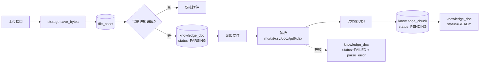

# 知识入库与切片实施方案（评分标准 + 岗位知识）

> **已过期（2026-09-14）**：请以 [RAG系统实施方案.md](RAG系统实施方案.md) 为准。
> 本文的归属字段设计已取消，模型与向量库配置已收进 `system_config`。

- 状态：**待评审**
- 日期：2026-09-14
- 关联：[RAG知识库实施方案-BGE-M3-Milvus.md](RAG知识库实施方案-BGE-M3-Milvus.md)、`app/models/knowledge.py`、`app/models/project.py`、`app/services/storage.py`
- 范围：**只做"入库 + 切片"**。不做 AI 问答会话，不接 Milvus，不接 BGE-M3（但字段与状态位先留好，二期不用再改表）

---

## 0. 结论先行

1. **复用现有上传链路，不造第二套。** `storage.save_bytes` + `file_asset` + `project_file` 这套已经很完整，评分标准只是多一个 `file_kind`。
2. **`knowledge_doc` 用两个正交字段区分两类知识**：`kb_domain`（用途：`EVAL` 评分 / `QA` 问答）× `owner_type`+`owner_id`（归属：项目 / 岗位）。原来那对 `biz_type`+`biz_id` 一个字段扛两个维度，评分标准一进来就错位。
3. **一期切片同步执行，不引入重依赖。** 解析只用 `python-docx` / `pypdf` / 已有 `openpyxl`，不装 langchain / torch / FlagEmbedding。上传接口当场解析切片，文件规模在几十 KB 级别完全可以接受。
4. **不新增表。** 表数保持 39（38 + `project_file`）。异步任务表 `knowledge_ingest_job` 推迟到接 Milvus 时再加——一期同步执行不需要它。
5. **`knowledge_chunk.status` 加一个 `PENDING`，语义就是"已切片、待入向量库"。** 一期所有切片停在这一态，二接 Milvus 时只改状态回填，不动表结构。

---

## 1. 现状：项目附件上传已经实现到什么程度

先把我读代码看到的东西列清楚，方案全部建立在它之上。

### 1.1 存储服务 `app/services/storage.py`

双后端，由 `settings.storage_backend` 选择：`local` 本地磁盘（默认）/ `s3` 对象存储（MinIO、OSS、S3 都走这条）。

| 能力 | 签名 / 行为 |
| --- | --- |
| 写入 | `save_bytes(content, *, filename, biz_type, scope=None) -> StoredFile` |
| 返回值 | `StoredFile(bucket, object_key, size_bytes, sha256, backend)` |
| 大小上限 | 在 `save_bytes` 内部校验 `settings.max_upload_mb`（默认 50MB），超限抛 `BusinessRuleError` |
| 读取 | `read_bytes(bucket, object_key)`、`path_of(bucket, object_key)`、`exists(...)` |
| 删除 / 移动 | `delete(...)`、`move_object(...)` |
| 项目目录 | `project_scope(project_id, project_name)` → `projects/<项目ID>-<项目名>` |

目录约定（两个后端一致）：

- 项目文件：`projects/<项目ID>-<项目名>/<用途小写>/<uuid>_<安全文件名>`
- 其它文件：`misc/<biz_type>/<年月>/<uuid>_<安全文件名>`

两个要点：**重复上传不去重**（每次生成新 `object_key`），`sha256` 只供业务侧查重；文件名做了 `_safe_name` 清洗，挡住了路径穿越。

### 1.2 数据模型

`file_asset`（[attempt.py:11](../app/models/attempt.py)）：文件台账，`bucket + object_key` 定位文件，记 `sha256`、大小、MIME、`biz_type`，唯一约束 `(bucket, object_key)`。

`project_file`（[project.py:99](../app/models/project.py)）：项目与文件的关联，`project_id + file_asset_id + file_kind + title + remark + sort_no + uploaded_by`，唯一约束 `(project_id, file_asset_id)`，索引 `(project_id, file_kind)`。**文件本体不入库**，只存关联。

### 1.3 接口

| 方法 | 路径 | 说明 |
| --- | --- | --- |
| POST | `/api/file-assets/upload` | 通用上传，文件落 `misc/<biz_type>/...` |
| POST | `/api/projects/{id}/files/upload` | **一步到位：上传 + 挂到项目**，落 `projects/<...>/<file_kind>/` |
| POST | `/api/projects/{id}/files` | 把已上传的文件挂到项目 |
| GET | `/api/projects/{id}/files` | 附件列表，可按 `file_kind` 过滤 |
| PATCH | `/api/projects/{id}/files/{pf_id}` | 改名 / 换用途 / 排序 / 备注 |
| DELETE | `/api/projects/{id}/files/{pf_id}` | 解除关联（文件台账与磁盘文件保留） |
| GET | `/api/file-assets/{id}/download` | 下载，返回文件流（不包统一响应体） |

### 1.4 配套

- 仓储 `ProjectFileRepository`：`list_of_project` / `by_asset` / `next_sort_no` / `delete_of_project`
- 统一响应体：`EnvelopeRoute` 包 `{code, data, msg}`，业务异常统一 `code=422`
- 路由集中注册在 `app/api/router.py` 的 `API_ROUTERS`
- 测试：`tests/test_crud_project.py::test_project_file_upload_and_attach` 覆盖了上传→挂载→列表→下载→改名→解除→超限的完整链路；`tests/conftest.py` 有 autouse 的 `local_storage` 夹具，把上传目录指到 `tmp_path`

### 1.5 现有实现里需要注意的四个点

| # | 现象 | 影响 | 处理 |
| --- | --- | --- | --- |
| 1 | `file_kind` 是自由字符串，接口用 `Form(default="OTHER")` 接收，**不校验是否属于 `ProjectFileKind`** | 传错用途名不会报错，会写出脏数据 | 本期顺手加上枚举校验 |
| 2 | `file_asset.biz_type` 被直接赋成 `file_kind`，但 `FileBizType` 枚举里**没有** `REPORT_TEMPLATE / DATASET / GUIDE` | `/api/enums` 返回的字典与实际写入值对不上 | 本期对齐两套枚举 |
| 3 | `storage` 只有 `project_scope()`，没有岗位维度的 scope | 岗位知识文件无处安放 | 加一个通用 `doc_scope(kind, id, name)` |
| 4 | 删除项目时 `delete_of_project` 只清附件关联，**文件和台账保留** | 项目删了但 `knowledge_doc` 还在 → 孤儿知识文档 | 项目删除时同步停用其知识文档 |

---

## 2. 目标与范围

**做：**

- 项目附件新增"评分标准"类型，上传后可被解析与切片
- 岗位知识入库 API（含解析与切片），**预留**给后续前端接入
- `knowledge_doc` / `knowledge_chunk` 的结构改造
- 纯 Python 的解析器与切分器
- 知识文档的查看 / 重新切片 / 停用接口

**不做：**

- AI 问答会话（`ai_qa_*` 三张表本期不动）
- Milvus 连接、BGE-M3 向量化、重排序
- 异步任务队列（同步执行，够用）
- 岗位知识的前端上传入口（需求里还没有这个页面）

---

## 3. 数据模型改动

### 3.1 枚举

| 枚举 | 改动 |
| --- | --- |
| `ProjectFileKind` | **新增** `SCORING_CRITERIA = "SCORING_CRITERIA"  # 评分标准` |
| `FileBizType` | 与 `ProjectFileKind` 对齐（补齐 `REPORT_TEMPLATE` / `DATASET` / `GUIDE`），消除 1.5 表里的第 2 个问题 |
| `KnowledgeBizType` | **改名为 `KnowledgeOwnerType`**，值域收窄为 `JOB` / `PROJECT`（去掉 `COURSE` 和 `SYSTEM`——平台没有课程表，`SYSTEM` 只是"没有归属"的另一种写法） |
| `KnowledgeDomain` | **新增**：`QA = "QA"` 学生问答 / `EVAL = "EVAL"` AI 评分 |
| `KnowledgeChunkStatus` | **新增** `PENDING = "PENDING"  # 已切片，待写入向量库` |

改枚举名会影响 `/api/enums` 的 key（`knowledge_biz_type` → `knowledge_owner_type`）以及 `app/schemas/enums.py`，需同步。

### 3.2 `knowledge_doc`

| 字段 | 动作 | 说明 |
| --- | --- | --- |
| `biz_type` | **改名** → `owner_type` | 值域 `JOB` / `PROJECT`；为空表示平台级全局知识 |
| `biz_id` | **改名** → `owner_id` | 与 `owner_type` 配对 |
| `kb_domain` | **新增** varchar(20) NOT NULL | `QA` / `EVAL`，决定用途与可见性 |
| `module_key` | **新增** varchar(50) 可空 | 评分标准挂到七大模块之一时填，项目级标准留空（本期建字段不启用） |
| `version_no` | **新增** int 默认 1 | 评分标准改版用（本期建字段不启用） |
| `parse_error` | **新增** text 可空 | 解析/切片失败原因 |
| `chunk_strategy` | **新增** varchar(50) 可空 | 切分策略版本，如 `v1_basic_800`，便于后续换策略时识别旧数据 |
| `title` / `file_asset_id` / `source` / `description` / `status` / `total_chunks` / `uploaded_by` | 保留 | — |

状态语义（沿用现有值，不改）：`PARSING` 解析中 → `READY` 内容就绪（已切片） / `FAILED` 失败 / `DISABLED` 停用。**注意 `READY` 表示"内容可用"，不表示"向量已写入"**——那是 `knowledge_chunk.status` 的事。

### 3.3 `knowledge_chunk`

| 字段 | 动作 | 说明 |
| --- | --- | --- |
| `token_count` | **新增** int 可空 | 本期留空，接入 BGE-M3 后用真实 tokenizer 回填 |
| `heading_path` | **新增** varchar(512) 可空 | 块所属标题路径，如 `第3章 模型训练 > 3.2 超参调优` |
| `page_no` | **新增** int 可空 | PDF 页码 |
| `status` | 值域扩展 | 加 `PENDING`；`READY` 的含义明确为"已写入 Milvus" |
| `content` / `content_hash` / `char_count` / `vector_id` / `model_name` | 保留 | `vector_id` 二期填 Milvus 主键 |

### 3.4 索引

| 表 | 索引 | 用途 |
| --- | --- | --- |
| `knowledge_doc` | **新增** `idx_knowledge_doc_domain_owner (kb_domain, owner_type, owner_id)` | 按知识域 + 归属查文档（现在这张表一个索引都没有，按归属查是全表扫） |
| `knowledge_doc` | **新增** `idx_knowledge_doc_file_asset (file_asset_id)` | 按文件反查文档，用于幂等与去重 |
| `knowledge_chunk` | **新增** `idx_knowledge_chunk_doc_status (doc_id, status)` | 查"某文档还有哪些块没进向量库" |

### 3.5 为什么不再加 `index_status` 字段

我在《RAG知识库实施方案》里曾建议给 `knowledge_doc` / `knowledge_chunk` 各加一个 `index_status`。**这里改口**：读了代码后发现 `KnowledgeChunkStatus` 的注释本来就写着 `READY = "READY"  # 可用，向量已写入 Milvus`——它已经是索引状态了。再加一列会变成两列表达同一件事，写入时必然出现两列不一致。正确做法是**扩展现有 `status` 的值域**（加 `PENDING`），而不是新增字段。

文档级的索引进度用 `total_chunks` 与已入库块数推导即可，一期不需要额外列。

---

## 4. 入库与切片链路

### 4.1 主流程



关键点：**入库失败不影响上传成功**。文件照常落到存储、附件照常挂到项目，只是 `knowledge_doc.status=FAILED` 并记下原因。这符合"文件是事实、知识索引是可重建的派生数据"这条总原则。

### 4.2 解析器

一期支持的格式（都能纯 Python 处理，不需要额外系统依赖）：

| 格式 | 库 | 是否已有依赖 |
| --- | --- | --- |
| `.md` / `.txt` / `.csv` | 内置读取 + 文本处理 | 已有 |
| `.docx` | `python-docx` | **需新增** |
| `.pdf` | `pypdf` | **需新增** |
| `.xlsx` | `openpyxl` | 已有 |

统一输出结构：

```
ParsedDocument(
    blocks: list[ParsedBlock(heading_path, page_no, text)],
    title: str | None,
)
```

约定：

- Markdown 按标题层级抽 `heading_path`；PDF 按页取 `page_no`；Docx 按标题样式尽量还原层级
- 解析器只负责"还原结构"，不做任何语义判断
- 不支持的扩展名 → 直接返回失败原因"暂不支持的文件类型：xxx"，**不静默跳过**

### 4.3 切分器

一期用纯 Python 实现，不引入 `langchain-text-splitters`（避免为了一个函数拖进整套依赖）。

策略：**结构优先 + 段落聚合 + 硬上限兜底**

1. 按 `heading_path` 分组，天然形成语义段
2. 段内按空行/句号聚合，直到接近目标长度
3. 超过目标长度的单段，按句末切分；仍超长的（如代码块、表格）按硬上限强制切
4. 相邻块保留重叠，避免跨块丢上下文
5. 每块 `content` 前面拼上 `heading_path`，正文保留
6. `content_hash = sha256(归一化后的正文)`

参数（走配置，不写死）：

| 配置项 | 默认值 | 说明 |
| --- | --- | --- |
| `knowledge_chunk_size_chars` | 800 | 目标块长（**字符**，一期不用 token） |
| `knowledge_chunk_overlap_chars` | 120 | 相邻块重叠 |
| `knowledge_max_chunk_chars` | 20000 | 硬上限 |

**为什么硬上限是 20000 而不是更大**：Milvus 的 `VarChar` 上限是 65535 **字节**，中文 UTF-8 一个汉字 3 字节，换算下来约 2.1 万汉字。切片阶段就卡住这条线，比写入向量库时才报错要好。这条约束现在写进代码，二期不用回来补。

**为什么一期用字符不用 token**：BGE-M3 用的是 XLM-R tokenizer，算准必须加载词表（就是 torch 那一套）。一期既然不接模型，就没必要为估算引入几百 MB 依赖。`token_count` 字段先建好留空，二期接模型时用真实 tokenizer 回填。

### 4.4 事务与写入

解析与切片是 CPU 工作、不是 IO，**不要放在数据库事务里**。顺序：

1. 短事务：建 `knowledge_doc`（`status=PARSING`）
2. 事务外：读文件 → 解析 → 切片（纯计算）
3. 短事务：批量插入 `knowledge_chunk`，回填 `total_chunks`，置 `status=READY`

失败时第 3 步改成写 `status=FAILED` + `parse_error`。

### 4.5 幂等与重新切片

重复上传同一个文件时（`file_asset.sha256` 相同）有两种处理，本期建议：

- **项目附件**：每次上传都是一条新的 `file_asset` + `project_file`（沿用现有行为，不去重）
- **知识文档**：新建文档前先按 `file_asset_id` 查一次，命中则**复用已有的 `knowledge_doc`**，不重复切片

`POST /api/knowledge/docs/{id}/reparse` 提供显式重建：先删该文档名下的全部 chunk，再按当前策略重新切一遍。这条路径同时是二期换切分策略时的迁移入口。

---

## 5. 接口设计

### 5.1 改造：项目附件支持评分标准

不新增接口，只扩展 `file_kind` 的取值，并在上传时判断是否需要入库。

| 改动 | 位置 | 说明 |
| --- | --- | --- |
| 枚举加值 | `ProjectFileKind` | `SCORING_CRITERIA` |
| 校验用途 | `POST /api/projects/{id}/files/upload`、`PATCH .../files/{id}` | 拒绝不属于枚举的 `file_kind`（修 1.5 表第 1 条） |
| 触发入库 | `POST /api/projects/{id}/files/upload` | 当 `file_kind == SCORING_CRITERIA` 时，额外建 `knowledge_doc(kb_domain=EVAL, owner_type=PROJECT, owner_id=project_id)` 并切片 |
| 返回值扩展 | 同上 | 返回体里带上 `knowledge_doc_id`（没入库则为 `null`），前端可直接跳进度 |
| 同步清理 | `DELETE /api/projects/{id}` | 项目删除时把其知识文档置 `DISABLED`（修 1.5 表第 4 条） |

**一个待定的取舍**：`PATCH .../files/{id}` 现在允许改 `file_kind`。一旦附件已经入库，改用途就和 `knowledge_doc.kb_domain` 打架了。本期建议**已入库的附件禁止改 `file_kind`**（改 `title` / `remark` / `sort_no` 不受影响），要换用途就删掉重传。这样比"跟着改知识文档"简单得多，也不会产生半个状态。

### 5.2 新增：知识文档通用接口

| 方法 | 路径 | 说明 |
| --- | --- | --- |
| GET | `/api/knowledge/docs` | 文档分页列表，可按 `kb_domain` / `owner_type` / `owner_id` / `status` 过滤 |
| GET | `/api/knowledge/docs/{id}` | 文档详情（含状态、块数、解析错误） |
| GET | `/api/knowledge/docs/{id}/chunks` | 切片分页列表（调参、验收时看切得好不好） |
| POST | `/api/knowledge/docs/{id}/reparse` | 重新切片（幂等重建） |
| DELETE | `/api/knowledge/docs/{id}` | 停用（软状态，不删 chunk） |

### 5.3 预留：岗位知识入库

| 方法 | 路径 | 说明 |
| --- | --- | --- |
| POST | `/api/jobs/{job_id}/knowledge/docs/upload` | 上传岗位知识文档：落存储 → 建 `knowledge_doc(kb_domain=QA, owner_type=JOB, owner_id=job_id)` → 切片 |
| GET | `/api/jobs/{job_id}/knowledge/docs` | 该岗位下的知识文档列表 |
| DELETE | `/api/jobs/{job_id}/knowledge/docs/{doc_id}` | 停用 |

与项目侧同构，差别只有三处：`owner_type=JOB`、`kb_domain=QA`、存储目录走 `jobs/<岗位ID>-<岗位名>/`。

> **"预留"的准确含义**：接口与入库切片**完整可用**（后端可联调、可测试），只是前端上传入口暂不开发——需求确认书里岗位管理页目前没有资料上传区。这样后续需求一确认，补一个页面即可，后端零改动。

---

## 6. 代码落点

```
app/
├─ services/
│  ├─ storage.py                # 加 doc_scope(kind, id, name)，project_scope 复用它
│  └─ knowledge/                # 新增包
│     ├─ __init__.py
│     ├─ parser.py              # 各格式 → ParsedDocument(blocks)
│     ├─ splitter.py            # ParsedDocument → list[Chunk]（纯函数，好测）
│     └─ ingest.py              # 编排：建 doc → 解析 → 切片 → 落 chunk → 回填状态
├─ crud/
│  └─ knowledge.py              # 新增：KnowledgeDocRepository / KnowledgeChunkRepository
├─ api/endpoints/
│  └─ knowledge.py              # 新增：知识文档接口 + 岗位知识入库
├─ models/
│  ├─ knowledge.py              # knowledge_doc / knowledge_chunk 字段调整
│  └─ enums.py                  # 枚举增删改
└─ schemas/
   ├─ knowledge.py              # 增补 Create/Read/Update
   └─ enums.py                  # 跟着枚举改
```

`parser.py` 与 `splitter.py` 刻意设计成**不碰数据库、不碰网络**的纯函数，这样单元测试不需要起 FastAPI，也不需要真实文件——给一段字符串就能验切分结果。这是这套代码里最值得单测的部分。

---

## 7. 配置与依赖

### 7.1 新增依赖

```
python-docx>=1.1.2     # .docx 解析
pypdf>=5.1             # .pdf 解析
```

`openpyxl` 已在依赖里。**不引入** `langchain`、`langchain-text-splitters`、`torch`、`FlagEmbedding`、`pymilvus`——那些是二期接 Milvus 与模型时的事。这样本期的镜像体积和安装时间基本不变。

### 7.2 新增配置（`.env.example` 追加）

```
# 知识切片（单位：字符）
KNOWLEDGE_CHUNK_SIZE_CHARS=800
KNOWLEDGE_CHUNK_OVERLAP_CHARS=120
KNOWLEDGE_MAX_CHUNK_CHARS=20000
```

---

## 8. 测试计划

| 文件 | 覆盖内容 |
| --- | --- |
| `tests/test_knowledge_parser.py`（新增） | 各格式解析：md 标题层级、txt 纯文本、docx、pdf、xlsx；空文件；不支持的扩展名 |
| `tests/test_knowledge_splitter.py`（新增） | 切分边界：超长单段强制切、多级标题的 `heading_path` 拼接、重叠生效、`content_hash` 稳定、硬上限拦截 |
| `tests/test_knowledge_api.py`（新增） | 项目评分标准上传 → 断言 `knowledge_doc` 的 `kb_domain/owner_type/owner_id` 与切片数量；岗位知识上传；重新切片；列表过滤；停用 |
| `tests/test_crud_project.py`（扩展） | 在上传用例里加 `file_kind=SCORING_CRITERIA` 分支，顺带覆盖 1.5 表里的非法 `file_kind` 校验 |
| `tests/test_metadata.py`（更新） | 表数仍是 39；补新字段与新索引的断言 |

切分结果**不写死断言具体块数**——那是调参就会变的脆弱断言。改断言"块数 > 1""每块长度不超过上限""拼回去能覆盖原文关键片段"这类性质。

跑完还要过一致性关卡：

```bash
uv run pytest
uv run ruff check .
uv run python scripts/check_schema_parity.py
uv run python scripts/check_db.py
```

---

## 9. 文档同步（这个仓库的硬约束）

`scripts/check_schema_parity.py` 与 `tests/test_schema_parity.py` 会拿 ORM 和 `docs/数据库表字段清单.md` 逐字段比对，所以**改字段必须三处一起动**，否则测试直接红：

| 文件 | 要改什么 |
| --- | --- |
| `app/models/knowledge.py` | 表模型字段 |
| `alembic/versions/*` | 新迁移（SQLite 走 batch 模式） |
| `docs/数据库表字段清单.md` | 7.1 / 7.2 两节的字段表 + 附录 A 的枚举 |
| `docs/database_schema_draft.sql` | DDL 原文 |

枚举改动还会影响 `/api/enums` 的输出，`app/schemas/enums.py` 也要跟着改。

---

## 10. 里程碑

| 里程碑 | 内容 | 验收 | 预估 |
| --- | --- | --- | --- |
| M1 模型与迁移 | 枚举增删改、`knowledge_doc` / `knowledge_chunk` 字段、索引、Alembic 迁移、字段清单同步 | `alembic check` 无差异，`check_schema_parity` 通过，表数仍为 39 | 0.5 天 |
| M2 解析与切分 | `parser.py` / `splitter.py` + 两个纯函数单测文件 | 六种格式都能解析出结构；超长、空文件、不支持格式都有明确结果 | 1 天 |
| M3 项目评分标准入库 | 上传接口加 `SCORING_CRITERIA` + 入库编排 + 列表/详情/重新切片/停用接口 | 上传一份评分标准后，`knowledge_doc` 与 `knowledge_chunk` 数据正确，失败可重试 | 1 天 |
| M4 岗位知识入库（预留） | 岗位维度 scope、三个接口 | 与项目侧行为一致，`kb_domain=QA` | 0.5 天 |
| M5 测试与文档 | 集成测试、README 接口清单、一致性脚本 | 全量测试与 lint 通过 | 0.5 天 |

合计约 **3.5 个工作日**（不含评审与前端联调）。

---

## 11. 待确认（开工前定，避免返工）

| # | 问题 | 我的建议 |
| --- | --- | --- |
| 1 | "预留岗位知识 API"是只定契约，还是连入库切片一起做？ | **连入库切片一起做**，只是不做前端入口。否则预留的接口是假的，二期还得重写 |
| 2 | 评分标准是项目级还是模块级？ | 一期**项目级**（一个项目一份），`module_key` 字段建好但不启用 |
| 3 | 已入库的附件允许改用途吗？ | **不允许**改 `file_kind`，要换就删掉重传 |
| 4 | 同一份文件既当评分标准又当岗位知识，怎么处理？ | 允许，建两条 `knowledge_doc` 分别指向同一个 `file_asset`。两套生命周期本来就不同 |
| 5 | `FileBizType` 与 `ProjectFileKind` 合并还是并存？ | 一类，先并存但**保证值域一致**；两套枚举长期维护成本更高，二期可考虑合并 |
| 6 | 切片长度单位最终用字符还是 token？ | 一期字符，二期接 BGE-M3 时按真实 tokenizer 重新标定并回填 `token_count` |
| 7 | 需要 sha256 去重吗？ | 知识文档层面去重（复用已有 doc），文件层面不去重（沿用现有行为） |

---

## 12. 与二期（Milvus）的衔接

本期做完之后，二期要动的只有三件事：

1. `ingest.py` 末尾追加"向量化 + 写 Milvus"一步，把 `knowledge_chunk.status` 从 `PENDING` 推进到 `READY`
2. 新增 `scripts/reindex.py`，从 SQLite 全量重建 Milvus 集合
3. 问答链路（`ai_qa_*`）开始读 Milvus

**表结构、状态机、接口在二期都不需要再改**——这正是本期把 `kb_domain` / `owner_*` / `PENDING` 这些一次性做对的价值。
