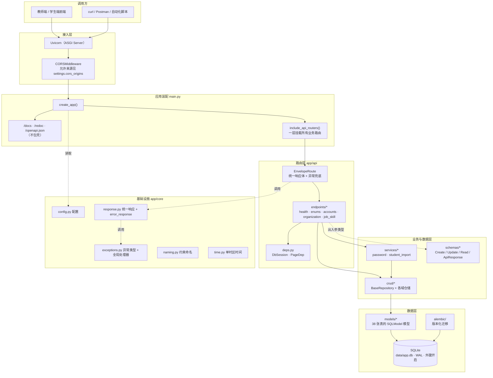
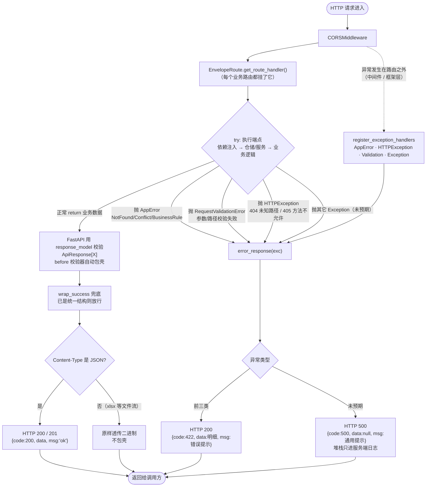
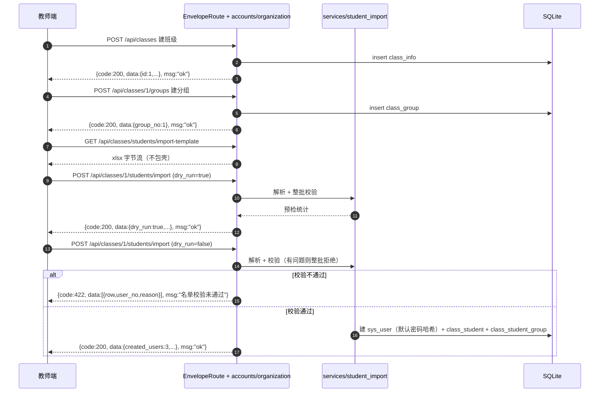

# 系统架构与请求处理链路

> 对应代码：`app/`（P0 脚手架 + P1 三域 CRUD）。图用 Mermaid 编写，GitHub / VS Code / 支持 Mermaid 的 Markdown 阅读器可直接渲染。

## 1. 分层架构



## 2. 全局处理器怎么工作的

一次请求只有两条出路：**正常返回**（包成 `{code:200, data, msg:"ok"}`）或**异常**（翻译成 `{code:422|500, data, msg}`）。
兜底入口只有一个 `EnvelopeRoute`；`register_exception_handlers` 是接住路由之外异常的第二道网。



### 关键约定

| 关注点 | 位置 | 说明 |
| --- | --- | --- |
| 成功包壳 | `schemas/base.py::ApiResponse[T]` | 端点照旧返回业务数据，`before` 校验器把它包成统一结构，`/docs` 的响应模型与真实返回一致 |
| 异常兜底 | `core/response.py::EnvelopeRoute` | 每个业务路由的路由类，`try/except` 只写这一处，44 个端点全覆盖、不会漏 |
| 异常翻译 | `core/response.py::error_response` | 四类异常统一出口：业务异常 / 参数校验 / HTTP 异常 / 未预期异常 |
| 第二道网 | `core/exceptions.py::register_exception_handlers` | 路由之外（中间件、依赖解析前）抛的异常也走同一出口 |
| 非 JSON 放行 | `core/response.py::wrap_success` | Excel 模板下载等文件流按 Content-Type 跳过包壳 |
| HTTP 状态 | `core/response.py::FAILURE_HTTP_STATUS` | 当前业务失败 = HTTP 200（只看 body 的 code）；未预期异常 = HTTP 500 |

### 请求示例

```bash
# 成功
curl -s http://127.0.0.1:8000/api/health
# {"code":200,"data":{"ok":true,...},"msg":"ok"}   HTTP 200

# 业务失败：找不到
curl -s http://127.0.0.1:8000/api/users/99999
# {"code":422,"data":null,"msg":"用户 99999 不存在"}   HTTP 200

# 参数校验失败：明细在 data
curl -s http://127.0.0.1:8000/api/users/abc
# {"code":422,"data":[{"loc":["path","user_id"],...}],"msg":"请求参数校验失败"}   HTTP 200

# 文件流：不包壳
curl -sI http://127.0.0.1:8000/api/classes/students/import-template
# content-type: application/vnd.openxmlformats-officedocument.spreadsheetml.sheet
```

## 3. 数据流：教师端建班导学


